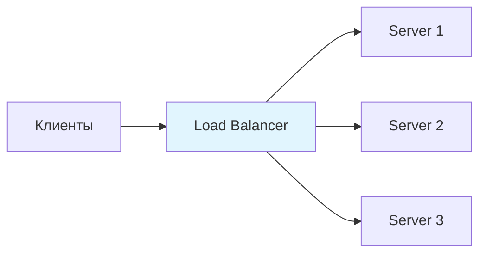
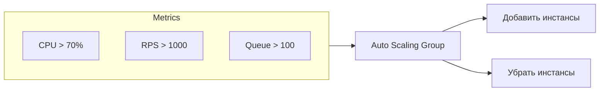
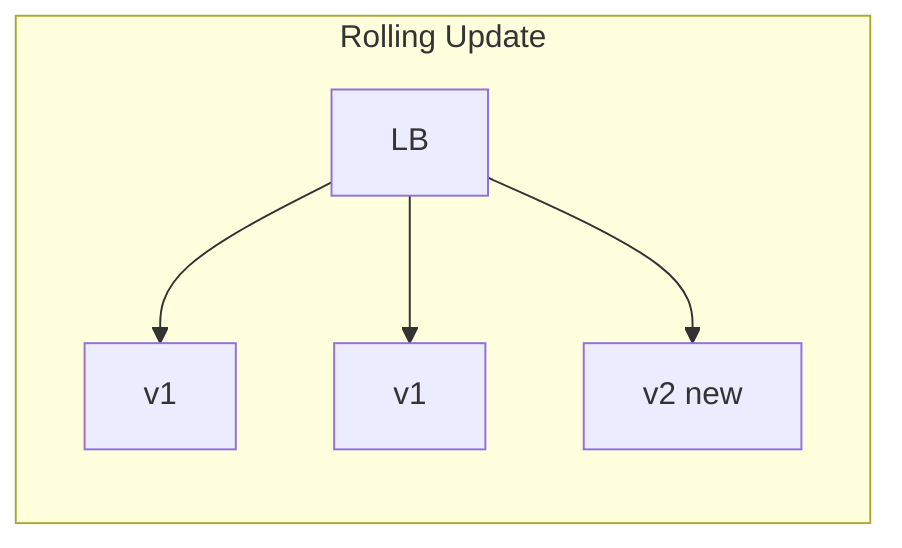

# Масштабирование (Scaling)

## Vertical vs Horizontal Scaling

### Vertical Scaling (Scale Up)
**Что это:** Увеличение ресурсов одного сервера (CPU, RAM, SSD). Берёшь машину помощнее.

**Когда использовать:**
- Начальная стадия проекта (проще в реализации)
- Stateful приложения, которые сложно распределить
- База данных до определённого предела (PostgreSQL отлично масштабируется вертикально)

**Пример:** Переход с t3.medium (2 CPU, 4GB) на r5.4xlarge (16 CPU, 128GB)

### Horizontal Scaling (Scale Out)
**Что это:** Добавление новых серверов в кластер. Работа распределяется между ними.

**Когда использовать:**
- Нагрузка превышает возможности одного сервера
- Нужна отказоустойчивость (один сервер упал — другие работают)
- Stateless сервисы (API серверы, воркеры)

### Trade-offs

| Аспект | Vertical | Horizontal |
|--------|----------|------------|
| Сложность | Просто | Требует архитектурных изменений |
| Потолок | Есть физический лимит | Практически безлимитно |
| Стоимость | Экспоненциально растёт | Линейно растёт |
| Downtime | Нужен при апгрейде | Zero-downtime возможен |
| State | Не проблема | Нужен shared state или stateless |

---

## Load Balancing

### Что это
Распределение входящего трафика между несколькими серверами. Точка входа, которая решает, какой сервер обработает запрос.



### Алгоритмы балансировки

| Алгоритм | Как работает | Когда использовать |
|----------|--------------|-------------------|
| **Round Robin** | По очереди: 1→2→3→1→2→3 | Серверы одинаковые, запросы однородные |
| **Weighted Round Robin** | С учётом весов: мощный сервер получает больше | Серверы разной мощности |
| **Least Connections** | На сервер с минимумом активных соединений | Запросы разной длительности |
| **IP Hash** | Hash от IP клиента → один сервер | Нужна sticky session без cookies |
| **Least Response Time** | На самый быстрый сервер | Когда важна latency |

### L4 vs L7 Load Balancer

```
L4 (Transport Layer):
- Работает с TCP/UDP
- Быстрее (не смотрит в payload)
- Не понимает HTTP
- Пример: AWS NLB, HAProxy в TCP mode

L7 (Application Layer):
- Работает с HTTP/HTTPS
- Может роутить по URL, headers, cookies
- Может терминировать SSL
- Пример: AWS ALB, Nginx, HAProxy в HTTP mode
```

**На интервью часто спрашивают:** "Какой тип LB выберете?"
- L4 — для максимальной производительности, простых TCP сервисов
- L7 — когда нужен routing по контенту, SSL termination, sticky sessions

### Health Checks

```
Active Health Check:
LB → периодически дёргает /health на серверах
Если 3 раза подряд не ответил → убираем из пула

Passive Health Check:
LB следит за реальными ответами
Много 5xx → убираем из пула
```

---

## Auto-scaling

### Что это
Автоматическое изменение количества серверов в зависимости от нагрузки.



### Метрики для scaling

| Метрика | Scale Up когда | Scale Down когда |
|---------|---------------|------------------|
| CPU | > 70% | < 30% |
| Memory | > 80% | < 40% |
| Request count | > threshold | < threshold |
| Queue depth | Растёт | Пустая |
| Custom (latency p99) | > SLA | Стабильно ниже |

### Политики масштабирования

**Target Tracking:**
```
"Держи CPU на уровне 60%"
- Система сама решает сколько инстансов нужно
- Самый простой вариант
```

**Step Scaling:**
```
CPU 60-70% → +1 instance
CPU 70-80% → +2 instances
CPU > 80%  → +4 instances
```

**Scheduled Scaling:**
```
Пн-Пт 09:00 → min: 10 instances (рабочий день)
Сб-Вс       → min: 2 instances  (выходные)
```

### Важные параметры

```
Cooldown Period: 300 сек
- Пауза между scaling действиями
- Предотвращает "флаппинг" (вверх-вниз-вверх-вниз)

Warm-up Time: 180 сек
- Время на запуск нового инстанса
- Новый инстанс не учитывается в метриках пока не прогреется
```

### Trade-offs Auto-scaling

| Плюсы | Минусы |
|-------|--------|
| Экономия денег (платим только за нужное) | Lag при scale up (инстансы не мгновенны) |
| Автоматическая адаптация к нагрузке | Сложнее дебажить (инстансы приходят и уходят) |
| Выживание при пиках | Cold start проблема |

---

## Практические вопросы на интервью

### "Как масштабировать сервис до 1M RPS?"

**Структура ответа:**
1. Посчитать: 1M RPS = ~1000 серверов при 1000 RPS/сервер
2. Добавить несколько уровней LB (DNS → L4 → L7)
3. Stateless сервисы + горизонтальное масштабирование
4. Кэширование для снижения нагрузки на БД
5. Шардирование БД

### "Как обеспечить zero-downtime deployment?"



**Варианты:**
- **Rolling update:** Постепенная замена инстансов (1 из 10, потом 2 из 10...)
- **Blue-Green:** Две идентичные среды, переключение трафика
- **Canary:** 1% трафика на новую версию, потом больше

### "Какой минимальный набор для production?"

```
Load Balancer (managed: ALB/NLB)
├── 2+ App servers (за auto-scaling group)
├── Database с репликой (primary + read replica)
└── Redis для кэша и сессий
```

**Почему минимум 2 сервера:** Один может упасть, обновляться, иметь проблемы. Два — базовая отказоустойчивость.
