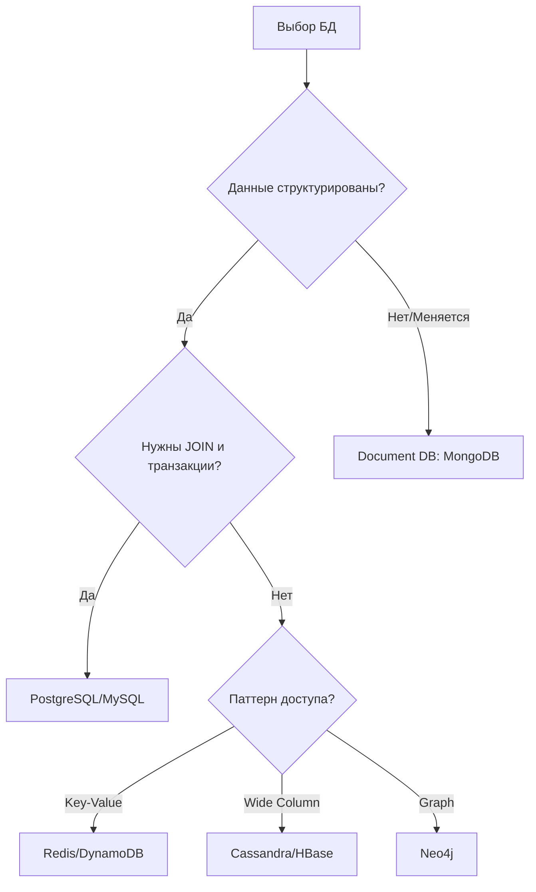
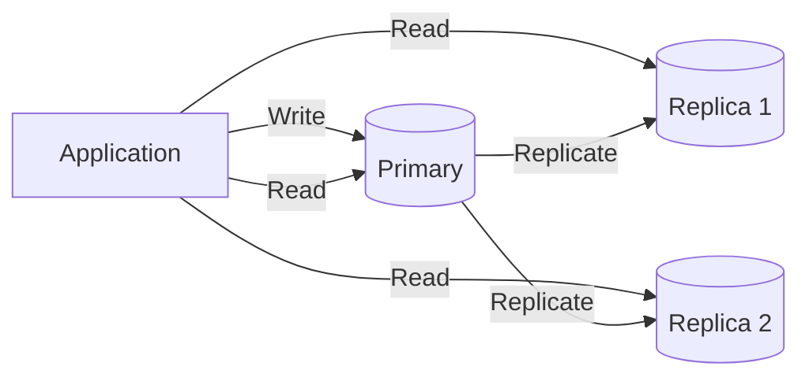
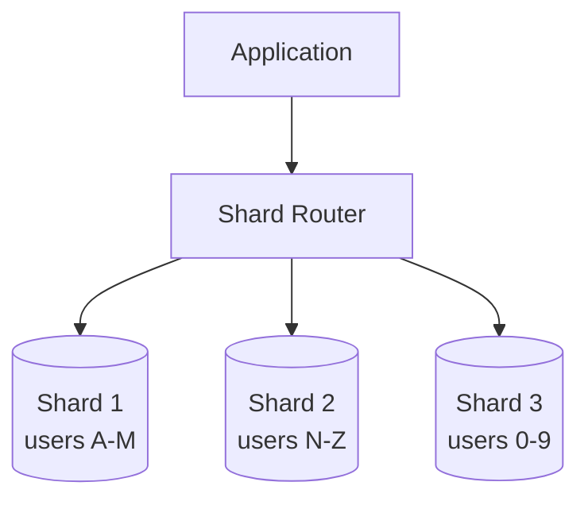

# Базы данных (Databases)

## SQL vs NoSQL

### Когда выбирать что



### Сравнение

| Критерий | SQL (PostgreSQL) | NoSQL (MongoDB) | NoSQL (Cassandra) |
|----------|------------------|-----------------|-------------------|
| Схема | Строгая | Гибкая | Строгая (но денормализованная) |
| Масштабирование | Вертикальное* | Горизонтальное | Горизонтальное |
| Транзакции | ACID | Ограниченные | Нет (eventual consistency) |
| JOIN | Да | Нет (denormalize) | Нет |
| Лучше для | Финансы, e-commerce | Контент, каталоги | Time-series, IoT, logs |

*PostgreSQL можно шардировать (Citus), но это сложнее

### Практический выбор

**PostgreSQL выбирай когда:**
- Деньги, транзакции, инвентарь (нужен ACID)
- Сложные запросы с JOIN
- Данные хорошо структурированы
- Команда знает SQL

**MongoDB выбирай когда:**
- Схема часто меняется
- Документы вложенные (профиль пользователя со всеми данными)
- Нужна горизонтальная масштабируемость из коробки

**Cassandra/ScyllaDB выбирай когда:**
- Write-heavy нагрузка (логи, метрики, IoT)
- Нужна линейная масштабируемость
- Допустима eventual consistency

---

## ACID vs BASE

### ACID (SQL базы)

| Свойство | Что значит | Пример |
|----------|-----------|--------|
| **A**tomicity | Транзакция или полностью выполнена, или откачена | Перевод денег: списание и начисление — атомарны |
| **C**onsistency | БД всегда в валидном состоянии | Баланс не может быть отрицательным |
| **I**solation | Транзакции не влияют друг на друга | Два параллельных перевода не конфликтуют |
| **D**urability | После commit данные сохранены | Даже если сервер упал сразу после commit |

### BASE (NoSQL базы)

| Свойство | Что значит |
|----------|-----------|
| **B**asically **A**vailable | Система всегда отвечает (может вернуть stale данные) |
| **S**oft state | Состояние может меняться без input (репликация) |
| **E**ventually consistent | Данные станут консистентными... когда-нибудь |

### Когда что использовать

```
ACID (PostgreSQL, MySQL):
├── Платежи и финансы
├── Бронирование (билеты, отели)
├── Инвентарь магазина
└── Любой критичный для бизнеса state

BASE (Cassandra, DynamoDB):
├── Лента социальной сети
├── Счётчики просмотров
├── Логи и аналитика
└── Сессии пользователей
```

---

## Replication (Репликация)

### Что это
Копирование данных на несколько серверов для отказоустойчивости и производительности чтения.



### Типы репликации

**Synchronous (синхронная):**
```
Write → Primary → ждём подтверждения от Replica → OK клиенту
+ Гарантия: данные на реплике
- Latency выше
- Реплика недоступна = запись блокируется
```

**Asynchronous (асинхронная):**
```
Write → Primary → OK клиенту → фоновая репликация
+ Быстрый write
- Реплика может отставать (replication lag)
- При failover можно потерять данные
```

**Semi-synchronous:**
```
Подтверждение от 1 из N реплик (обычно ближайшей)
Компромисс между durability и latency
```

### Replication Lag — главная проблема

```
Сценарий:
1. Пользователь обновил профиль (→ Primary)
2. Страница перезагружается (→ Read Replica)
3. Видит старые данные (lag ~100ms)

Решения:
- Read-your-writes: после записи читать с Primary
- Monotonic reads: один пользователь → одна реплика
- Causal consistency: отслеживать зависимости
```

---

## Sharding (Шардирование)

### Что это
Разделение данных между несколькими серверами. Каждый сервер хранит часть данных.



### Стратегии шардирования

**1. Range-based (по диапазону)**
```
Shard 1: user_id 1-1,000,000
Shard 2: user_id 1,000,001-2,000,000
...

+ Просто понять
+ Range queries работают
- Hotspots: новые юзеры все на последнем шарде
```

**2. Hash-based (по хэшу)**
```
shard = hash(user_id) % num_shards

+ Равномерное распределение
- Range queries не работают (scatter-gather)
- Resharding — боль (consistent hashing помогает)
```

**3. Directory-based (справочник)**
```
Отдельный сервис хранит: user_id → shard_id

+ Гибко: можно двигать данные
- Lookup service = single point of failure
- Дополнительный hop
```

### Shard Key — критически важно

```
Хороший shard key:
✓ Высокая кардинальность (много уникальных значений)
✓ Равномерное распределение записей
✓ Часто используется в запросах

Плохой shard key:
✗ country_code — неравномерно (US >> остальные)
✗ created_date — все новые записи на одном шарде
✗ boolean поля — только 2 значения
```

### Проблемы шардирования

| Проблема | Что это | Решение |
|----------|---------|---------|
| Cross-shard queries | JOIN между шардами | Денормализация, application-level join |
| Hotspots | Один шард перегружен | Выбрать правильный shard key |
| Resharding | Добавление/удаление шардов | Consistent hashing |
| Transactions | ACID между шардами | Saga pattern, 2PC (сложно) |

---

## Partitioning vs Sharding

```
Partitioning — разделение данных ВНУТРИ одной БД
(логическое разделение, один сервер)

Sharding — разделение данных МЕЖДУ серверами
(физическое разделение, много серверов)

PostgreSQL partitioning:
CREATE TABLE events (
    id SERIAL,
    created_at DATE,
    data JSONB
) PARTITION BY RANGE (created_at);

CREATE TABLE events_2024_01 PARTITION OF events
    FOR VALUES FROM ('2024-01-01') TO ('2024-02-01');
```

---

## Практические вопросы на интервью

### "Как спроектировать БД для Twitter?"

```
Масштаб:
- 500M пользователей
- 500M tweets/день
- Read-heavy: 100:1 (читают в 100 раз чаще чем пишут)

Решение:
1. Users — PostgreSQL (structured, нужен ACID для auth)
2. Tweets — Cassandra (write-heavy, eventual consistency OK)
3. Timeline — Redis (precomputed, очень read-heavy)
4. Followers graph — отдельный сервис или Neo4j

Shard tweets по user_id:
- Все твиты юзера на одном шарде
- Его timeline легко собрать
```

### "SQL или NoSQL для e-commerce?"

```
PostgreSQL для:
- Products catalog (структурированные данные, search)
- Orders (транзакции, ACID)
- Users (auth, profiles)
- Payments (ACID критичен)

Redis для:
- Shopping cart (быстрый доступ, TTL)
- Sessions
- Product views counter

Elasticsearch для:
- Full-text search по товарам
- Фасетный поиск (фильтры)
```

### "Как мигрировать с одной БД на шардированную?"

```
1. Double-write: пишем в обе БД
2. Backfill: копируем исторические данные
3. Shadow read: читаем из обеих, сравниваем
4. Постепенный switch: 1% → 10% → 50% → 100%
5. Убираем старую БД
```
