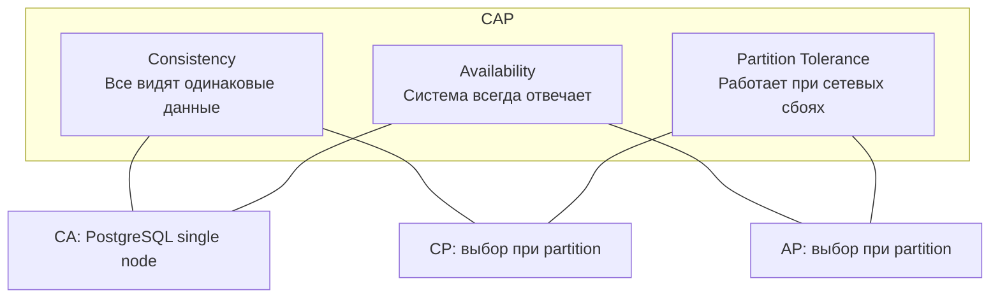
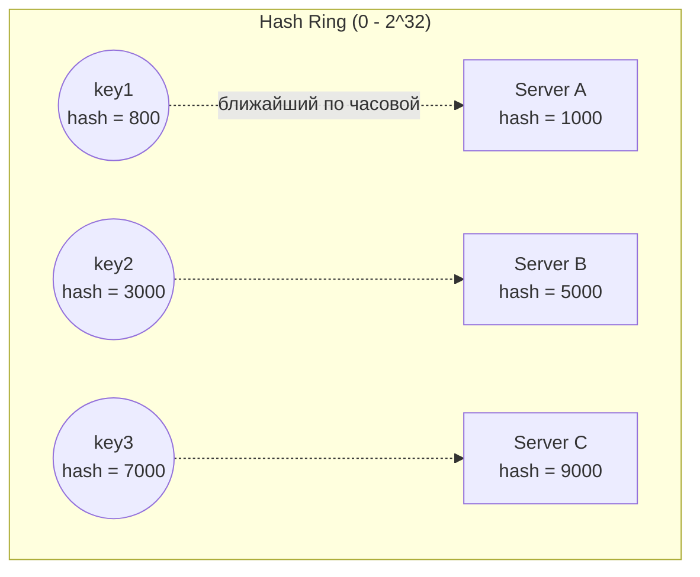

# Теоремы и алгоритмы распределённых систем

## CAP Theorem

### Что это
В распределённой системе при network partition можно гарантировать только 2 из 3 свойств:



### Важное уточнение
**CAP — это выбор ТОЛЬКО в момент partition.** В нормальном состоянии система может быть и consistent, и available.

```
Partition случился:
┌─────────────────┐     X     ┌─────────────────┐
│   Node A        │ ───────── │   Node B        │
│   (Primary)     │  Network  │   (Replica)     │
│                 │   split   │                 │
└─────────────────┘           └─────────────────┘

CP выбор: Node A отвечает, Node B отказывает (или read-only)
AP выбор: Оба отвечают, но могут разойтись (split-brain)
```

### Практические примеры

| Система | Выбор | Поведение при partition |
|---------|-------|------------------------|
| PostgreSQL + sync replica | CP | Запись блокируется до восстановления |
| Cassandra | AP | Работает, eventual consistency |
| MongoDB | Configurable | Можно выбрать на уровне запроса |
| ZooKeeper | CP | Минорити не отвечает |
| DynamoDB | AP | Работает, last-write-wins |

### Что отвечать на интервью

**Вопрос:** "Что выберете — consistency или availability?"

**Ответ:**
```
Зависит от use case:

CP (consistency) для:
- Платежей — лучше отказ, чем двойное списание
- Бронирования — нельзя продать одно место дважды
- Inventory — нельзя продать то, чего нет

AP (availability) для:
- Ленты соцсети — лучше показать старое, чем ничего
- Счётчики лайков — не критично если неточно
- Логирования — потерять часть логов лучше чем упасть
```

---

## PACELC Theorem

### Что это
Расширение CAP: даже **без partition** есть trade-off между **latency** и **consistency**.

```
if (Partition) {
    choose: Availability vs Consistency  // это CAP
} else {
    choose: Latency vs Consistency        // это PACELC
}
```

### Матрица решений

| Система | При Partition (PAC) | Иначе (ELC) |
|---------|---------------------|-------------|
| PostgreSQL sync | PC (consistency) | EC (consistency) |
| Cassandra | PA (availability) | EL (latency) |
| MongoDB default | PA (availability) | EC (consistency) |
| DynamoDB | PA (availability) | EL (latency) |

### Практический смысл

```
Синхронная репликация:
Write → Primary → Wait for Replica → OK
Consistency ✓, но Latency +50ms

Асинхронная репликация:
Write → Primary → OK (replica updates later)
Latency ✓, но можешь прочитать stale данные
```

**На интервью:** PACELC показывает, что даже в "хорошие времена" нужно выбирать. Нет бесплатной консистентности — за неё платишь latency.

---

## Consistent Hashing

### Зачем нужно
Обычное хэширование (`hash(key) % n`) ломается при изменении количества серверов — почти все ключи нужно перемещать.

```
Было 3 сервера:
hash("user:123") % 3 = 1 → Server 1

Стало 4 сервера:
hash("user:123") % 4 = 3 → Server 3  // переезд!

При n серверах → n-1/n ключей переезжают
При 100 серверах → 99% ключей переезжают
```

### Как работает Consistent Hashing



**Принцип:** Ключ идёт на первый сервер по часовой стрелке от своего хэша.

### При добавлении/удалении сервера

```
Добавляем Server D (hash = 6000):

До:  key (hash=7000) → Server C (9000)
После: key (hash=7000) → Server D (6000)  // переехал

Но keys с hash 3001-5000 остались на Server B
И keys с hash 9001-1000 остались на Server A

Переезжает только ~1/n ключей!
```

### Virtual Nodes (Vnodes)

**Проблема:** Если серверов мало, распределение неравномерное.

**Решение:** Каждый физический сервер = много виртуальных точек на кольце.

```
Server A → vnode_A_1, vnode_A_2, vnode_A_3, ... (100+ vnodes)
Server B → vnode_B_1, vnode_B_2, vnode_B_3, ...

Больше точек → равномернее распределение
```

### Где используется

| Система | Использование |
|---------|--------------|
| Cassandra | Распределение данных по нодам |
| DynamoDB | Partitioning |
| Memcached | Client-side sharding |
| CDN | Определение edge server |
| Discord | Распределение guild по серверам |

### Код (упрощённый)

```python
import hashlib

class ConsistentHash:
    def __init__(self, nodes, vnodes=100):
        self.ring = {}
        self.sorted_keys = []

        for node in nodes:
            for i in range(vnodes):
                key = self._hash(f"{node}:{i}")
                self.ring[key] = node
                self.sorted_keys.append(key)

        self.sorted_keys.sort()

    def _hash(self, key):
        return int(hashlib.md5(key.encode()).hexdigest(), 16)

    def get_node(self, key):
        h = self._hash(key)
        # Найти первый сервер по часовой стрелке
        for ring_key in self.sorted_keys:
            if h <= ring_key:
                return self.ring[ring_key]
        return self.ring[self.sorted_keys[0]]
```

---

## Практические вопросы на интервью

### "Как бы вы реализовали распределённый кэш?"

```
1. Consistent hashing для распределения ключей
2. Replication factor = 3 (данные на 3 нодах по часовой)
3. Quorum reads/writes: W=2, R=2 из 3
4. Gossip protocol для membership
5. Virtual nodes для равномерности

Пример:
Client хочет key="user:123"
→ Hash key, найти 3 ноды
→ Write на все 3, ждать 2 подтверждения
→ Read с 2 нод, вернуть latest timestamp
```

### "Почему Cassandra AP, а MongoDB CP?"

```
Cassandra:
- При partition каждая нода отвечает
- Eventual consistency через vector clocks
- Конфликты разрешаются last-write-wins
- Фокус: availability + partition tolerance

MongoDB (default):
- Primary отвечает за writes
- При partition secondary отказываются писать
- Ждём пока primary вернётся или выберем новый
- Фокус: consistency + partition tolerance

Но MongoDB можно настроить на AP (readPreference: nearest)
```

### "Объясните eventual consistency"

```
Eventual consistency означает:
"Если не будет новых записей,
все реплики EVENTUALLY сойдутся к одному значению"

Время сходимости:
- Обычно миллисекунды-секунды
- Зависит от нагрузки и сети
- Не гарантируется конкретное время

Пример:
1. User A обновляет профиль (→ Node 1)
2. User B читает профиль (→ Node 2)
3. B может увидеть старую версию
4. Через ~100ms Node 2 получит апдейт
5. После этого B увидит новую версию

Это OK для: соцсети, счётчики, рекомендации
Это NOT OK для: платежи, инвентарь, бронирование
```
