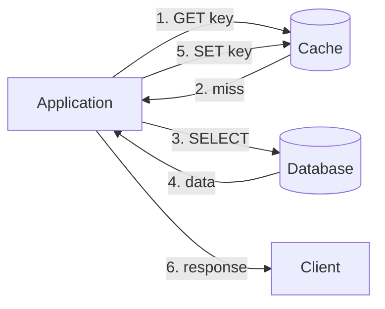
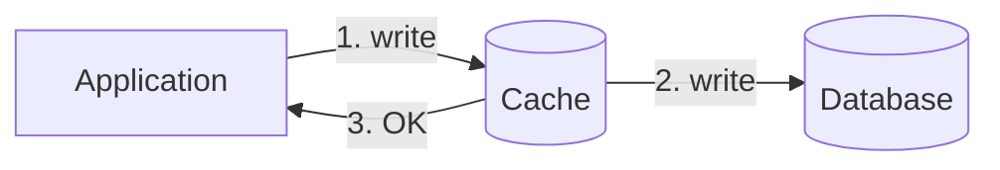
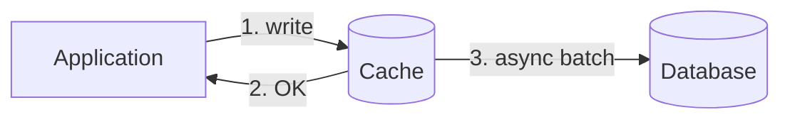
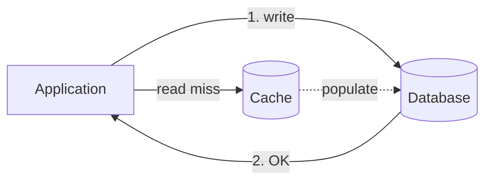
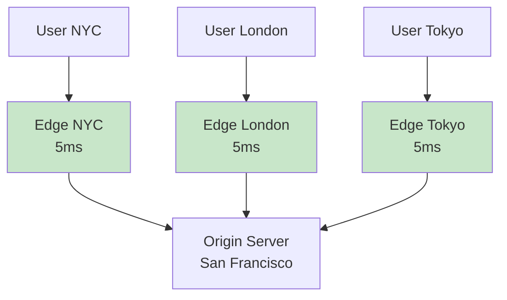

# Кэширование (Caching)

## Зачем кэшировать

```
Без кэша:
User → API → Database (50ms) → API → User
Latency: 50ms, DB load: high

С кэшем:
User → API → Cache (1ms) → API → User  (cache hit)
User → API → Cache miss → DB → Cache → User (cache miss)
Latency: 1-50ms, DB load: low
```

**Типичные выигрыши:**
- Latency: 50ms → 1ms (50x)
- DB load: 10,000 QPS → 1,000 QPS (90% cache hit rate)

---

## Стратегии кэширования

### Cache-Aside (Lazy Loading)



**Как работает:**
1. Приложение проверяет кэш
2. Cache miss → читаем из БД
3. Сохраняем в кэш
4. Возвращаем данные

```python
def get_user(user_id):
    # 1. Try cache
    user = cache.get(f"user:{user_id}")
    if user:
        return user

    # 2. Cache miss - read from DB
    user = db.query("SELECT * FROM users WHERE id = ?", user_id)

    # 3. Populate cache
    cache.set(f"user:{user_id}", user, ttl=3600)

    return user
```

| Плюсы | Минусы |
|-------|--------|
| Простая реализация | Первый запрос всегда медленный |
| Кэшируется только то, что реально нужно | Cache miss penalty |
| Отказ кэша не ломает систему | Данные могут устареть |

---

### Write-Through



**Как работает:** Каждая запись идёт сначала в кэш, кэш синхронно пишет в БД.

| Плюсы | Минусы |
|-------|--------|
| Кэш всегда актуален | Write latency выше |
| Простая модель consistency | Пишем в кэш даже редко читаемое |

---

### Write-Behind (Write-Back)



**Как работает:** Пишем в кэш, OK клиенту. Кэш асинхронно сбрасывает в БД.

| Плюсы | Минусы |
|-------|--------|
| Очень быстрый write | Риск потери данных |
| Батчинг записей в БД | Сложнее в реализации |
| Сглаживает пики нагрузки | Eventual consistency |

**Используется в:** CPU cache, OS page cache, Redis с persistence

---

### Write-Around



**Как работает:** Пишем напрямую в БД, кэш наполняется только при чтении.

| Плюсы | Минусы |
|-------|--------|
| Кэш не засоряется write-only данными | Первое чтение медленное |
| Проще, чем write-through | Write потом read = miss |

---

## Сравнение стратегий

| Стратегия | Read latency | Write latency | Consistency | Use case |
|-----------|--------------|---------------|-------------|----------|
| Cache-Aside | Miss: high | N/A (direct DB) | Eventual | Общий случай, read-heavy |
| Write-Through | Always low | High | Strong | Критичная consistency |
| Write-Behind | Always low | Very low | Eventual | Write-heavy, OK терять |
| Write-Around | Miss: high | Low | Eventual | Write-heavy, read редко |

---

## Cache Invalidation

> "There are only two hard things in CS: cache invalidation and naming things."

### Стратегии инвалидации

**1. TTL (Time-To-Live)**
```python
cache.set("user:123", user_data, ttl=3600)  # 1 час
```
- Просто
- Данные могут устареть до TTL
- Stale данные после update до истечения TTL

**2. Event-based Invalidation**
```python
def update_user(user_id, data):
    db.update(user_id, data)
    cache.delete(f"user:{user_id}")  # invalidate
```
- Актуальность данных
- Нужно не забыть во всех местах
- Race condition возможен

**3. Version-based**
```python
cache_key = f"user:{user_id}:v{user.version}"
```
- Нет проблем с invalidation
- Старые версии могут накапливаться

---

## Redis vs Memcached

| Аспект | Redis | Memcached |
|--------|-------|-----------|
| Структуры данных | Strings, Lists, Sets, Hashes, Sorted Sets | Только strings |
| Persistence | RDB, AOF | Нет |
| Репликация | Master-Slave | Нет (client-side) |
| Pub/Sub | Да | Нет |
| Lua scripting | Да | Нет |
| Multithreading | Single-threaded* | Multi-threaded |
| Memory efficiency | Менее эффективен | Более эффективен |

*Redis 6+ имеет I/O threading

### Когда что выбирать

**Redis:**
- Нужны структуры данных (leaderboard, rate limiting, sessions)
- Нужна persistence
- Нужен Pub/Sub
- Атомарные операции (INCR, LPUSH, etc.)

**Memcached:**
- Простой key-value кэш
- Максимальная производительность
- Экономия памяти
- Legacy системы

---

## CDN (Content Delivery Network)

### Что это
Географически распределённая сеть серверов для доставки статического контента ближе к пользователю.



### Как работает

```
1. User запрашивает image.jpg
2. DNS резолвит cdn.example.com → ближайший Edge
3. Edge проверяет кэш:
   - Hit → возвращает из кэша (5ms)
   - Miss → запрашивает Origin, кэширует, возвращает (100ms first, 5ms after)
```

### Pull vs Push CDN

**Pull CDN:**
```
Origin загружает файл → CDN ничего не знает
User запрашивает → Edge идёт к Origin → кэширует
+ Автоматически, не нужно управлять
- Первый запрос медленный (cache miss)
```

**Push CDN:**
```
Origin загружает файл → отправляет на CDN
User запрашивает → Edge уже имеет файл
+ Нет cold start
- Нужно управлять загрузкой
- Занимает storage даже для непопулярного контента
```

### Cache-Control Headers

```http
Cache-Control: public, max-age=31536000, immutable
```

| Директива | Значение |
|-----------|----------|
| `public` | CDN может кэшировать |
| `private` | Только браузер (user-specific данные) |
| `max-age=N` | Кэшировать N секунд |
| `no-cache` | Валидировать с origin каждый раз |
| `no-store` | Никогда не кэшировать |
| `immutable` | Контент не изменится (versioned assets) |

### Типичные TTL

| Контент | TTL | Почему |
|---------|-----|--------|
| Версионированные assets (`app.a1b2c3.js`) | 1 год | Immutable, новая версия = новый URL |
| Изображения | 1 день - 1 неделя | Редко меняются |
| API responses | Секунды или no-cache | Часто меняются |
| HTML | Short или no-cache | Должен быть свежим |

---

## Cache Stampede (Thundering Herd)

### Проблема
TTL истекает → все запросы одновременно идут в БД → БД падает.

```
Сценарий:
- 10,000 RPS на один ключ
- TTL истёк
- 10,000 запросов одновременно в БД
- БД перегружена
```

### Решения

**1. Locking (Mutex)**
```python
def get_with_lock(key):
    value = cache.get(key)
    if value:
        return value

    if cache.set(f"lock:{key}", "1", nx=True, ex=10):
        # Только один поток обновляет
        value = db.query(key)
        cache.set(key, value, ex=3600)
        cache.delete(f"lock:{key}")
        return value
    else:
        # Остальные ждут и retry
        time.sleep(0.1)
        return get_with_lock(key)
```

**2. Probabilistic Early Expiration**
```python
def get_with_early_refresh(key, ttl=3600, beta=1):
    value, expiry = cache.get_with_expiry(key)

    # Чем ближе к истечению, тем выше шанс обновить
    remaining = expiry - time.now()
    if remaining < ttl * random() * beta:
        # Refresh в фоне
        refresh_async(key)

    return value
```

**3. Background Refresh**
```python
# Фоновый процесс обновляет популярные ключи ДО истечения TTL
# Ключ никогда не истекает для пользователей
```

---

## Практические вопросы на интервью

### "Где бы вы добавили кэширование?"

```
Слои кэширования (от клиента к БД):

1. Browser cache (Cache-Control headers)
2. CDN (статика, иногда API)
3. API Gateway cache
4. Application cache (Redis)
5. Database query cache
6. Database buffer pool

Правило: кэшировать как можно ближе к клиенту
```

### "Как обеспечить consistency между кэшем и БД?"

```
1. Write-through: синхронно обновляем оба
2. Cache-aside + invalidation: удаляем из кэша при update
3. TTL: eventual consistency, данные освежаются периодически

Pattern для cache-aside:
def update_user(user_id, data):
    db.update(user_id, data)       # 1. Update DB
    cache.delete(f"user:{user_id}") # 2. Delete cache
    # НЕ cache.set() — пусть следующий read заполнит
    # Избегаем race condition
```

### "Как бы кэшировали ленту Twitter?"

```
Timeline кэширование:
1. Pre-compute: для каждого пользователя храним готовую ленту в Redis
2. При новом твите: fan-out в ленты фолловеров
3. Для celebrities: не fan-out, pull при запросе (гибридный подход)

Структура в Redis:
timeline:{user_id} → sorted set by timestamp
    tweet_id_1: 1699123456
    tweet_id_2: 1699123457
    ...

ZREVRANGE timeline:123 0 20  → последние 20 твитов
```
