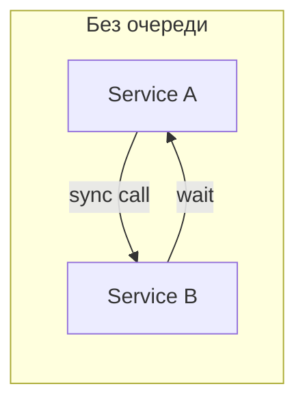
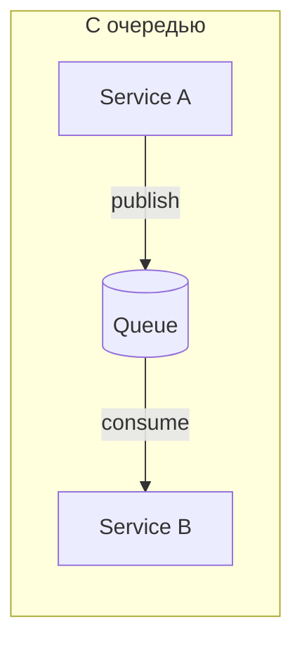
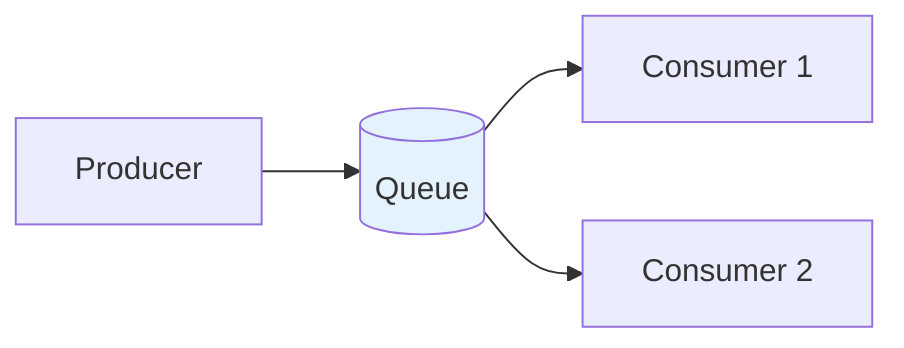
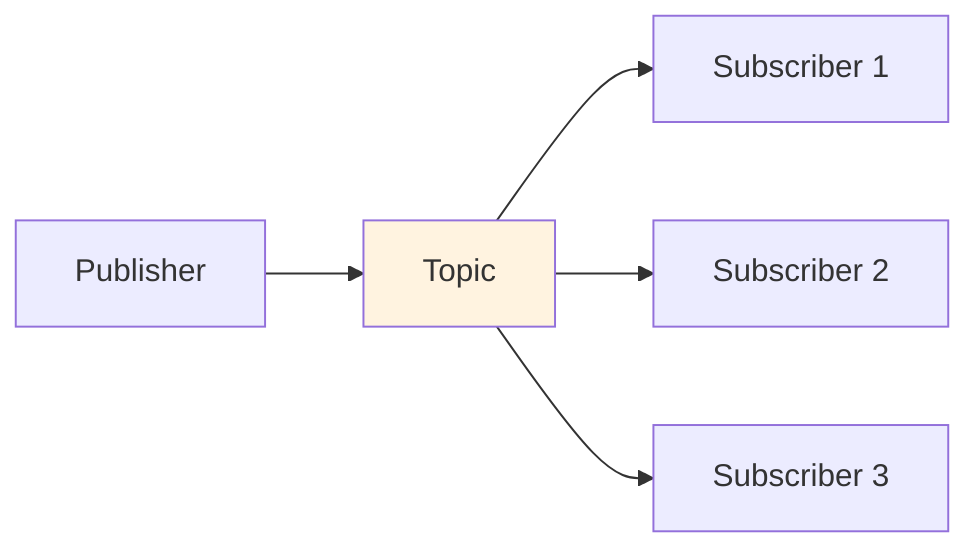
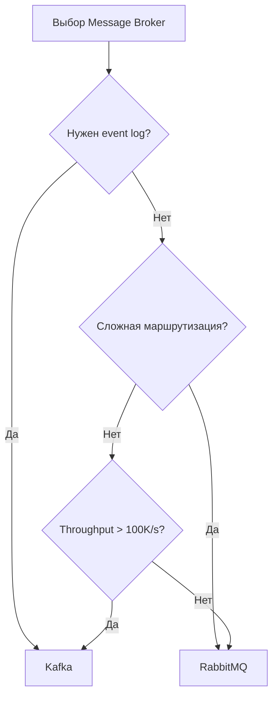
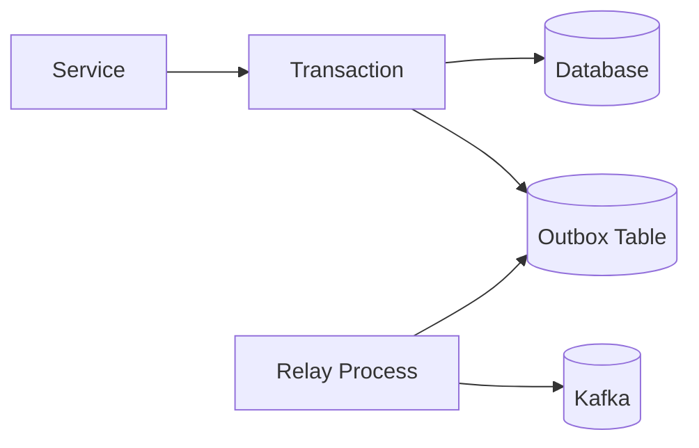
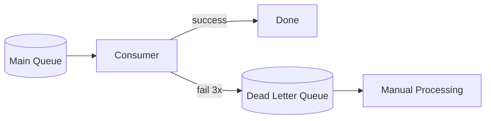
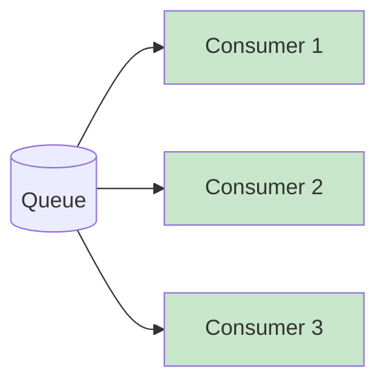
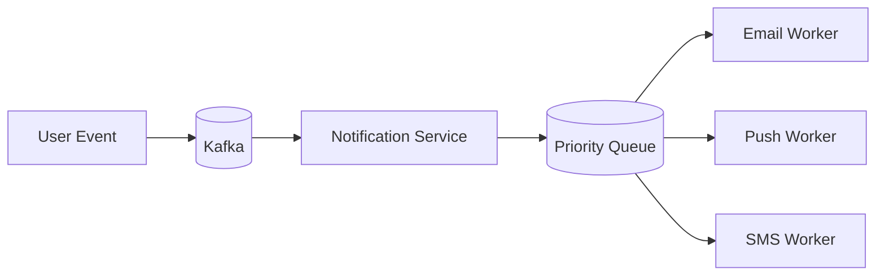

# Очереди сообщений (Message Queues)

## Зачем нужны очереди





**Проблемы синхронных вызовов:**
- Service B упал → Service A тоже падает
- Service B медленный → Service A ждёт
- Пик нагрузки → оба перегружены

**Что даёт очередь:**
- **Decoupling:** A не знает о B, только об очереди
- **Buffering:** Очередь держит сообщения при пиках
- **Resilience:** B может быть недоступен, сообщения подождут
- **Scaling:** Можно добавить consumers

---

## Message Queue vs Pub/Sub

### Message Queue (Point-to-Point)



- Одно сообщение → один consumer
- Load balancing между consumers
- Сообщение удаляется после обработки

**Use cases:** Task processing, job queues, order processing

### Pub/Sub (Publish-Subscribe)



- Одно сообщение → все subscribers
- Fan-out pattern
- Каждый subscriber получает копию

**Use cases:** Notifications, event broadcasting, real-time updates

---

## Kafka vs RabbitMQ

### Когда что использовать



### Детальное сравнение

| Аспект | Kafka | RabbitMQ |
|--------|-------|----------|
| Модель | Log (append-only) | Queue (удаление после обработки) |
| Ordering | Per partition | Per queue |
| Retention | Временное хранение (дни/недели) | До consume |
| Throughput | Миллионы msg/sec | Тысячи msg/sec |
| Latency | ~5ms | ~1ms |
| Replay | Да (перечитать с offset) | Нет (сообщение удалено) |
| Routing | Простой (topic + partition) | Сложный (exchanges, bindings) |
| Протокол | Kafka protocol | AMQP |

### Kafka — когда выбирать

```
✓ Event sourcing (история событий)
✓ Stream processing (Kafka Streams, Flink)
✓ Log aggregation (собираем логи со всех сервисов)
✓ Metrics pipeline
✓ Нужен replay (перечитать события)
✓ Очень высокий throughput

Архитектура Kafka:
┌─────────────────────────────────────────┐
│                Topic                     │
├─────────────┬─────────────┬─────────────┤
│ Partition 0 │ Partition 1 │ Partition 2 │
│ [msg1,msg2] │ [msg3,msg4] │ [msg5,msg6] │
└─────────────┴─────────────┴─────────────┘
     ↑              ↑              ↑
  Consumer 1    Consumer 2    Consumer 3
  (group A)     (group A)     (group A)
```

### RabbitMQ — когда выбирать

```
✓ Task queues (web → worker)
✓ RPC pattern (request-response через очередь)
✓ Сложная маршрутизация (routing keys, headers)
✓ Priority queues
✓ Delay/scheduling
✓ Не нужен replay, важна простота

Exchanges в RabbitMQ:
┌─────────────┐
│   Exchange  │ ← routing rules
├─────────────┤
│  Direct     │ → exact match routing key
│  Topic      │ → pattern match (orders.*)
│  Fanout     │ → все очереди
│  Headers    │ → по headers
└─────────────┘
```

---

## Delivery Guarantees

### At-Most-Once

```
Producer → Broker (no ack) → Consumer
Сообщение может потеряться, но не задублируется

Когда OK:
- Метрики (потерять одну точку не критично)
- Логи (пропустить строку OK)
```

### At-Least-Once

```
Producer → Broker → Ack
Consumer → Process → Ack to Broker

Retry при ошибке = возможны дубликаты

Когда OK:
- Idempotent операции
- С дедупликацией на стороне consumer
```

### Exactly-Once

```
Сложно! Требует:
- Idempotent producer (Kafka)
- Transactional outbox pattern
- Consumer с дедупликацией

Когда нужно:
- Финансовые транзакции
- Критичные бизнес-события
```

---

## Паттерны

### Transactional Outbox

**Проблема:** Как атомарно записать в БД и отправить событие?



```sql
-- В одной транзакции:
BEGIN;
INSERT INTO orders (id, user_id, total) VALUES (1, 42, 100);
INSERT INTO outbox (event_type, payload) VALUES ('OrderCreated', '{"order_id": 1}');
COMMIT;

-- Отдельный процесс читает outbox и отправляет в Kafka
-- После успешной отправки удаляет из outbox
```

### Dead Letter Queue (DLQ)



**Когда использовать:**
- Poison messages (невозможно обработать)
- Retry limit exceeded
- Нужен manual review

### Competing Consumers



**Масштабирование:**
- Больше consumers = быстрее обработка
- Автоматический load balancing
- Consumer упал → другие подхватят

**Важно:** Ordering не гарантирован при нескольких consumers!

---

## Практические числа

| Система | Throughput | Latency | Max message size |
|---------|------------|---------|------------------|
| Kafka | 1M+ msg/sec per broker | 2-10ms | 1MB default (configurable) |
| RabbitMQ | 20-50K msg/sec | <1ms | 128MB (not recommended) |
| AWS SQS | Unlimited (managed) | 20-50ms | 256KB |
| Redis Streams | 100K+ msg/sec | <1ms | 512MB |

---

## Практические вопросы на интервью

### "Как бы вы спроектировали систему уведомлений?"



```
1. События в Kafka (event sourcing, можно replay)
2. Notification Service определяет каналы и приоритет
3. Priority Queue (RabbitMQ) для разных каналов
4. Отдельные workers для каждого канала
5. DLQ для failed notifications
6. Rate limiting per user (не спамить)
```

### "Как обеспечить exactly-once processing?"

```
Вариант 1: Idempotent consumer
- Храни processed message IDs в БД
- Перед обработкой проверяй: уже обработано?
- SET message_id NX в Redis с TTL

Вариант 2: Transactional outbox + Idempotent key
- Генерируй idempotency key на producer
- Consumer использует его для дедупликации

Вариант 3: Kafka transactions (если весь pipeline в Kafka)
- Atomic read-process-write
- Сложнее в настройке
```

### "Kafka partition key — как выбрать?"

```
Partition key определяет:
1. Какой partition получит сообщение
2. Ordering (гарантирован внутри partition)
3. Parallelism (один partition = один consumer в group)

Хороший ключ:
- user_id: все события пользователя в порядке
- order_id: все события заказа в порядке
- tenant_id: изоляция между клиентами

Плохой ключ:
- timestamp: все на одном partition
- null: random distribution (нет ordering)
- country: неравномерное распределение
```

### "Как обрабатывать backpressure?"

```
Backpressure: consumers не успевают за producers

Решения:
1. Больше consumers (scaling)
2. Больше partitions (Kafka)
3. Rate limiting на producer
4. Sampling (обрабатывать N% сообщений)
5. Drop old messages (при переполнении)
6. Alert и manual intervention

Мониторинг:
- Consumer lag (Kafka)
- Queue depth (RabbitMQ)
- Processing rate vs incoming rate
```
