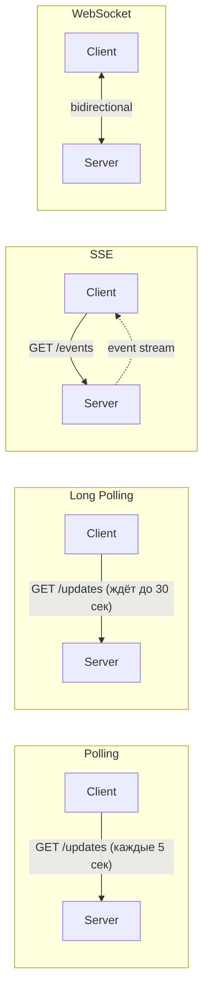

# API и протоколы коммуникации

## REST vs GraphQL vs gRPC

### Быстрое сравнение

| Аспект | REST | GraphQL | gRPC |
|--------|------|---------|------|
| Формат | JSON | JSON | Protocol Buffers (binary) |
| Транспорт | HTTP/1.1 | HTTP/1.1 | HTTP/2 |
| Схема | OpenAPI (опционально) | Строгая (обязательно) | .proto (обязательно) |
| Overfetching | Да | Нет | Нет |
| Типизация | Нет (JSON) | Да | Да |
| Browser support | Отличная | Отличная | Ограниченная |
| Latency | Средняя | Средняя | Низкая |
| Use case | Public APIs | Сложные клиенты | Microservices |

---

## REST

### Когда выбирать
- Public API (понятен всем, много инструментов)
- Simple CRUD операции
- Кэширование важно (HTTP caching works out of box)
- Разные клиенты (web, mobile, third-party)

### Принципы хорошего REST API

```
Resources (существительные, не глаголы):
✓ GET /users/123
✗ GET /getUser?id=123

HTTP методы:
GET    - читать (idempotent)
POST   - создать
PUT    - заменить целиком (idempotent)
PATCH  - частичное обновление
DELETE - удалить (idempotent)

Статус коды:
200 OK           - успех
201 Created      - создано (POST)
204 No Content   - успех без тела (DELETE)
400 Bad Request  - ошибка клиента
401 Unauthorized - не аутентифицирован
403 Forbidden    - нет прав
404 Not Found    - ресурс не найден
429 Too Many     - rate limit
500 Server Error - ошибка сервера
```

### Примеры endpoint'ов

```
GET    /users              - список пользователей
GET    /users/123          - один пользователь
POST   /users              - создать пользователя
PUT    /users/123          - обновить пользователя
DELETE /users/123          - удалить пользователя

GET    /users/123/orders   - заказы пользователя
POST   /users/123/orders   - создать заказ для пользователя

Фильтрация и пагинация:
GET /users?status=active&limit=20&offset=40
GET /users?cursor=abc123&limit=20
```

### Проблемы REST

**Overfetching:** Получаем больше данных, чем нужно
```json
// Нужен только name, но получаем всё:
GET /users/123
{
  "id": 123,
  "name": "John",
  "email": "...",
  "address": "...",
  "orders": [...],
  // ... 50 других полей
}
```

**Underfetching:** N+1 запросов
```
// Нужен user + orders + products
GET /users/123           // 1 запрос
GET /users/123/orders    // 2 запрос
GET /products/1          // 3 запрос
GET /products/2          // 4 запрос
...
```

---

## GraphQL

### Когда выбирать
- Разные клиенты с разными потребностями (mobile vs web)
- Сложные вложенные данные
- Быстрая итерация frontend без изменения backend
- Bandwidth критичен (mobile)

### Пример

```graphql
# Клиент запрашивает ровно то, что нужно:
query {
  user(id: 123) {
    name
    orders(last: 5) {
      id
      total
      products {
        name
        price
      }
    }
  }
}
```

### Плюсы и минусы

| Плюсы | Минусы |
|-------|--------|
| Один endpoint, клиент выбирает данные | Сложность на backend |
| Нет over/underfetching | Кэширование сложнее (POST запросы) |
| Строгая типизация | N+1 проблема на backend (нужен DataLoader) |
| Отличный developer experience | Rate limiting сложнее (сложность запроса) |
| Самодокументирующийся (introspection) | Security: сложные запросы могут положить сервер |

### N+1 в GraphQL

```graphql
query {
  users {        # 1 запрос к users
    orders {     # N запросов к orders (для каждого user)
      products { # M запросов к products (для каждого order)
      }
    }
  }
}
```

**Решение: DataLoader**
```javascript
const orderLoader = new DataLoader(userIds =>
  db.orders.findAll({ where: { userId: userIds } })
);
// Батчит все userIds в один SQL запрос
```

---

## gRPC

### Когда выбирать
- Service-to-service коммуникация (microservices)
- Высокие требования к latency
- Streaming нужен (bidirectional)
- Строгий контракт между сервисами
- Polyglot (разные языки, одна схема)

### Пример .proto

```protobuf
syntax = "proto3";

service UserService {
  rpc GetUser(GetUserRequest) returns (User);
  rpc ListUsers(ListUsersRequest) returns (stream User);
  rpc CreateUser(CreateUserRequest) returns (User);
}

message User {
  int64 id = 1;
  string name = 2;
  string email = 3;
}

message GetUserRequest {
  int64 id = 1;
}
```

### Типы gRPC вызовов

```
Unary:          Client ──request──> Server ──response──> Client
Server stream:  Client ──request──> Server ══response══> Client
Client stream:  Client ══request══> Server ──response──> Client
Bidirectional:  Client ══════════════════════════════════> Server
                       <══════════════════════════════════
```

### Плюсы и минусы

| Плюсы | Минусы |
|-------|--------|
| Binary = быстрее и компактнее | Не читается человеком |
| HTTP/2 multiplexing | Сложнее отлаживать |
| Строгая типизация | Browser поддержка через grpc-web |
| Code generation | Нужен .proto для всех сервисов |
| Bidirectional streaming | Более сложная инфраструктура |

---

## Real-time коммуникация

### Сравнение подходов



### Polling

```javascript
// Клиент каждые N секунд
setInterval(() => {
  fetch('/api/updates').then(...)
}, 5000);
```

| Плюсы | Минусы |
|-------|--------|
| Просто реализовать | Задержка (до интервала) |
| Работает везде | Лишняя нагрузка на сервер |
| Stateless | Неэффективно при редких updates |

**Когда использовать:** Простые случаи, нечастые updates, legacy клиенты

---

### Long Polling

```javascript
async function longPoll() {
  const response = await fetch('/api/updates?timeout=30');
  handleUpdate(response);
  longPoll(); // сразу следующий запрос
}
```

| Плюсы | Минусы |
|-------|--------|
| Меньше задержка чем polling | Держит connections открытыми |
| Работает через firewalls | Сложнее масштабировать |
| Fallback если WebSocket не работает | Overhead HTTP headers |

**Когда использовать:** Когда WebSocket недоступен, умеренный real-time

---

### Server-Sent Events (SSE)

```javascript
// Клиент
const source = new EventSource('/api/events');
source.onmessage = (event) => {
  console.log(event.data);
};

// Сервер
res.setHeader('Content-Type', 'text/event-stream');
res.write(`data: ${JSON.stringify(update)}\n\n`);
```

| Плюсы | Минусы |
|-------|--------|
| Простой API | Только server → client |
| Auto-reconnect | Лимит connections в браузере (6) |
| Работает через HTTP/1.1 | Text only (нужен JSON) |

**Когда использовать:** Notifications, live feeds, stock tickers — когда поток односторонний

---

### WebSocket

```javascript
const ws = new WebSocket('wss://example.com/socket');

ws.onopen = () => ws.send('Hello');
ws.onmessage = (event) => console.log(event.data);
```

| Плюсы | Минусы |
|-------|--------|
| Bidirectional | Сложнее масштабировать (sticky sessions) |
| Low latency | Нужна отдельная инфраструктура |
| Binary support | Firewalls могут блокировать |
| Эффективен для частых сообщений | Connection management |

**Когда использовать:** Chat, gaming, collaborative editing, trading

---

### Сравнительная таблица

| Метод | Latency | Server → Client | Client → Server | Сложность |
|-------|---------|-----------------|-----------------|-----------|
| Polling | Высокая | Да | Да (через POST) | Низкая |
| Long Polling | Средняя | Да | Да | Низкая |
| SSE | Низкая | Да | Нет | Низкая |
| WebSocket | Очень низкая | Да | Да | Высокая |

---

## API Versioning

### Подходы

**1. URL versioning**
```
GET /v1/users
GET /v2/users
+ Очевидно, легко кэшировать
- Дублирование кода
```

**2. Header versioning**
```
GET /users
Accept-Version: v2
+ Чистые URL
- Менее discoverable
```

**3. Query parameter**
```
GET /users?version=2
+ Просто для клиентов
- Сложнее кэшировать
```

**Рекомендация:** URL versioning для public APIs (понятнее), header для internal

---

## Rate Limiting

### Алгоритмы

**Token Bucket:**
```
Bucket с N токенами, пополняется R токенов/сек
Каждый запрос забирает 1 токен
Нет токенов → 429 Too Many Requests

+ Допускает burst
+ Простой и эффективный
```

**Sliding Window:**
```
Считаем запросы за последние N секунд
Точнее чем fixed window

Пример в Redis:
ZADD rate_limit:{user_id} {timestamp} {request_id}
ZREMRANGEBYSCORE rate_limit:{user_id} 0 {timestamp - window}
ZCARD rate_limit:{user_id}
```

### Практика

```
Response headers:
X-RateLimit-Limit: 100      # лимит
X-RateLimit-Remaining: 95   # осталось
X-RateLimit-Reset: 1699999  # когда сбросится (Unix timestamp)
Retry-After: 60             # когда retry (при 429)
```

---

## Практические вопросы на интервью

### "REST или GraphQL для вашего API?"

```
REST если:
- Public API (сторонние разработчики)
- Simple CRUD
- Команда не знает GraphQL
- HTTP caching важен

GraphQL если:
- Много разных клиентов (mobile нужны минимальные данные)
- Сложные связанные данные
- Фронтенд хочет автономность
- Bandwidth критичен
```

### "Как бы спроектировали real-time систему?"

```
Chat application:
- WebSocket для сообщений (bidirectional, low latency)
- Redis Pub/Sub для broadcast между серверами
- Long polling как fallback
- REST для history, user management

Live dashboard:
- SSE достаточно (только server → client)
- Simpler than WebSocket
- Auto-reconnect из коробки
```

### "Как обрабатывать API backward compatibility?"

```
1. Additive changes OK (новые поля)
2. Не удалять поля — deprecate
3. Версионирование для breaking changes
4. Sunset policy (v1 работает ещё 6 месяцев)
5. Migration guide для клиентов

Пример deprecation:
{
  "user_name": "john",     // deprecated
  "username": "john",      // new field
  "name": "John Doe"
}
```
