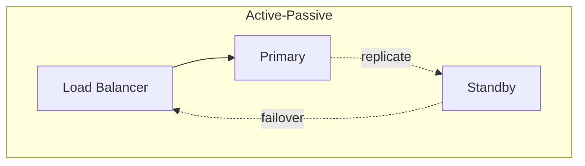
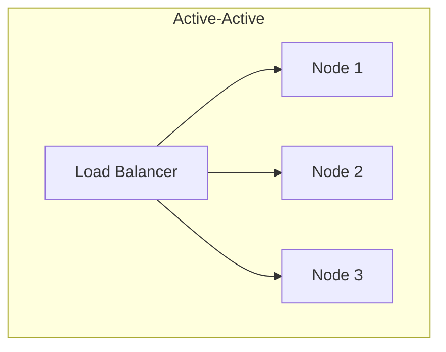
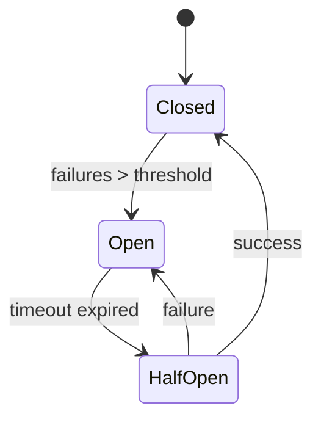

# Надёжность (Reliability)

## Ключевые метрики

### Availability (Доступность)

```
Availability = Uptime / (Uptime + Downtime)

"Nines" таблица:
┌──────────┬─────────────────┬─────────────────┐
│ Уровень  │ Uptime          │ Downtime/год    │
├──────────┼─────────────────┼─────────────────┤
│ 99%      │ "two nines"     │ 3.65 дня        │
│ 99.9%    │ "three nines"   │ 8.76 часов      │
│ 99.99%   │ "four nines"    │ 52.6 минут      │
│ 99.999%  │ "five nines"    │ 5.26 минут      │
└──────────┴─────────────────┴─────────────────┘
```

### Как считать availability системы

```
Последовательные компоненты (все нужны):
A(total) = A1 × A2 × A3
Пример: 99.9% × 99.9% × 99.9% = 99.7%

Параллельные компоненты (нужен хотя бы один):
A(total) = 1 - (1-A1) × (1-A2)
Пример: 1 - (1-0.999) × (1-0.999) = 99.9999%
```

**Вывод:** Redundancy критически важна для high availability.

---

## Redundancy (Избыточность)

### Типы redundancy



**Active-Passive (Hot Standby):**
- Primary обрабатывает трафик
- Standby синхронизирован, но idle
- При отказе primary → failover на standby



**Active-Active:**
- Все ноды обрабатывают трафик
- При отказе одной → остальные подхватывают
- Лучше утилизация ресурсов

### Redundancy на каждом уровне

```
DNS:          Multiple DNS providers
Load Balancer: Active-passive pair
Application:  Multiple instances (auto-scaling)
Database:     Primary + replicas
Cache:        Redis cluster
Storage:      Cross-region replication
```

---

## Circuit Breaker

### Проблема

```
Service A → Service B (медленный/мёртвый)
Service A ждёт timeout (30 сек)
Все threads Service A заблокированы
Service A тоже становится недоступным
Cascade failure!
```

### Решение: Circuit Breaker



**Состояния:**
- **Closed:** Нормальная работа, запросы проходят
- **Open:** Запросы сразу fail без вызова downstream
- **Half-Open:** Пробуем один запрос, если OK → Closed

### Пример конфигурации

```python
circuit_breaker = CircuitBreaker(
    failure_threshold=5,      # открыть после 5 ошибок
    success_threshold=3,      # закрыть после 3 успехов
    timeout=30,               # время в Open состоянии
    fallback=default_response # что возвращать при Open
)

@circuit_breaker
def call_external_service():
    return requests.get('http://external-service/api')
```

### Что отвечать при открытом circuit

```
Варианты fallback:
1. Cached response (stale но лучше чем ничего)
2. Default response (пустой список, default значение)
3. Graceful degradation (отключить фичу)
4. Error message (честно сказать что недоступно)
```

---

## Retry с Exponential Backoff

### Зачем backoff

```
Без backoff:
Service A: retry, retry, retry, retry... (DDoS своего же сервиса)
Service B: перегружен retry'ами

С exponential backoff:
Attempt 1: wait 1 sec
Attempt 2: wait 2 sec
Attempt 3: wait 4 sec
Attempt 4: wait 8 sec
...
```

### Пример реализации

```python
def retry_with_backoff(func, max_retries=5, base_delay=1):
    for attempt in range(max_retries):
        try:
            return func()
        except RetryableError:
            if attempt == max_retries - 1:
                raise

            delay = base_delay * (2 ** attempt)
            jitter = random.uniform(0, delay * 0.1)  # +/- 10%
            time.sleep(delay + jitter)
```

### Jitter — зачем нужен

```
Без jitter:
1000 клиентов упали
Все retry через 1 сек → 1000 запросов
Все retry через 2 сек → 1000 запросов
Thundering herd!

С jitter:
Каждый клиент retry в случайное время
Нагрузка распределена
```

### Когда retry, а когда нет

```
Retry имеет смысл:
- 5xx ошибки (сервер временно недоступен)
- Timeout (может сеть лагнула)
- 429 Too Many Requests (с Retry-After)
- Connection refused

Retry бесполезен:
- 4xx ошибки (клиент неправ, retry не поможет)
- 400 Bad Request
- 401/403 Auth errors
- 404 Not Found
```

---

## Idempotency (Идемпотентность)

### Что это

```
Операция идемпотентна, если многократное выполнение
даёт тот же результат, что и однократное.

Идемпотентно:
x = 5           (присвоение)
DELETE /users/1 (удаление)
PUT /users/1    (замена)

НЕ идемпотентно:
x = x + 1       (инкремент)
POST /users     (создание)
```

### Зачем нужна идемпотентность

```
Сценарий:
1. Клиент отправляет POST /payments (списать $100)
2. Сервер обработал, но ответ потерялся
3. Клиент делает retry
4. Без идемпотентности: списано $200!
```

### Idempotency Key

```python
# Клиент генерирует уникальный ключ
POST /payments
Idempotency-Key: 550e8400-e29b-41d4-a716-446655440000
{
  "amount": 100,
  "to": "user_123"
}

# Сервер
def process_payment(idempotency_key, request):
    # Проверяем, не обработан ли уже
    existing = redis.get(f"idem:{idempotency_key}")
    if existing:
        return existing  # Возвращаем сохранённый результат

    # Обрабатываем
    result = do_payment(request)

    # Сохраняем результат
    redis.setex(f"idem:{idempotency_key}", 86400, result)

    return result
```

### Практические рекомендации

```
1. Idempotency key генерирует КЛИЕНТ
   (сервер не знает что это retry)

2. Храни результат, а не факт выполнения
   (чтобы вернуть тот же response)

3. TTL разумный (24 часа обычно)
   (не хранить вечно)

4. Scope ключа: per user или per resource
   (user_123:payment:uuid)
```

---

## Timeouts

### Типы timeout'ов

```
Connection timeout: время на установку соединения
- Обычно короткий (1-5 сек)
- Если не можем connect, сервер скорее всего мёртв

Read timeout: время на получение ответа
- Зависит от операции
- Быстрые API: 5-30 сек
- Batch jobs: минуты

Total timeout: общее время на всю операцию
- Connection + все retries + все reads
```

### Рекомендации

```python
requests.get(url,
    connect_timeout=3,    # не ждать долго если сервер мёртв
    read_timeout=10,      # разумное время на ответ
    total_timeout=30      # включая retries
)
```

```
Анти-паттерн:
timeout = None  # бесконечно ждать

Почему плохо:
- Thread/connection заблокирован навсегда
- Resource exhaustion
- Каскадный отказ
```

---

## Health Checks

### Типы проверок

**Liveness probe:** "Процесс жив?"
```
GET /healthz
200 OK  → alive
5xx     → restart container
```

**Readiness probe:** "Готов принимать трафик?"
```
GET /ready
200 OK  → route traffic
5xx     → remove from load balancer

Проверяет:
- DB connection
- Cache connection
- Dependencies
- Warm-up completed
```

### Пример реализации

```python
@app.route('/healthz')
def liveness():
    return {'status': 'alive'}, 200

@app.route('/ready')
def readiness():
    checks = {
        'database': check_db_connection(),
        'redis': check_redis_connection(),
        'downstream': check_critical_service()
    }

    if all(checks.values()):
        return {'status': 'ready', 'checks': checks}, 200
    else:
        return {'status': 'not ready', 'checks': checks}, 503
```

---

## Graceful Degradation

### Стратегии

```
1. Отключение некритичных фич
   Рекомендации недоступны → показываем популярное

2. Снижение качества
   HD видео → SD (при высокой нагрузке)

3. Кэшированные данные
   Свежие данные недоступны → показываем stale

4. Static fallback
   Динамический контент → статическая страница
```

### Feature Flags для degradation

```python
if feature_flags.is_enabled('recommendations'):
    recs = recommendation_service.get(user)
else:
    recs = get_popular_items()  # fallback
```

---

## Практические вопросы на интервью

### "Как обеспечить 99.99% availability?"

```
1. Redundancy на каждом уровне:
   - 2+ instances каждого сервиса
   - Database: primary + sync replica
   - Multi-AZ deployment

2. Автоматический failover:
   - Health checks (liveness + readiness)
   - Auto-scaling groups
   - Database automatic failover

3. Защита от cascade failures:
   - Circuit breakers
   - Timeouts везде
   - Bulkheads (изоляция)

4. Graceful degradation:
   - Feature flags
   - Cached fallbacks

5. Monitoring & Alerting:
   - Detect issues fast
   - Автоматическое mitigation
```

### "Как обработать partial failure?"

```
Сценарий: User создаёт order, нужно:
1. Сохранить в DB ✓
2. Отправить email ✗ (сервис недоступен)
3. Обновить inventory ✓

Решения:
1. Saga pattern: компенсирующие транзакции
2. Outbox pattern: гарантированная доставка событий
3. Async processing: retry через очередь
4. Graceful: создать order, email отправить позже
```

### "Как предотвратить cascading failures?"


```
1. Circuit Breaker: быстро fail если downstream мёртв
2. Timeouts: не ждать вечно
3. Bulkheads: изолировать thread pools
4. Rate Limiting: не перегружать downstream
5. Fallbacks: graceful degradation
6. Async: через очередь, decoupling
```

### "Design retry strategy"

```python
retry_config = {
    'max_attempts': 3,
    'initial_delay': 1.0,
    'max_delay': 30.0,
    'exponential_base': 2,
    'jitter': True,

    'retry_on': [
        ConnectionError,
        TimeoutError,
        HTTPError(status_code=503),
        HTTPError(status_code=429),
    ],

    'dont_retry_on': [
        HTTPError(status_code=400),
        HTTPError(status_code=401),
        HTTPError(status_code=404),
    ]
}
```
