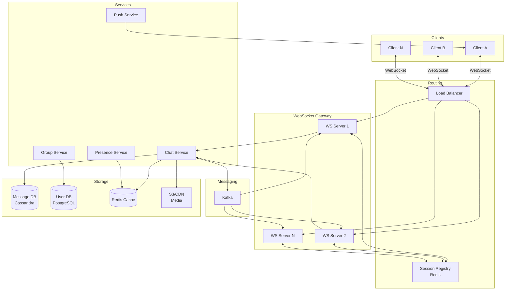
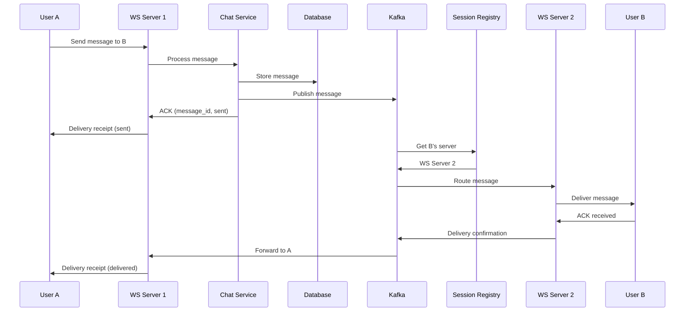
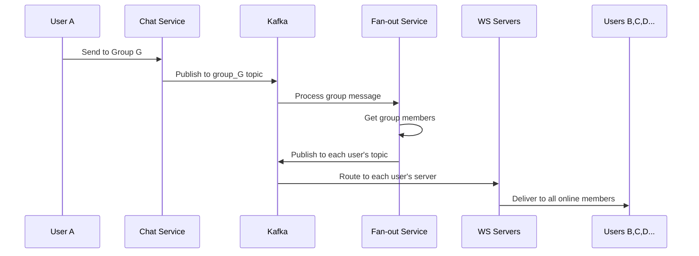
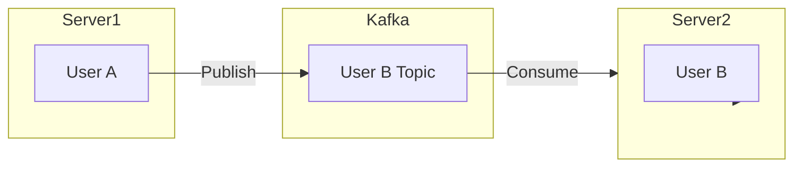
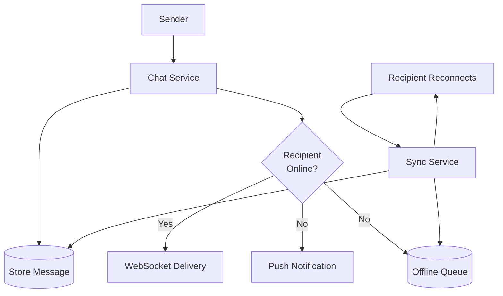

# Chat / Messaging System (WhatsApp / Slack)

## Уточняющие вопросы

- 1-on-1 чаты или групповые? Размер групп?
- Real-time или допустима задержка?
- Нужны ли media сообщения (фото, видео, файлы)?
- Delivery/read receipts?
- Онлайн-статус пользователей?
- История сообщений: хранить сколько?
- End-to-end encryption?
- Push notifications когда offline?
- Search по сообщениям?

---

## Requirements

### Functional
- 1-on-1 messaging
- Group chats (до 500 участников)
- Online/offline status
- Message delivery & read receipts
- Push notifications
- Message history
- Media sharing (images, files)
- (Опционально) E2E encryption

### Non-Functional
- **Low latency**: < 100ms для доставки
- **High availability**: 99.99%
- **Consistency**: сообщения не теряются, порядок сохраняется
- **Scalability**: 500M DAU, 50B messages/day
- **Durability**: сообщения хранятся годами

---

## Capacity Estimation

### Assumptions
- 500M DAU
- Каждый отправляет 40 сообщений/день
- Средний размер сообщения: 100 bytes
- 20% сообщений с media (avg 200KB)
- 1M concurrent connections per server

### Calculations

**Messages per day:**
```
500M × 40 = 20B messages/day
```

**QPS:**
```
20B / 86400 ≈ 230K messages/sec
Peak: 230K × 3 = 700K messages/sec
```

**Storage (messages):**
```
20B × 100B = 2 TB/day (text only)
За год: 2TB × 365 = 730 TB
```

**Storage (media):**
```
20B × 20% × 200KB = 800 TB/day
За год: ~300 PB (нужен CDN + tiered storage)
```

**Bandwidth:**
```
Text: 230K × 100B = 23 MB/s
Media: 46K × 200KB = 9.2 GB/s
```

**WebSocket connections:**
```
500M DAU / 500K per server = 1000 chat servers
```

---

## High-Level Design



### Компоненты

**WebSocket Gateway**
- Persistent connections с клиентами
- Stateful: хранит user → connection mapping
- Heartbeat для keep-alive
- Handles reconnection

**Session Registry (Redis)**
- Mapping: user_id → ws_server_id
- Pub/sub для routing между серверами
- TTL для stale sessions

**Chat Service**
- Message validation
- Persistence в БД
- Fan-out для групповых чатов
- Media upload orchestration

**Presence Service**
- Online/offline status
- Last seen timestamp
- Typing indicators

**Message Queue (Kafka)**
- Pub/sub для real-time delivery
- Guaranteed ordering per chat
- Replay capability

---

## Message Flow

### 1-on-1 Message Flow



### Group Message Flow



---

## API Design

### WebSocket Messages

**Connect & Authenticate:**
```json
// Client → Server
{
    "type": "auth",
    "token": "jwt_token_here"
}

// Server → Client
{
    "type": "auth_success",
    "user_id": "user_123",
    "session_id": "sess_456"
}
```

**Send Message:**
```json
// Client → Server
{
    "type": "message",
    "id": "client_msg_001",  // client-generated for dedup
    "chat_id": "chat_789",
    "content": "Hello!",
    "timestamp": 1705312800000
}

// Server → Client (ACK)
{
    "type": "message_ack",
    "client_id": "client_msg_001",
    "message_id": "msg_abc123",
    "status": "sent",
    "timestamp": 1705312800050
}
```

**Receive Message:**
```json
// Server → Client
{
    "type": "message",
    "message_id": "msg_abc123",
    "chat_id": "chat_789",
    "sender_id": "user_456",
    "content": "Hello!",
    "timestamp": 1705312800000
}

// Client → Server (ACK)
{
    "type": "message_received",
    "message_id": "msg_abc123"
}
```

**Typing Indicator:**
```json
// Client → Server
{
    "type": "typing",
    "chat_id": "chat_789",
    "is_typing": true
}
```

**Read Receipt:**
```json
// Client → Server
{
    "type": "read",
    "chat_id": "chat_789",
    "last_read_message_id": "msg_abc123"
}
```

### REST API (History, Media)

**Get Message History:**
```http
GET /api/v1/chats/{chat_id}/messages?before={message_id}&limit=50

{
    "messages": [...],
    "has_more": true,
    "cursor": "next_page_cursor"
}
```

**Upload Media:**
```http
POST /api/v1/media/upload
Content-Type: multipart/form-data

Response:
{
    "media_id": "media_123",
    "url": "https://cdn.example.com/...",
    "thumbnail_url": "https://cdn.example.com/thumb/..."
}
```

---

## Data Model

### Messages Table (Cassandra)
```sql
CREATE TABLE messages (
    chat_id         UUID,
    message_id      TIMEUUID,  -- sortable by time
    sender_id       VARCHAR,
    content         TEXT,
    content_type    VARCHAR,   -- text, image, file
    media_url       TEXT,
    status          VARCHAR,   -- sent, delivered, read
    created_at      TIMESTAMP,

    PRIMARY KEY (chat_id, message_id)
) WITH CLUSTERING ORDER BY (message_id DESC);
```

**Почему Cassandra:**
- Отличная write performance
- Партиционирование по chat_id
- Time-series friendly (TIMEUUID)
- Автоматический TTL для старых сообщений

### Chats Table (PostgreSQL)
```sql
CREATE TABLE chats (
    id              UUID PRIMARY KEY,
    type            VARCHAR(10) NOT NULL,  -- direct, group
    name            VARCHAR(100),          -- for groups
    created_at      TIMESTAMP DEFAULT NOW(),
    updated_at      TIMESTAMP DEFAULT NOW()
);

CREATE TABLE chat_members (
    chat_id         UUID REFERENCES chats(id),
    user_id         VARCHAR(50) NOT NULL,
    role            VARCHAR(20) DEFAULT 'member',
    joined_at       TIMESTAMP DEFAULT NOW(),
    last_read_at    TIMESTAMP,
    muted_until     TIMESTAMP,

    PRIMARY KEY (chat_id, user_id)
);

CREATE INDEX idx_user_chats ON chat_members(user_id);
```

### User Sessions (Redis)
```
Key: session:{user_id}
Value: {
    "ws_server": "ws-server-42",
    "connected_at": 1705312800,
    "last_active": 1705312900,
    "device": "iPhone"
}
TTL: 5 minutes (refreshed by heartbeat)
```

### Presence (Redis)
```
Key: presence:{user_id}
Value: {
    "status": "online",
    "last_seen": 1705312900
}
TTL: 5 minutes
```

---

## Deep Dives

### 1. Message Ordering & Consistency

**Problem:** Сообщения могут приходить не в порядке

**Solution: Logical timestamps (Lamport/Vector clocks)**

```python
class Message:
    chat_id: str
    sequence_num: int      # Per-chat sequence
    sender_clock: int      # Sender's local clock
    server_timestamp: int  # Server's timestamp
```

**Ordering strategy:**
1. Server присваивает sequence_num при получении
2. Клиент сортирует по sequence_num
3. При конфликтах — server_timestamp как tiebreaker

**Cassandra TIMEUUID:**
- Монотонно возрастающий
- Включает timestamp + random component
- Естественный порядок сортировки

### 2. Real-time Delivery Architecture

**WebSocket Connection Management:**

```python
class WebSocketServer:
    def __init__(self):
        self.connections = {}  # user_id → WebSocket
        self.redis = Redis()

    async def on_connect(self, user_id, ws):
        self.connections[user_id] = ws
        # Register in session registry
        await self.redis.hset(
            f"session:{user_id}",
            {"ws_server": self.server_id, "connected_at": now()}
        )
        # Subscribe to user's Kafka topic
        await self.kafka.subscribe(f"user_{user_id}")

    async def on_message(self, user_id, message):
        # Route to recipient
        recipient = message.recipient_id
        session = await self.redis.hgetall(f"session:{recipient}")

        if session:
            # Online: route through Kafka
            await self.kafka.publish(f"user_{recipient}", message)
        else:
            # Offline: queue for push notification
            await self.push_queue.publish(message)
```

**Cross-Server Routing:**



### 3. Group Chat Scalability

**Problem:** Группа с 500 участниками = 500 fan-out

**Solution 1: Lazy fan-out**
```python
async def send_group_message(message):
    # Store message once
    await store_message(message)

    # Get online members only
    members = await get_group_members(message.group_id)
    online = [m for m in members if await is_online(m)]

    # Fan-out only to online users
    for user_id in online:
        await deliver_to_user(user_id, message)

    # Offline users fetch on reconnect
```

**Solution 2: Read-time fan-out**
```python
# Don't fan-out at all
# Each user queries their groups on reconnect
async def on_reconnect(user_id):
    groups = await get_user_groups(user_id)
    for group_id in groups:
        last_read = await get_last_read(user_id, group_id)
        new_messages = await get_messages_after(group_id, last_read)
        await send_to_user(user_id, new_messages)
```

**Solution 3: Hybrid (WhatsApp approach)**
- Small groups (< 50): eager fan-out
- Large groups (> 50): lazy fan-out + pull

### 4. Offline Message Handling



```python
async def handle_offline_user(user_id, message):
    # Store in offline queue (Redis sorted set by timestamp)
    await redis.zadd(
        f"offline:{user_id}",
        {message.id: message.timestamp}
    )

    # Send push notification
    await push_service.send(
        user_id=user_id,
        title=f"New message from {message.sender_name}",
        body=message.content[:100]
    )

async def on_user_reconnect(user_id):
    # Get all offline messages
    message_ids = await redis.zrange(f"offline:{user_id}", 0, -1)
    messages = await fetch_messages(message_ids)

    # Deliver in order
    for msg in sorted(messages, key=lambda m: m.timestamp):
        await deliver_to_user(user_id, msg)

    # Clear offline queue
    await redis.delete(f"offline:{user_id}")
```

---

## Bottlenecks & Solutions

### Problem 1: WebSocket server failure
- **Issue**: Все connections на сервере теряются
- **Solution**:
  - Client auto-reconnect с exponential backoff
  - Session registry для quick routing recovery
  - Stateless app servers (state в Redis/Kafka)

### Problem 2: Hot groups (millions of members)
- **Issue**: Celebrity group = огромный fan-out
- **Solution**:
  - Pull-based для больших групп
  - Pagination при delivery
  - Rate limiting per group

### Problem 3: Message ordering across devices
- **Issue**: Один user на нескольких устройствах
- **Solution**:
  - Sync all devices через user topic
  - Vector clocks для conflict resolution
  - Last-write-wins для simple cases

### Problem 4: Media bandwidth
- **Issue**: 800 TB/day media
- **Solution**:
  - Direct upload to S3/CDN
  - Progressive download
  - Multiple quality versions
  - Thumbnail preview

### Problem 5: Presence at scale
- **Issue**: 500M users × presence updates = много трафика
- **Solution**:
  - Batch presence updates
  - Presence только для contacts
  - Subscribe on-demand (open chat)
  - Lazy updates (poll every 30s)

---

## Trade-offs для обсуждения

| Решение | Trade-off |
|---------|-----------|
| WebSocket vs Long polling | Complexity vs Latency |
| Eager vs Lazy fan-out | Latency vs Resource usage |
| Cassandra vs PostgreSQL | Scale vs Query flexibility |
| Store-and-forward vs P2P | Reliability vs Privacy |
| E2E encryption | Security vs Features (search) |

---

## Comparison: WhatsApp vs Slack

| Aspect | WhatsApp | Slack |
|--------|----------|-------|
| Scale | 2B users, E2E | 20M DAU, searchable |
| Storage | Minimal server-side | Full history |
| Groups | Max 1024 | Thousands |
| Media | Compressed, expiring | Full quality, permanent |
| Search | Local only | Server-side |
| Protocol | Signal Protocol | Custom |
