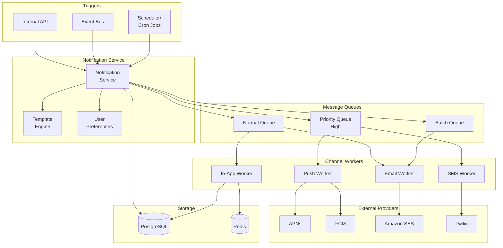
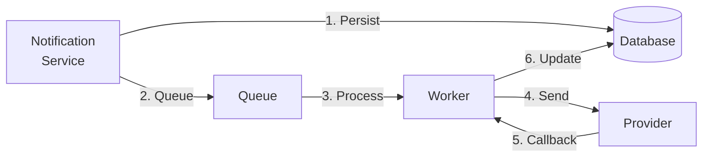
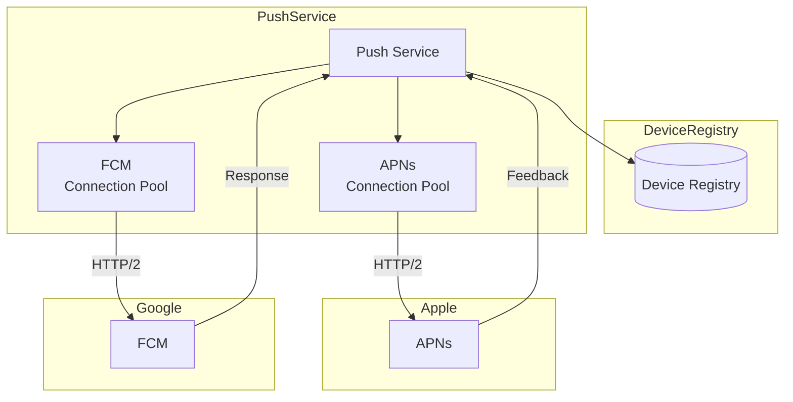

# Notification System

## Уточняющие вопросы

- Какие каналы нотификаций? (Push, SMS, Email, In-app)
- Какой объём? (1M/день или 1B/день)
- Real-time или допустима задержка?
- Нужны ли приоритеты? (urgent vs marketing)
- Нужен ли tracking доставки?
- User preferences (opt-in/opt-out)?
- Rate limiting per user?
- Шаблоны или произвольный контент?

---

## Requirements

### Functional
- Отправка push notifications (iOS, Android, Web)
- Отправка SMS
- Отправка Email
- In-app notifications
- User preferences management
- Template management
- Delivery tracking & analytics

### Non-Functional
- **Scalability**: 10M notifications/день
- **Latency**: < 5 sec для high priority
- **Reliability**: at-least-once delivery
- **Availability**: 99.9% uptime
- **Extensibility**: легко добавить новый канал

---

## Capacity Estimation

### Assumptions
- 10M notifications/день
- Distribution: 40% push, 30% email, 20% in-app, 10% SMS
- Peak: 5x average (evenings, campaigns)
- Retention: 30 days для in-app

### Calculations

**Average load:**
```
10M / 86400 ≈ 115 notifications/sec
```

**Peak load:**
```
115 × 5 = 575 notifications/sec
Campaign bursts: до 10,000/sec
```

**Storage (in-app notifications):**
```
500M users × 0.1% active × 20 notifications × 1KB = 1 GB
30 days retention = 30 GB
```

**External API costs:**
```
SMS: 10% × 10M = 1M SMS/день
Email: 30% × 10M = 3M emails/день
Push: 40% × 10M = 4M push/день
```

---

## High-Level Design



### Компоненты

**Notification Service**
- Принимает запросы на отправку
- Валидация и обогащение данных
- Проверка user preferences
- Роутинг в соответствующую очередь

**Template Engine**
- Хранение шаблонов (Handlebars, Jinja)
- Персонализация контента
- A/B testing вариантов
- Локализация

**User Preferences Service**
- Opt-in/opt-out per channel
- Quiet hours
- Frequency caps
- Channel preferences

**Priority Queues**
- High: OTP, security alerts (< 30 sec)
- Normal: transactional (< 5 min)
- Batch: marketing, digests (best effort)

**Channel Workers**
- Отдельный worker pool per channel
- Rate limiting to external APIs
- Retry logic с exponential backoff
- Circuit breaker для failing providers

---

## API Design

### Send Notification
```http
POST /api/v1/notifications
Content-Type: application/json

{
    "user_id": "user_123",
    "template_id": "order_shipped",
    "channels": ["push", "email"],
    "priority": "high",
    "data": {
        "order_id": "ORD-456",
        "tracking_url": "https://...",
        "delivery_date": "2024-01-20"
    },
    "options": {
        "send_at": "2024-01-15T10:00:00Z",  // scheduled
        "ttl": 3600,                         // expire if not sent
        "idempotency_key": "order-456-shipped"
    }
}

Response 202:
{
    "notification_id": "notif_789",
    "status": "queued",
    "channels": {
        "push": "pending",
        "email": "pending"
    }
}
```

### Send Bulk Notification
```http
POST /api/v1/notifications/bulk

{
    "template_id": "weekly_digest",
    "segment": "active_users_last_7d",
    "channels": ["email"],
    "priority": "low",
    "data": {
        "week": "2024-W02"
    }
}
```

### Get Notification Status
```http
GET /api/v1/notifications/{notification_id}

{
    "notification_id": "notif_789",
    "user_id": "user_123",
    "status": "delivered",
    "channels": {
        "push": {
            "status": "delivered",
            "delivered_at": "2024-01-15T10:00:05Z",
            "device": "iPhone"
        },
        "email": {
            "status": "opened",
            "sent_at": "2024-01-15T10:00:02Z",
            "opened_at": "2024-01-15T12:30:00Z"
        }
    }
}
```

### User Preferences
```http
GET /api/v1/users/{user_id}/notification-preferences
PUT /api/v1/users/{user_id}/notification-preferences

{
    "channels": {
        "push": true,
        "email": true,
        "sms": false
    },
    "categories": {
        "marketing": false,
        "transactional": true,
        "security": true
    },
    "quiet_hours": {
        "enabled": true,
        "start": "22:00",
        "end": "08:00",
        "timezone": "America/New_York"
    },
    "frequency": {
        "max_per_day": 10,
        "digest_mode": false
    }
}
```

---

## Data Model

### Notifications Table
```sql
CREATE TABLE notifications (
    id              UUID PRIMARY KEY,
    user_id         VARCHAR(50) NOT NULL,
    template_id     VARCHAR(50),
    priority        VARCHAR(10) DEFAULT 'normal',
    data            JSONB,
    status          VARCHAR(20) DEFAULT 'pending',
    created_at      TIMESTAMP DEFAULT NOW(),
    scheduled_at    TIMESTAMP,
    expires_at      TIMESTAMP
);

CREATE INDEX idx_user_status ON notifications(user_id, status);
CREATE INDEX idx_scheduled ON notifications(scheduled_at)
    WHERE status = 'scheduled';
```

### Delivery Attempts Table
```sql
CREATE TABLE delivery_attempts (
    id              UUID PRIMARY KEY,
    notification_id UUID REFERENCES notifications(id),
    channel         VARCHAR(20) NOT NULL,
    status          VARCHAR(20) NOT NULL,
    provider        VARCHAR(50),
    provider_id     VARCHAR(100),  -- external message ID
    attempted_at    TIMESTAMP DEFAULT NOW(),
    delivered_at    TIMESTAMP,
    error_code      VARCHAR(50),
    error_message   TEXT
);

CREATE INDEX idx_notif_channel ON delivery_attempts(notification_id, channel);
```

### Templates Table
```sql
CREATE TABLE templates (
    id              VARCHAR(50) PRIMARY KEY,
    name            VARCHAR(100) NOT NULL,
    channels        JSONB NOT NULL,  -- {push: {...}, email: {...}}
    variables       JSONB,           -- schema for data
    version         INT DEFAULT 1,
    active          BOOLEAN DEFAULT true,
    created_at      TIMESTAMP DEFAULT NOW()
);
```

**Template Example:**
```json
{
    "id": "order_shipped",
    "channels": {
        "push": {
            "title": "Your order is on the way!",
            "body": "Order {{order_id}} shipped. Track: {{tracking_url}}"
        },
        "email": {
            "subject": "Your order has shipped",
            "template": "emails/order_shipped.html"
        }
    }
}
```

### User Preferences Table
```sql
CREATE TABLE user_preferences (
    user_id         VARCHAR(50) PRIMARY KEY,
    channels        JSONB DEFAULT '{"push": true, "email": true, "sms": true}',
    categories      JSONB DEFAULT '{}',
    quiet_hours     JSONB,
    frequency_cap   JSONB,
    updated_at      TIMESTAMP DEFAULT NOW()
);
```

---

## Deep Dives

### 1. Reliability & Delivery Guarantees

**At-least-once delivery:**


**Retry Strategy:**
```python
RETRY_DELAYS = [30, 60, 300, 900, 3600]  # seconds

def send_with_retry(notification, attempt=0):
    try:
        result = provider.send(notification)
        mark_delivered(notification, result)
    except TemporaryError as e:
        if attempt < len(RETRY_DELAYS):
            delay = RETRY_DELAYS[attempt]
            schedule_retry(notification, delay, attempt + 1)
        else:
            mark_failed(notification, e)
    except PermanentError as e:
        mark_failed(notification, e)  # No retry
```

**Idempotency:**
```python
def process_notification(notification):
    # Check if already processed
    if redis.exists(f"processed:{notification.idempotency_key}"):
        return {"status": "duplicate"}

    # Mark as processing
    redis.setex(f"processed:{notification.idempotency_key}",
                86400,  # 24h TTL
                "processing")

    # Actually send
    result = send_notification(notification)
    return result
```

### 2. Rate Limiting & Throttling

**Per-User Rate Limiting:**
```python
def check_user_rate_limit(user_id):
    key = f"notif_count:{user_id}:{today()}"
    count = redis.incr(key)
    redis.expire(key, 86400)

    prefs = get_user_preferences(user_id)
    if count > prefs.max_per_day:
        return False, "daily_limit_exceeded"
    return True, None
```

**Provider Rate Limiting:**
```python
# Twilio: 1 SMS/sec per number
# APNs: 1000/sec per connection
# FCM: 1000/sec per project

class ProviderRateLimiter:
    def __init__(self, provider, rate_per_sec):
        self.semaphore = asyncio.Semaphore(rate_per_sec)

    async def send(self, message):
        async with self.semaphore:
            return await self.provider.send(message)
            # Semaphore released after 1 second
```

**Quiet Hours:**
```python
def should_send_now(user_id, priority):
    if priority == "high":
        return True  # Always send security alerts

    prefs = get_user_preferences(user_id)
    if not prefs.quiet_hours.enabled:
        return True

    user_time = now_in_timezone(prefs.quiet_hours.timezone)
    if prefs.quiet_hours.start <= user_time <= prefs.quiet_hours.end:
        return False  # Queue for later
    return True
```

### 3. Push Notification Infrastructure



**Device Token Management:**
```sql
CREATE TABLE device_tokens (
    id              UUID PRIMARY KEY,
    user_id         VARCHAR(50) NOT NULL,
    platform        VARCHAR(10) NOT NULL,  -- ios, android, web
    token           TEXT NOT NULL,
    app_version     VARCHAR(20),
    last_active     TIMESTAMP,
    created_at      TIMESTAMP DEFAULT NOW(),

    UNIQUE(user_id, platform, token)
);
```

**Handling Invalid Tokens:**
```python
async def send_push(user_id, message):
    tokens = get_device_tokens(user_id)

    for token in tokens:
        try:
            if token.platform == "ios":
                await apns.send(token.token, message)
            else:
                await fcm.send(token.token, message)
        except InvalidTokenError:
            delete_token(token)  # Token invalid, remove
        except ExpiredTokenError:
            delete_token(token)  # Device unregistered
```

---

## Bottlenecks & Solutions

### Problem 1: Provider API limits
- **Issue**: Twilio/APNs имеют rate limits
- **Solution**:
  - Connection pooling
  - Multiple accounts/certificates
  - Queue backpressure
  - Provider-specific rate limiters

### Problem 2: Bulk notifications spike
- **Issue**: Marketing campaign = 1M emails сразу
- **Solution**:
  - Separate bulk queue с throttling
  - Gradual rollout (1% → 10% → 100%)
  - Pre-warm providers

### Problem 3: User notification fatigue
- **Issue**: Слишком много уведомлений
- **Solution**:
  - Frequency caps per user
  - Smart batching (digest mode)
  - Priority-based filtering

### Problem 4: Provider failures
- **Issue**: Twilio недоступен
- **Solution**:
  - Circuit breaker pattern
  - Fallback providers (Twilio → Vonage)
  - Retry with exponential backoff
  - Dead letter queue для review

### Problem 5: Duplicate notifications
- **Issue**: Retry → пользователь получает 2 SMS
- **Solution**:
  - Idempotency keys
  - Deduplication window в Redis
  - Provider message IDs check

---

## Trade-offs для обсуждения

| Решение | Trade-off |
|---------|-----------|
| At-least-once vs Exactly-once | Simplicity vs No duplicates |
| Push vs Pull (in-app) | Real-time vs Battery/bandwidth |
| Template vs Raw content | Consistency vs Flexibility |
| Sync vs Async sending | Latency vs Throughput |
| Single vs Multiple providers | Simplicity vs Reliability |

---

## Monitoring & Observability

### Key Metrics
```
- Delivery rate per channel
- Latency (queued → delivered)
- Failure rate by provider/reason
- Retry count distribution
- User engagement (opens, clicks)
```

### Alerts
```yaml
alerts:
  - name: high_failure_rate
    condition: failure_rate > 5%
    severity: critical

  - name: delivery_latency
    condition: p99_latency > 30s
    severity: warning

  - name: queue_depth
    condition: queue_size > 100000
    severity: warning
```
