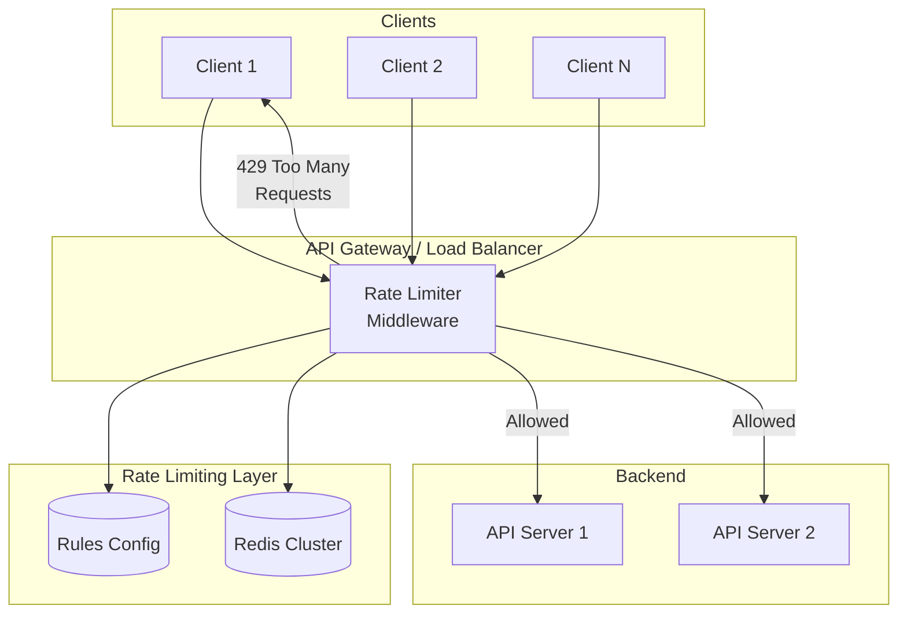
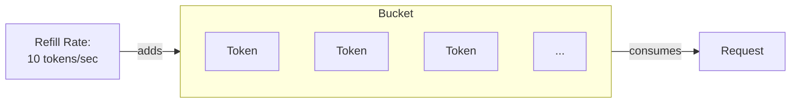
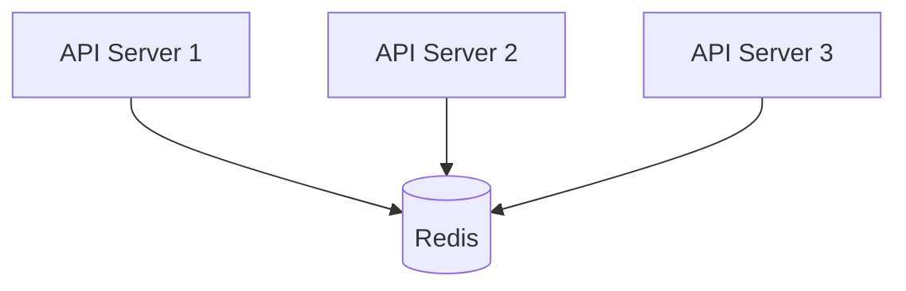

# Rate Limiter

## Уточняющие вопросы

- Что именно ограничиваем? (API calls, login attempts, messages)
- Где rate limiter? (Client-side, Server-side, Middleware, API Gateway)
- По какому ключу лимитируем? (User ID, IP, API key)
- Какие лимиты? (requests/sec, requests/min, requests/day)
- Distributed или single server?
- Hard limit или soft limit (с grace period)?
- Что возвращаем при превышении? (429, queue, degrade)

---

## Requirements

### Functional
- Ограничение количества запросов по заданному ключу
- Различные лимиты для разных endpoints/users
- Информирование клиента о текущем состоянии лимита
- Graceful degradation при превышении

### Non-Functional
- **Low latency**: < 1ms overhead на запрос
- **High availability**: не должен блокировать весь трафик при сбое
- **Distributed**: работает на нескольких серверах
- **Memory efficient**: миллионы ключей
- **Accurate**: минимальные race conditions

---

## Capacity Estimation

### Assumptions
- 10M активных пользователей
- 1000 requests/sec на сервер
- 100 API серверов
- Лимит: 100 requests/min per user

### Calculations

**Total QPS:**
```
100 servers × 1000 rps = 100,000 requests/sec
```

**Memory (для tracking):**
```
Один user record: user_id (8B) + counter (8B) + timestamp (8B) = 24B
10M users × 24B = 240 MB
С overhead Redis: ~500 MB
```

**Latency budget:**
```
Rate limiter должен добавлять < 1ms
Network to Redis: ~0.5ms (same DC)
Redis operation: ~0.1ms
Total: ~0.6ms ✓
```

---

## High-Level Design



### Компоненты

**Rate Limiter Middleware**
- Встроен в API Gateway или отдельный сервис
- Stateless — состояние в Redis
- Fail-open: при недоступности Redis пропускает запросы

**Rules Configuration**
- YAML/JSON конфиг с правилами
- Hot reload без рестарта
- Разные лимиты для разных tiers

**Redis Cluster**
- Хранит counters и timestamps
- Репликация для HA
- Expiration для автоочистки

---

## Алгоритмы Rate Limiting

### 1. Token Bucket ⭐ (рекомендуется)



**Параметры:**
- Bucket size (burst capacity)
- Refill rate (tokens/sec)

**Логика:**
```python
def allow_request(user_id):
    bucket = get_bucket(user_id)

    # Refill tokens based on time elapsed
    now = time.now()
    elapsed = now - bucket.last_refill
    bucket.tokens = min(
        bucket.capacity,
        bucket.tokens + elapsed * refill_rate
    )
    bucket.last_refill = now

    # Check if request allowed
    if bucket.tokens >= 1:
        bucket.tokens -= 1
        return True
    return False
```

**Плюсы:** Позволяет bursts, smooth rate limiting
**Минусы:** Нужно хранить состояние

### 2. Sliding Window Log

**Логика:**
- Храним timestamp каждого запроса
- Считаем запросы в окне [now - window, now]

```python
def allow_request(user_id):
    now = time.now()
    window_start = now - WINDOW_SIZE

    # Remove old entries
    redis.zremrangebyscore(user_id, 0, window_start)

    # Count requests in window
    count = redis.zcard(user_id)

    if count < LIMIT:
        redis.zadd(user_id, {now: now})
        return True
    return False
```

**Плюсы:** Точный
**Минусы:** Много памяти (хранит все timestamps)

### 3. Sliding Window Counter (компромисс)

**Логика:**
- Комбинация fixed window + weighted average
- Меньше памяти, чем log

```python
def allow_request(user_id):
    now = time.now()
    current_window = now // WINDOW_SIZE
    previous_window = current_window - 1

    # Get counts from both windows
    current_count = redis.get(f"{user_id}:{current_window}") or 0
    previous_count = redis.get(f"{user_id}:{previous_window}") or 0

    # Calculate weighted count
    elapsed_in_current = now % WINDOW_SIZE
    weight = elapsed_in_current / WINDOW_SIZE

    estimated_count = previous_count * (1 - weight) + current_count

    if estimated_count < LIMIT:
        redis.incr(f"{user_id}:{current_window}")
        return True
    return False
```

**Плюсы:** Хороший баланс памяти и точности
**Минусы:** Приблизительный

### 4. Fixed Window Counter

**Логика:**
- Простейший: counter per time window
- Reset в начале каждого окна

**Плюсы:** Простой, мало памяти
**Минусы:** Burst на границе окон (2x limit)

### Сравнение алгоритмов

| Алгоритм | Memory | Accuracy | Burst | Complexity |
|----------|--------|----------|-------|------------|
| Token Bucket | Low | High | Allowed | Medium |
| Sliding Log | High | Exact | No | Low |
| Sliding Counter | Low | ~High | Partial | Medium |
| Fixed Window | Very Low | Low | 2x burst | Very Low |

---

## API Design

### Rate Limit Headers (standard)
```http
HTTP/1.1 200 OK
X-RateLimit-Limit: 100
X-RateLimit-Remaining: 45
X-RateLimit-Reset: 1640000000
```

### Rate Limit Exceeded Response
```http
HTTP/1.1 429 Too Many Requests
X-RateLimit-Limit: 100
X-RateLimit-Remaining: 0
X-RateLimit-Reset: 1640000000
Retry-After: 30

{
    "error": "rate_limit_exceeded",
    "message": "Too many requests. Please retry after 30 seconds.",
    "retry_after": 30
}
```

### Rules Configuration API
```http
GET /api/v1/rate-limits/rules
POST /api/v1/rate-limits/rules

{
    "rules": [
        {
            "name": "api_default",
            "key": "user_id",
            "limit": 100,
            "window": "1m"
        },
        {
            "name": "login_attempts",
            "key": "ip",
            "limit": 5,
            "window": "15m"
        },
        {
            "name": "premium_users",
            "key": "user_id",
            "condition": "user.tier == 'premium'",
            "limit": 1000,
            "window": "1m"
        }
    ]
}
```

---

## Data Model

### Redis Structure (Token Bucket)
```
Key: rate_limit:{user_id}
Value: {
    "tokens": 85,
    "last_refill": 1640000000.123
}
TTL: 1 hour (auto-cleanup inactive users)
```

### Redis Structure (Sliding Window Counter)
```
Key: rate_limit:{user_id}:{window_id}
Value: 42
TTL: 2 * window_size
```

### Rules Storage
```yaml
# rate_limits.yaml
default:
  requests_per_minute: 100
  requests_per_day: 10000

tiers:
  free:
    requests_per_minute: 20
  basic:
    requests_per_minute: 100
  premium:
    requests_per_minute: 1000

endpoints:
  /api/v1/search:
    requests_per_minute: 10
  /api/v1/export:
    requests_per_day: 5
```

---

## Deep Dives

### 1. Distributed Rate Limiting

**Challenge:** Несколько серверов должны разделять лимит

**Approach 1: Centralized Redis**


- Все серверы обращаются к одному Redis
- Lua scripts для атомарности
- Latency: ~0.5ms per request

**Lua Script для атомарной проверки:**
```lua
local key = KEYS[1]
local limit = tonumber(ARGV[1])
local window = tonumber(ARGV[2])

local current = redis.call('GET', key)
if current and tonumber(current) >= limit then
    return 0
end

current = redis.call('INCR', key)
if current == 1 then
    redis.call('EXPIRE', key, window)
end

return limit - current
```

**Approach 2: Local + Sync**
```
Каждый сервер держит локальный counter
Периодически синхронизируется с Redis
```

- Меньше latency (локальная проверка)
- Менее точно (eventual consistency)
- Подходит для soft limits

### 2. Race Conditions

**Problem:** Check-then-increment не атомарен

```
Server A: GET counter → 99
Server B: GET counter → 99
Server A: SET counter = 100 ✓
Server B: SET counter = 100 ✓  // Оба прошли!
```

**Solutions:**

1. **Redis INCR (атомарный)**
```python
count = redis.incr(key)
if count == 1:
    redis.expire(key, window_size)
if count > limit:
    return REJECTED
```

2. **Lua Scripts**
```lua
-- Весь check-and-increment атомарен
```

3. **Redis MULTI/EXEC**
```python
with redis.pipeline() as pipe:
    pipe.watch(key)
    count = pipe.get(key)
    if count >= limit:
        return REJECTED
    pipe.multi()
    pipe.incr(key)
    pipe.execute()
```

### 3. Fail-Open vs Fail-Close

**Fail-Open (рекомендуется для большинства):**
```python
try:
    if not rate_limiter.allow(request):
        return 429
except RedisConnectionError:
    # Redis down — пропускаем запрос
    log.warning("Rate limiter unavailable")
    pass  # Allow request

return process(request)
```

**Fail-Close (для критичных систем):**
```python
try:
    if not rate_limiter.allow(request):
        return 429
except RedisConnectionError:
    # Redis down — блокируем
    return 503  # Service Unavailable
```

---

## Bottlenecks & Solutions

### Problem 1: Redis latency adds up
- **Issue**: +0.5ms на каждый запрос
- **Solution**:
  - Local cache для частых ключей
  - Batch rate limit checks
  - Redis в том же datacenter

### Problem 2: Hot keys (celebrity problem)
- **Issue**: Один user генерирует огромный трафик
- **Solution**:
  - Sharding по user_id
  - Локальные counters + периодический sync
  - Separate Redis cluster для hot keys

### Problem 3: Redis SPOF
- **Issue**: Redis падает — rate limiting не работает
- **Solution**:
  - Redis Cluster (минимум 3 nodes)
  - Redis Sentinel для failover
  - Fallback на local rate limiting

### Problem 4: Clock skew
- **Issue**: Серверы с разным временем
- **Solution**:
  - NTP синхронизация
  - Использовать Redis TIME
  - Sliding window вместо fixed

---

## Trade-offs для обсуждения

| Решение | Trade-off |
|---------|-----------|
| Token Bucket vs Fixed Window | Accuracy vs Simplicity |
| Centralized vs Distributed | Consistency vs Latency |
| Fail-open vs Fail-close | Availability vs Protection |
| Per-user vs Per-IP | Fairness vs DDoS protection |
| Soft vs Hard limits | UX vs Resource protection |

---

## Примеры из реальных систем

**GitHub API:**
- 5000 requests/hour для authenticated
- 60 requests/hour для unauthenticated
- Separate limits per endpoint

**Twitter API:**
- 15-minute windows
- Different limits per endpoint (180-900)
- App-level and user-level limits

**Stripe API:**
- 100 requests/second (live mode)
- 25 requests/second (test mode)
- Exponential backoff recommended
