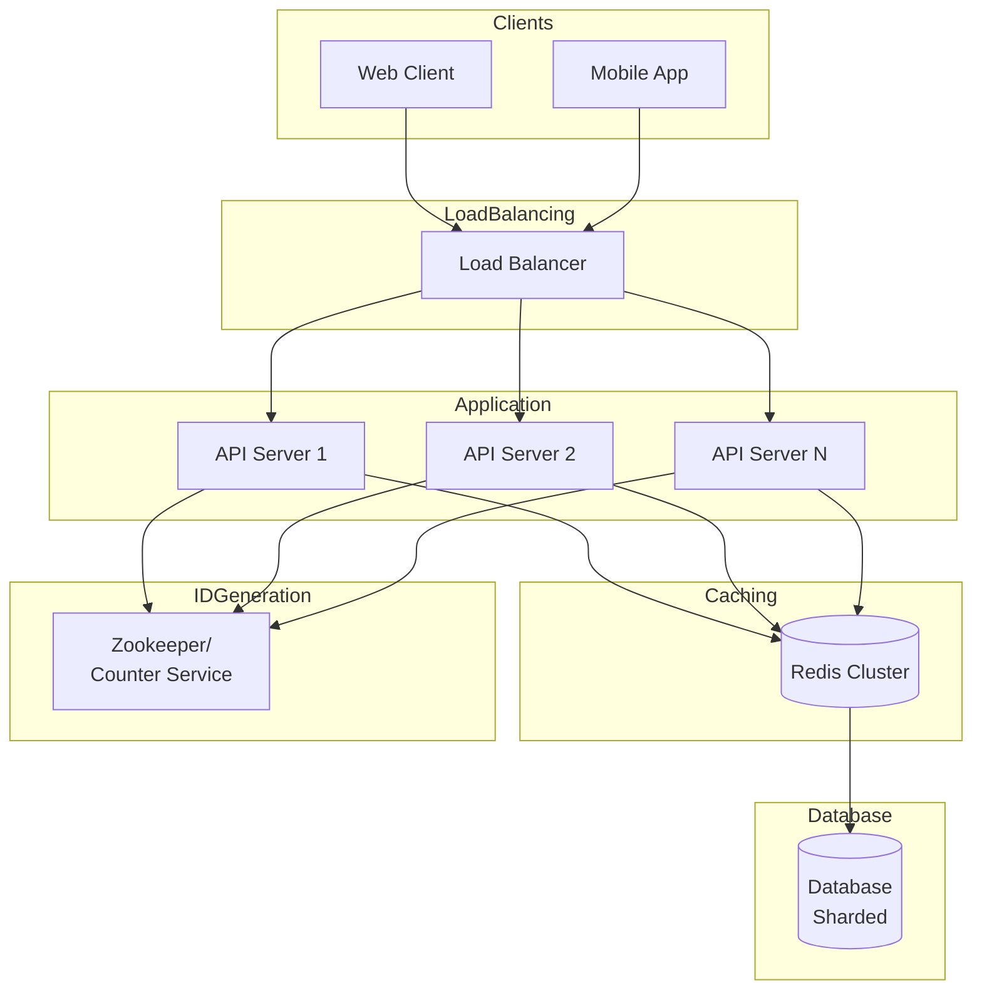
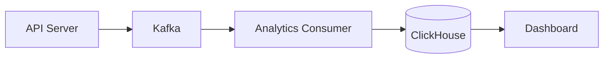

# URL Shortener (TinyURL / Bit.ly)

## Уточняющие вопросы

- Какой ожидаемый объём? (100M URLs/день? 1B?)
- Нужна ли кастомизация коротких URL?
- Какой TTL для ссылок? (вечные / 1 год / настраиваемые)
- Нужна ли аналитика кликов?
- Какое соотношение read/write? (обычно 100:1)

---

## Requirements

### Functional
- Создание короткого URL из длинного
- Редирект по короткому URL на оригинальный
- (Опционально) Кастомные alias
- (Опционально) TTL для ссылок
- (Опционально) Аналитика кликов

### Non-Functional
- **High availability**: 99.99% uptime
- **Low latency**: редирект < 100ms
- **Scalability**: 100M новых URL/день
- **Durability**: ссылки не должны теряться

---

## Capacity Estimation

### Assumptions
- 100M новых URL в день
- Соотношение read:write = 100:1
- Хранение 5 лет
- Средний URL: 100 bytes, short URL: 7 chars

### Calculations

**Write QPS:**
```
100M / 86400 ≈ 1,200 writes/sec
Peak: 1,200 × 3 = 3,600 writes/sec
```

**Read QPS:**
```
1,200 × 100 = 120,000 reads/sec
Peak: 360,000 reads/sec
```

**Storage:**
```
URL record: ~500 bytes (URL + metadata)
За день: 100M × 500B = 50 GB
За 5 лет: 50 GB × 365 × 5 ≈ 90 TB
```

**Bandwidth:**
```
Write: 1,200 × 500B = 600 KB/s
Read: 120K × 500B = 60 MB/s
```

---

## High-Level Design



### Компоненты

**Load Balancer**
- Round-robin или least connections
- Health checks на API серверы
- SSL termination

**API Servers (Stateless)**
- Создание коротких URL
- Редирект на оригинальный URL
- Горизонтальное масштабирование

**Cache (Redis)**
- LRU eviction policy
- Cache hot URLs (80/20 правило)
- TTL = несколько часов

**Database**
- NoSQL (Cassandra/DynamoDB) для scale
- Или PostgreSQL с шардированием
- Партиционирование по short_url

**ID Generation**
- Zookeeper для уникальных ranges
- Или Twitter Snowflake
- Или Base62(MD5[:7])

---

## API Design

### Create Short URL
```http
POST /api/v1/urls
Content-Type: application/json

{
    "long_url": "https://example.com/very/long/path",
    "custom_alias": "my-link",     // optional
    "expires_at": "2025-12-31"     // optional
}

Response 201:
{
    "short_url": "https://tiny.url/abc1234",
    "long_url": "https://example.com/very/long/path",
    "expires_at": "2025-12-31",
    "created_at": "2024-01-15T10:30:00Z"
}
```

### Redirect
```http
GET /{short_code}

Response 301/302:
Location: https://example.com/very/long/path
```

**301 vs 302:**
- 301 (Permanent): Браузер кэширует, меньше нагрузка, нет аналитики
- 302 (Temporary): Каждый запрос к нам, можно считать клики

---

## Data Model

### URL Table
```sql
CREATE TABLE urls (
    id              BIGINT PRIMARY KEY,
    short_code      VARCHAR(10) UNIQUE NOT NULL,
    long_url        TEXT NOT NULL,
    user_id         BIGINT,
    created_at      TIMESTAMP DEFAULT NOW(),
    expires_at      TIMESTAMP,
    click_count     BIGINT DEFAULT 0
);

-- Index для редиректа (основной запрос)
CREATE INDEX idx_short_code ON urls(short_code);
```

### Sharding Strategy
- **Shard key**: short_code (равномерное распределение)
- Или hash(short_code) % num_shards
- Consistent hashing для добавления шардов

---

## Deep Dives

### 1. URL Encoding (Генерация short_code)

**Подход 1: Base62 Encoding**
```
Alphabet: [a-z, A-Z, 0-9] = 62 символа
7 символов = 62^7 = 3.5 trillion комбинаций

Counter → Base62:
12345 → "dnh"
```

Плюсы: Короткие URL, предсказуемая длина
Минусы: Нужен централизованный counter

**Подход 2: MD5/SHA256 + Truncate**
```
MD5(long_url)[:7] в Base62
```

Плюсы: Stateless, дедупликация
Минусы: Коллизии (нужна проверка)

**Подход 3: Pre-generated Keys**
```
Заранее генерируем pool short_codes
При запросе берём из pool
```

Плюсы: Быстро, нет bottleneck
Минусы: Сложность управления pool

**Рекомендация для интервью:** Counter с Zookeeper ranges

### 2. Handling Scale (360K reads/sec)

**Кэширование:**
```
Read flow:
1. Check Redis cache
2. Cache hit → return
3. Cache miss → read from DB → update cache
```

- 20% URLs генерируют 80% трафика
- Cache size: top 20% = ~20M records × 500B = 10GB
- Redis cluster с репликацией

**Database Sharding:**
```
Consistent hashing по short_code
5-10 шардов для 100TB данных
Read replicas для каждого шарда (3x)
```

### 3. Analytics (опционально)



- Async запись в Kafka при каждом клике
- Batch processing в ClickHouse
- Pre-aggregated метрики по времени

---

## Bottlenecks & Solutions

### Problem 1: Counter bottleneck
- **Issue**: Единая точка генерации ID
- **Solution**: Zookeeper выдаёт ranges (1-1000, 1001-2000)
- Каждый API server получает свой range

### Problem 2: Hot URLs
- **Issue**: Вирусные ссылки перегружают один шард
- **Solution**:
  - Aggressive caching в Redis
  - Rate limiting per URL
  - CDN для географического распределения

### Problem 3: Database write throughput
- **Issue**: 3,600 writes/sec на пике
- **Solution**:
  - Батчинг writes
  - Async writes с acknowledgment
  - Write-optimized DB (Cassandra)

### Problem 4: Cache invalidation
- **Issue**: URL удалён, но в кэше
- **Solution**:
  - TTL на кэш (несколько часов)
  - Pub/sub для invalidation
  - Lazy deletion (проверка при 404)

---

## Trade-offs для обсуждения

| Решение | Trade-off |
|---------|-----------|
| 301 vs 302 redirect | Performance vs Analytics |
| SQL vs NoSQL | Consistency vs Scale |
| 6 vs 7 vs 8 chars | URL length vs capacity |
| Hash vs Counter | Simplicity vs Coordination |
| Sync vs Async writes | Consistency vs Latency |
