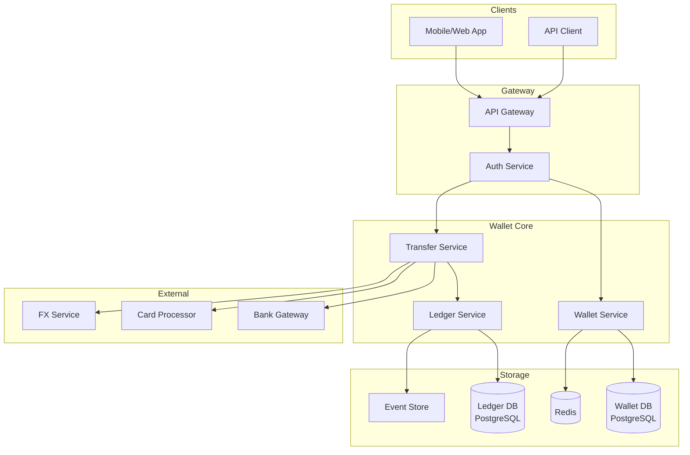
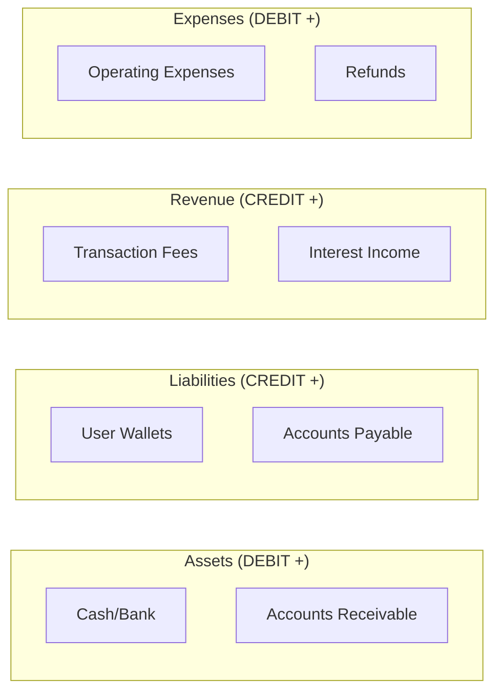
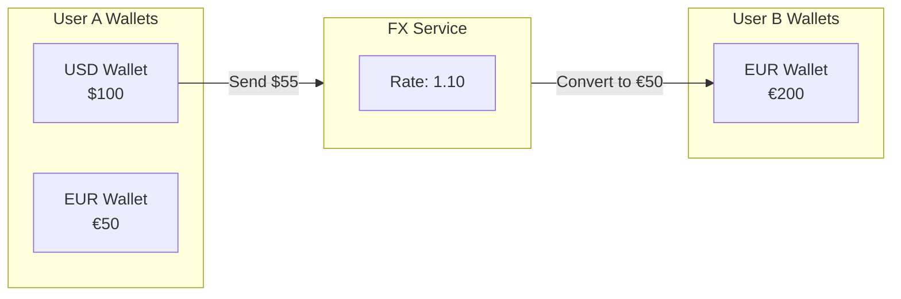

# Digital Wallet / Ledger System

## Уточняющие вопросы

- Какие операции? (deposit, withdraw, transfer, payment)
- Multi-currency или single?
- Какой объём? (transactions/sec, total balance)
- Нужен ли credit (negative balance)?
- Real-time balance или eventual consistency?
- Audit requirements?
- Interest calculation?
- Limits (daily, transaction)?

---

## Requirements

### Functional
- Create/manage wallet accounts
- Deposit funds (from bank, card)
- Withdraw funds (to bank)
- Transfer между wallets (P2P)
- Pay merchants
- Transaction history
- Real-time balance query
- Multi-currency support

### Non-Functional
- **Consistency**: Strong (balance must be accurate)
- **Availability**: 99.99%
- **Latency**: Balance query < 50ms, Transfer < 200ms
- **Durability**: Zero financial loss
- **Auditability**: Complete transaction trail

---

## Capacity Estimation

### Assumptions
- 50M wallet accounts
- 10M transactions/day
- Peak: 5x average
- Avg transaction: $100
- Total balance under management: $5B

### Calculations

**TPS:**
```
10M / 86400 ≈ 115 TPS average
Peak: 115 × 5 = 575 TPS
```

**Storage:**
```
Account record: ~500 bytes
50M × 500B = 25 GB

Transaction record: ~1KB
10M × 1KB = 10 GB/day
Per year: ~3.6 TB

Ledger entries (2 per txn): 20 GB/day
Per year: ~7 TB
```

**Balance precision:**
```
Using BIGINT for cents: max 9.2 × 10^18 cents
= $92 quadrillion (sufficient)
```

---

## High-Level Design



### Компоненты

**Wallet Service**
- Account management
- Balance queries
- Limit enforcement
- Account status (active, frozen, closed)

**Transfer Service**
- P2P transfers
- External transfers (deposit/withdraw)
- Multi-currency conversion
- Transaction orchestration

**Ledger Service**
- Double-entry bookkeeping
- Immutable transaction log
- Balance calculation
- Reconciliation

**FX Service**
- Exchange rate quotes
- Currency conversion
- Rate locking

---

## Double-Entry Bookkeeping

### Принцип
```
Каждая транзакция: DEBIT + CREDIT
Sum(DEBIT) = Sum(CREDIT) всегда

Example: User A transfers $100 to User B
- DEBIT User A wallet: $100
- CREDIT User B wallet: $100
```

### Account Types


### Transaction Examples

**Deposit $100 from bank:**
```
DEBIT  company_bank_account    $100
CREDIT user_wallet_123         $100
```

**Transfer $50 from User A to User B (with $1 fee):**
```
DEBIT  user_wallet_A           $51
CREDIT user_wallet_B           $50
CREDIT fee_revenue             $1
```

**Withdraw $200 to bank:**
```
DEBIT  user_wallet_123         $200
CREDIT company_bank_account    $200
```

---

## API Design

### Create Wallet
```http
POST /v1/wallets
{
    "user_id": "user_123",
    "currency": "USD",
    "type": "personal"
}

Response 201:
{
    "id": "wallet_abc",
    "user_id": "user_123",
    "currency": "USD",
    "balance": 0,
    "available_balance": 0,
    "status": "active",
    "created_at": "2024-01-15T10:00:00Z"
}
```

### Get Balance
```http
GET /v1/wallets/{wallet_id}/balance

{
    "wallet_id": "wallet_abc",
    "balance": 150000,           // cents
    "available_balance": 145000, // minus pending
    "pending_in": 5000,
    "pending_out": 10000,
    "currency": "USD",
    "as_of": "2024-01-15T10:30:00Z"
}
```

### Transfer (P2P)
```http
POST /v1/transfers
Idempotency-Key: txn_abc123

{
    "from_wallet": "wallet_abc",
    "to_wallet": "wallet_xyz",
    "amount": 5000,              // cents
    "currency": "USD",
    "description": "Lunch money",
    "metadata": {}
}

Response 200:
{
    "id": "txn_789",
    "status": "completed",
    "from_wallet": "wallet_abc",
    "to_wallet": "wallet_xyz",
    "amount": 5000,
    "fee": 0,
    "created_at": "2024-01-15T10:30:00Z"
}
```

### Deposit (External)
```http
POST /v1/wallets/{wallet_id}/deposit
Idempotency-Key: dep_abc123

{
    "amount": 100000,
    "source": {
        "type": "bank_account",
        "id": "ba_123"
    }
}

Response 202:  // Async for bank
{
    "id": "dep_456",
    "status": "pending",
    "amount": 100000,
    "expected_completion": "2024-01-16T10:00:00Z"
}
```

### Transaction History
```http
GET /v1/wallets/{wallet_id}/transactions?limit=50&cursor=...

{
    "transactions": [
        {
            "id": "txn_789",
            "type": "transfer_out",
            "amount": -5000,
            "balance_after": 145000,
            "counterparty": {...},
            "description": "Lunch money",
            "created_at": "2024-01-15T10:30:00Z"
        }
    ],
    "cursor": "...",
    "has_more": true
}
```

---

## Data Model

### Wallets Table
```sql
CREATE TABLE wallets (
    id                  VARCHAR(50) PRIMARY KEY,
    user_id             VARCHAR(50) NOT NULL,
    currency            CHAR(3) NOT NULL,
    type                VARCHAR(20) NOT NULL,
    status              VARCHAR(20) NOT NULL DEFAULT 'active',
    balance             BIGINT NOT NULL DEFAULT 0,
    pending_balance     BIGINT NOT NULL DEFAULT 0,
    created_at          TIMESTAMP NOT NULL DEFAULT NOW(),
    updated_at          TIMESTAMP NOT NULL DEFAULT NOW(),
    version             INT NOT NULL DEFAULT 1,

    CONSTRAINT positive_balance CHECK (balance >= 0),
    CONSTRAINT unique_user_currency UNIQUE (user_id, currency)
);

CREATE INDEX idx_user_wallets ON wallets(user_id);
```

### Ledger Entries Table
```sql
CREATE TABLE ledger_entries (
    id                  BIGSERIAL PRIMARY KEY,
    transaction_id      VARCHAR(50) NOT NULL,
    account_id          VARCHAR(50) NOT NULL,    -- wallet_id или system account
    account_type        VARCHAR(20) NOT NULL,    -- user_wallet, system, revenue
    entry_type          CHAR(1) NOT NULL,        -- D(ebit) / C(redit)
    amount              BIGINT NOT NULL,
    currency            CHAR(3) NOT NULL,
    balance_after       BIGINT NOT NULL,
    description         TEXT,
    created_at          TIMESTAMP NOT NULL DEFAULT NOW(),

    CONSTRAINT positive_amount CHECK (amount > 0)
);

-- Быстрый поиск по account
CREATE INDEX idx_account_entries ON ledger_entries(account_id, created_at DESC);

-- Быстрая проверка баланса транзакции
CREATE INDEX idx_transaction ON ledger_entries(transaction_id);
```

### Transactions Table
```sql
CREATE TABLE transactions (
    id                  VARCHAR(50) PRIMARY KEY,
    type                VARCHAR(30) NOT NULL,
    status              VARCHAR(20) NOT NULL,
    from_wallet_id      VARCHAR(50),
    to_wallet_id        VARCHAR(50),
    amount              BIGINT NOT NULL,
    fee                 BIGINT DEFAULT 0,
    currency            CHAR(3) NOT NULL,
    description         TEXT,
    metadata            JSONB,
    idempotency_key     VARCHAR(100),
    created_at          TIMESTAMP NOT NULL DEFAULT NOW(),
    completed_at        TIMESTAMP,

    CONSTRAINT unique_idempotency UNIQUE (idempotency_key)
);

CREATE INDEX idx_from_wallet ON transactions(from_wallet_id, created_at DESC);
CREATE INDEX idx_to_wallet ON transactions(to_wallet_id, created_at DESC);
```

### System Accounts (Internal)
```sql
-- Predefined system accounts
INSERT INTO wallets (id, user_id, currency, type, status) VALUES
    ('system_usd_liability', 'SYSTEM', 'USD', 'liability', 'active'),
    ('system_usd_revenue', 'SYSTEM', 'USD', 'revenue', 'active'),
    ('system_usd_bank', 'SYSTEM', 'USD', 'asset', 'active');
```

---

## Deep Dives

### 1. Atomic Balance Updates

**Problem:** Concurrent transactions → race conditions

**Solution: Optimistic Locking + SELECT FOR UPDATE**

```python
class TransferService:
    async def execute_transfer(self, from_wallet_id, to_wallet_id, amount, idempotency_key):
        async with db.transaction(isolation_level="SERIALIZABLE"):
            # Idempotency check
            existing = await self.check_idempotency(idempotency_key)
            if existing:
                return existing

            # Lock wallets in consistent order (prevent deadlock)
            wallet_ids = sorted([from_wallet_id, to_wallet_id])

            wallets = await db.execute("""
                SELECT * FROM wallets
                WHERE id = ANY($1)
                ORDER BY id
                FOR UPDATE
            """, wallet_ids)

            from_wallet = next(w for w in wallets if w.id == from_wallet_id)
            to_wallet = next(w for w in wallets if w.id == to_wallet_id)

            # Validate
            if from_wallet.balance < amount:
                raise InsufficientFundsError()

            if from_wallet.status != 'active' or to_wallet.status != 'active':
                raise WalletInactiveError()

            # Create transaction
            txn_id = generate_transaction_id()

            # Update balances atomically
            await db.execute("""
                UPDATE wallets SET balance = balance - $1, version = version + 1
                WHERE id = $2 AND version = $3
            """, amount, from_wallet_id, from_wallet.version)

            await db.execute("""
                UPDATE wallets SET balance = balance + $1, version = version + 1
                WHERE id = $2 AND version = $3
            """, amount, to_wallet_id, to_wallet.version)

            # Create ledger entries
            await self.create_ledger_entries(txn_id, from_wallet, to_wallet, amount)

            # Create transaction record
            await self.create_transaction_record(txn_id, ...)

            return {"transaction_id": txn_id, "status": "completed"}
```

**Alternative: Event Sourcing**
```python
# Instead of updating balance directly, append events
# Balance = sum of all events for account

async def transfer(from_id, to_id, amount):
    # Append debit event
    await event_store.append({
        "type": "DEBIT",
        "account_id": from_id,
        "amount": amount,
        "timestamp": now()
    })

    # Append credit event
    await event_store.append({
        "type": "CREDIT",
        "account_id": to_id,
        "amount": amount,
        "timestamp": now()
    })

# Balance is calculated from events
def get_balance(account_id):
    events = event_store.get_events(account_id)
    return sum(
        e.amount if e.type == "CREDIT" else -e.amount
        for e in events
    )
```

### 2. Balance Caching Strategy

**Problem:** Real-time balance queries at scale

**Solution: Cache with careful invalidation**

```python
class BalanceService:
    async def get_balance(self, wallet_id):
        # Try cache first
        cached = await redis.hgetall(f"balance:{wallet_id}")
        if cached:
            return {
                "balance": int(cached["balance"]),
                "pending": int(cached["pending"]),
                "as_of": cached["as_of"]
            }

        # Cache miss: read from DB
        wallet = await db.fetchone(
            "SELECT balance, pending_balance FROM wallets WHERE id = $1",
            wallet_id
        )

        # Update cache
        await redis.hmset(f"balance:{wallet_id}", {
            "balance": wallet.balance,
            "pending": wallet.pending_balance,
            "as_of": now().isoformat()
        })
        await redis.expire(f"balance:{wallet_id}", 300)  # 5 min TTL

        return {...}

    async def invalidate_balance(self, wallet_id):
        # Delete cache on any balance change
        await redis.delete(f"balance:{wallet_id}")

        # Or update directly for consistency
        wallet = await db.fetchone(...)
        await redis.hmset(f"balance:{wallet_id}", {...})
```

**Read-your-writes consistency:**
```python
async def transfer_and_get_balance(from_id, to_id, amount):
    # Execute transfer
    result = await transfer_service.execute(from_id, to_id, amount)

    # Invalidate both caches immediately
    await balance_service.invalidate_balance(from_id)
    await balance_service.invalidate_balance(to_id)

    # Return updated balance from DB (not cache)
    return await balance_service.get_balance_from_db(from_id)
```

### 3. Multi-Currency Support



```python
class CrossCurrencyTransfer:
    async def transfer(self, from_wallet_id, to_wallet_id, amount, target_currency):
        from_wallet = await get_wallet(from_wallet_id)
        to_wallet = await get_wallet(to_wallet_id)

        if from_wallet.currency == to_wallet.currency:
            # Same currency: direct transfer
            return await self.direct_transfer(...)

        # Get FX rate
        fx_rate = await fx_service.get_rate(
            from_currency=from_wallet.currency,
            to_currency=to_wallet.currency
        )

        # Lock the rate
        rate_lock = await fx_service.lock_rate(fx_rate, ttl=60)

        converted_amount = int(amount * fx_rate.rate)

        async with db.transaction():
            # Debit source
            await self.debit_wallet(from_wallet_id, amount)

            # Credit destination (converted)
            await self.credit_wallet(to_wallet_id, converted_amount)

            # Record FX transaction
            await self.record_fx_transaction(
                rate_lock_id=rate_lock.id,
                from_amount=amount,
                from_currency=from_wallet.currency,
                to_amount=converted_amount,
                to_currency=to_wallet.currency,
                rate=fx_rate.rate
            )
```

### 4. Reconciliation

**Daily reconciliation process:**
```python
class ReconciliationService:
    async def daily_reconciliation(self, date):
        results = {
            "date": date,
            "checks": [],
            "discrepancies": []
        }

        # Check 1: Sum of all user wallet balances = liability account
        user_total = await db.fetchval("""
            SELECT SUM(balance) FROM wallets
            WHERE type = 'user' AND status != 'closed'
        """)

        liability_balance = await self.get_system_account_balance('liability')

        if user_total != liability_balance:
            results["discrepancies"].append({
                "check": "liability_balance",
                "expected": user_total,
                "actual": liability_balance,
                "diff": user_total - liability_balance
            })

        # Check 2: Sum of debits = Sum of credits for each transaction
        unbalanced = await db.fetch("""
            SELECT transaction_id,
                   SUM(CASE WHEN entry_type = 'D' THEN amount ELSE 0 END) as debits,
                   SUM(CASE WHEN entry_type = 'C' THEN amount ELSE 0 END) as credits
            FROM ledger_entries
            WHERE DATE(created_at) = $1
            GROUP BY transaction_id
            HAVING SUM(CASE WHEN entry_type = 'D' THEN amount ELSE 0 END) !=
                   SUM(CASE WHEN entry_type = 'C' THEN amount ELSE 0 END)
        """, date)

        for txn in unbalanced:
            results["discrepancies"].append({
                "check": "balanced_transaction",
                "transaction_id": txn.transaction_id,
                "debits": txn.debits,
                "credits": txn.credits
            })

        # Check 3: External bank balance matches our records
        bank_balance = await bank_gateway.get_balance()
        our_bank_record = await self.get_system_account_balance('bank')

        if bank_balance != our_bank_record:
            results["discrepancies"].append({
                "check": "bank_balance",
                "bank_reported": bank_balance,
                "our_records": our_bank_record
            })

        return results
```

---

## Bottlenecks & Solutions

### Problem 1: Hot wallet (celebrity/merchant)
- **Issue**: One wallet = thousands TPS
- **Solution**:
  - Wallet sharding (sub-wallets)
  - Async batching
  - Rate limiting per wallet

### Problem 2: Database lock contention
- **Issue**: Popular wallets → lock queues
- **Solution**:
  - Optimistic locking
  - Short transactions
  - SKIP LOCKED для queues

### Problem 3: Balance calculation latency
- **Issue**: Sum of events is slow
- **Solution**:
  - Materialized balance (update on write)
  - Snapshot + delta
  - Caching

### Problem 4: Audit log volume
- **Issue**: Every transaction → multiple log entries
- **Solution**:
  - Async logging
  - Partitioned tables
  - Cold storage for old data

### Problem 5: Multi-currency reconciliation
- **Issue**: FX rates change constantly
- **Solution**:
  - Lock rates at transaction time
  - Store both amounts
  - End-of-day FX snapshots

---

## Trade-offs для обсуждения

| Решение | Trade-off |
|---------|-----------|
| Real-time vs Batch balance | Complexity vs Consistency |
| Event Sourcing vs CRUD | Auditability vs Query simplicity |
| Sync vs Async transfers | Latency vs Throughput |
| Per-txn vs Periodic reconciliation | Cost vs Detection speed |
| Single vs Sharded wallet | Simplicity vs Scale |

---

## Compliance Considerations

### Anti-Money Laundering (AML)
```
- Transaction monitoring (velocity, patterns)
- Large transaction reporting (> $10K)
- Suspicious activity reports (SAR)
- Know Your Customer (KYC) verification
```

### Audit Requirements
```
- Complete transaction history (7+ years)
- Immutable ledger entries
- Who did what when (actor tracking)
- System access logs
```
