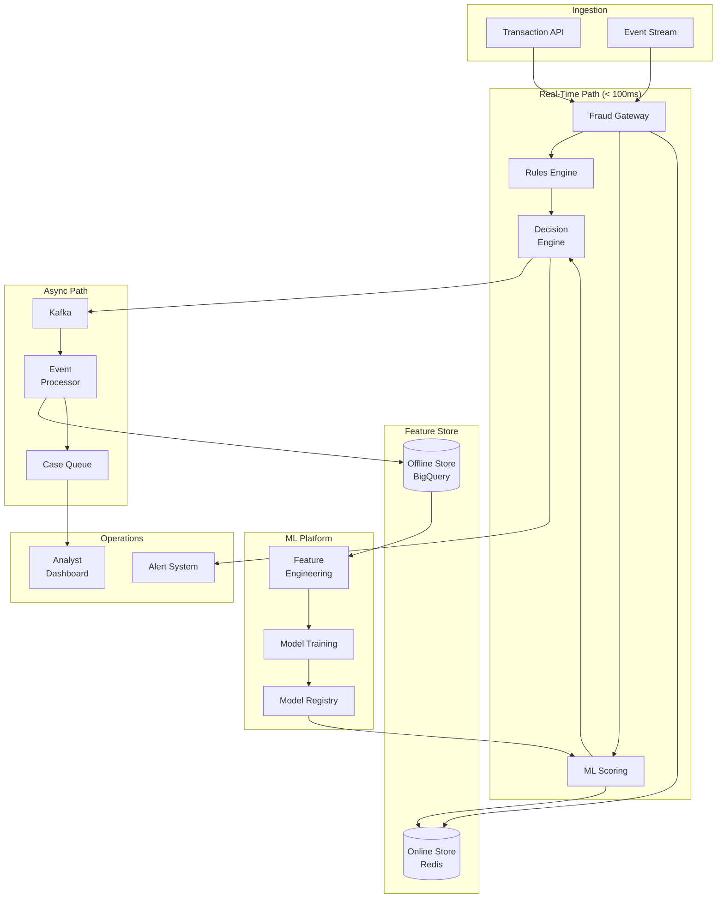
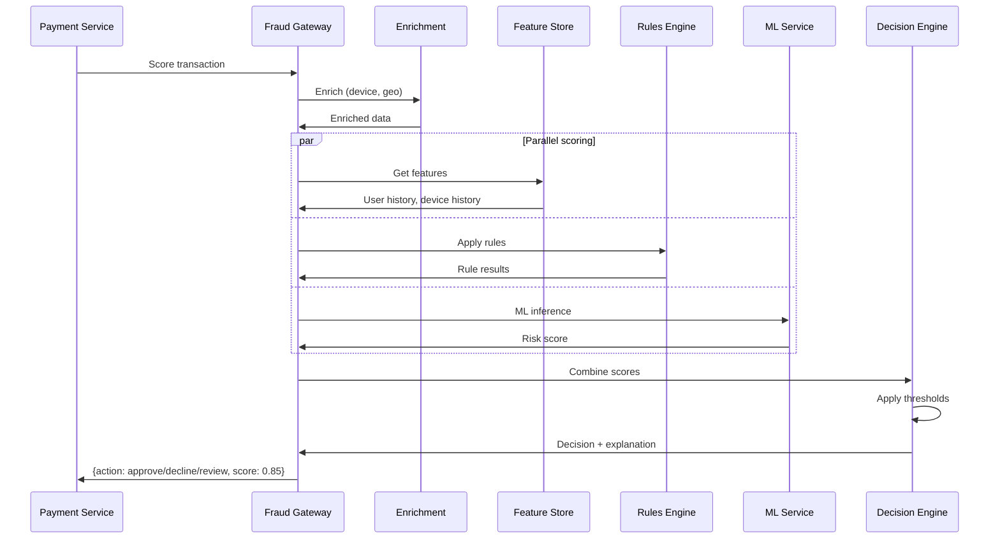
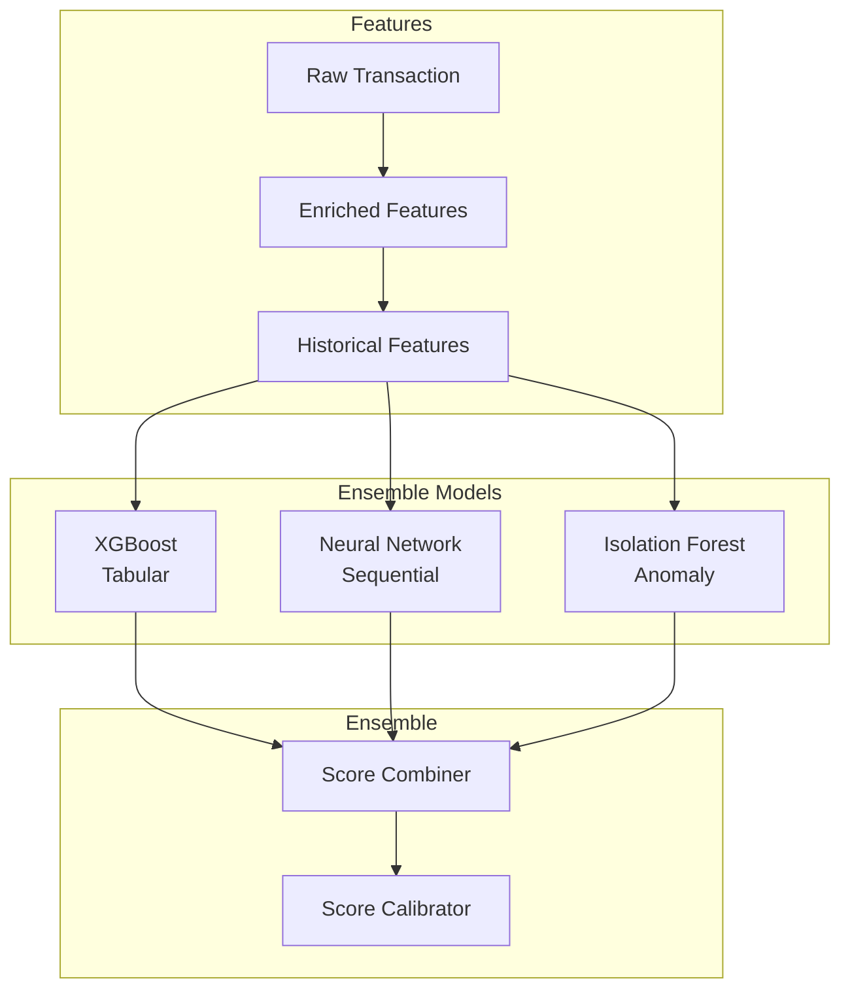
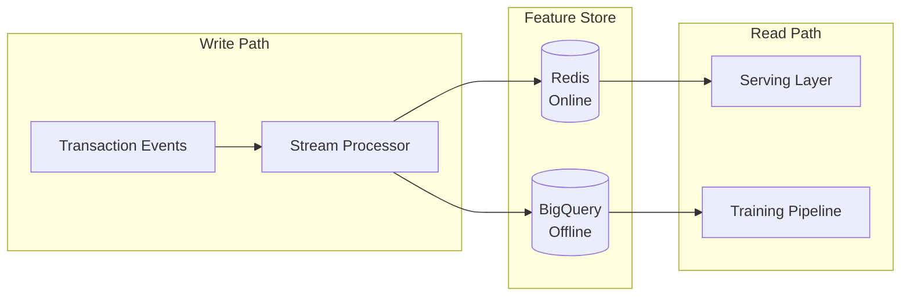

# Real-Time Fraud Detection System

## Уточняющие вопросы

- Какой тип fraud? (payment, account takeover, identity)
- Real-time или batch analysis?
- Какой объём? (transactions/sec)
- Какая допустимая latency для решения?
- Блокируем или только alert?
- ML модели или rule-based?
- False positive tolerance?
- Какие данные доступны? (device, location, history)

---

## Requirements

### Functional
- Real-time transaction scoring
- Rule-based fraud detection
- ML-based anomaly detection
- Device fingerprinting
- Velocity checks
- Case management для review
- Feedback loop для model training
- Alert & notification system

### Non-Functional
- **Latency**: < 100ms для scoring (sync path)
- **Availability**: 99.99%
- **Accuracy**: < 0.1% false positive rate
- **Scalability**: 10K transactions/sec
- **Adaptability**: Быстрый deploy новых rules/models

---

## Capacity Estimation

### Assumptions
- 10K transactions/second peak
- 100 features per transaction
- Model inference: 50ms p99
- 0.5% transactions flagged for review
- Historical data: 2 years

### Calculations

**Throughput:**
```
10K TPS × 3600 = 36M transactions/hour
864M transactions/day
```

**Feature store reads:**
```
10K TPS × 20 feature lookups = 200K reads/sec
```

**Model inference:**
```
10K TPS × 50ms = 500 GPU-seconds/sec
Requires: ~50 GPU instances (with 10x headroom)
```

**Storage (features + events):**
```
Transaction event: ~2KB
864M × 2KB = 1.7 TB/day
Per year: ~620 TB
```

---

## High-Level Design



### Компоненты

**Fraud Gateway**
- Entry point для всех transactions
- Enrichment (device, geo, history)
- Routing к scoring engines

**Rules Engine**
- Deterministic rules (velocity, blacklist)
- Hot-swappable rule configuration
- Low latency (< 10ms)

**ML Scoring Service**
- Model inference
- Multiple models (ensemble)
- A/B testing support

**Decision Engine**
- Combines rule + ML scores
- Action decision (approve, decline, review)
- Explainability

**Feature Store**
- Online: real-time features (Redis)
- Offline: historical features (BigQuery)
- Feature consistency между training и serving

**Case Management**
- Analyst workflow
- Decision tracking
- Feedback collection

---

## Scoring Flow



---

## API Design

### Score Transaction
```http
POST /v1/fraud/score
{
    "transaction_id": "txn_123",
    "amount": 50000,
    "currency": "USD",
    "merchant": {
        "id": "merch_456",
        "category": "electronics",
        "country": "US"
    },
    "user": {
        "id": "user_789",
        "email": "user@example.com"
    },
    "payment_method": {
        "type": "card",
        "last4": "4242",
        "bin": "424242"
    },
    "device": {
        "fingerprint": "fp_abc",
        "ip": "192.168.1.1",
        "user_agent": "..."
    },
    "session": {
        "id": "sess_xyz",
        "created_at": "2024-01-15T10:00:00Z"
    }
}

Response 200 (< 100ms):
{
    "transaction_id": "txn_123",
    "decision": "approve",           // approve, decline, review
    "risk_score": 0.15,              // 0-1
    "risk_level": "low",             // low, medium, high
    "signals": [
        {"rule": "velocity_ok", "passed": true},
        {"rule": "device_known", "passed": true},
        {"model": "card_fraud_v3", "score": 0.12}
    ],
    "recommended_actions": [],
    "request_id": "req_abc123"
}
```

### Report Fraud (Feedback)
```http
POST /v1/fraud/report
{
    "transaction_id": "txn_123",
    "fraud_type": "unauthorized_transaction",
    "reported_by": "customer",
    "reported_at": "2024-01-15T12:00:00Z",
    "details": "Card was stolen"
}
```

### Get Case
```http
GET /v1/fraud/cases/{case_id}

{
    "case_id": "case_456",
    "transaction_id": "txn_123",
    "status": "pending_review",
    "risk_score": 0.75,
    "flags": ["high_amount", "new_device", "unusual_location"],
    "user_history": {...},
    "similar_cases": [...],
    "created_at": "2024-01-15T10:00:00Z"
}
```

### Update Rules
```http
PUT /v1/fraud/rules/{rule_id}
{
    "name": "high_amount_new_user",
    "condition": "amount > 100000 AND user_age_days < 7",
    "action": "review",
    "priority": 100,
    "enabled": true
}
```

---

## Data Model

### Transactions Table (Events)
```sql
CREATE TABLE fraud_events (
    id                  BIGSERIAL PRIMARY KEY,
    transaction_id      VARCHAR(50) NOT NULL,
    timestamp           TIMESTAMP NOT NULL,
    amount              BIGINT NOT NULL,
    currency            CHAR(3) NOT NULL,
    user_id             VARCHAR(50) NOT NULL,
    merchant_id         VARCHAR(50),

    -- Scoring results
    risk_score          FLOAT,
    decision            VARCHAR(20),
    model_version       VARCHAR(20),
    rule_results        JSONB,

    -- Raw features (for training)
    features            JSONB,

    -- Feedback
    is_fraud            BOOLEAN,
    fraud_reported_at   TIMESTAMP,

    INDEX idx_user_time (user_id, timestamp DESC),
    INDEX idx_fraud (is_fraud) WHERE is_fraud = TRUE
);
```

### Feature Store Schema

**Online Features (Redis):**
```
# User aggregate features
Key: user_features:{user_id}
Type: Hash
Fields:
  - txn_count_1h: 5
  - txn_count_24h: 12
  - txn_amount_1h: 150000
  - txn_amount_24h: 500000
  - unique_merchants_24h: 3
  - unique_devices_7d: 2
  - avg_txn_amount_30d: 8500
  - last_txn_timestamp: 1705312800
TTL: 24 hours (refreshed on activity)

# Device features
Key: device_features:{device_fingerprint}
Type: Hash
Fields:
  - first_seen: 1705000000
  - user_count: 1
  - txn_count: 50
  - fraud_count: 0

# Card BIN risk
Key: bin_risk:{bin}
Type: String
Value: 0.05 (risk score)
```

**Offline Features (BigQuery/Snowflake):**
```sql
CREATE TABLE user_features_daily (
    user_id             VARCHAR(50),
    date                DATE,

    -- Aggregates
    txn_count_30d       INT,
    txn_amount_30d      BIGINT,
    unique_merchants_30d INT,
    unique_countries_30d INT,
    avg_txn_amount      FLOAT,
    std_txn_amount      FLOAT,
    fraud_rate_lifetime FLOAT,

    -- Behavioral
    typical_txn_hour    INT,
    typical_merchant_categories ARRAY<STRING>,

    PRIMARY KEY (user_id, date)
);
```

### Rules Configuration
```sql
CREATE TABLE fraud_rules (
    id                  VARCHAR(50) PRIMARY KEY,
    name                VARCHAR(100) NOT NULL,
    description         TEXT,
    condition           TEXT NOT NULL,          -- DSL expression
    action              VARCHAR(20) NOT NULL,   -- approve, decline, review
    priority            INT DEFAULT 100,
    enabled             BOOLEAN DEFAULT TRUE,
    version             INT DEFAULT 1,
    created_at          TIMESTAMP DEFAULT NOW(),
    updated_at          TIMESTAMP DEFAULT NOW()
);

-- Example rules:
INSERT INTO fraud_rules (id, name, condition, action, priority) VALUES
('r1', 'blacklist_device', 'device.fingerprint IN blacklist', 'decline', 1000),
('r2', 'velocity_limit', 'user.txn_count_1h > 10', 'decline', 900),
('r3', 'high_amount_new_user', 'amount > 100000 AND user.age_days < 7', 'review', 500),
('r4', 'new_device_high_amount', 'device.is_new AND amount > 50000', 'review', 400);
```

### Cases Table
```sql
CREATE TABLE fraud_cases (
    id                  VARCHAR(50) PRIMARY KEY,
    transaction_id      VARCHAR(50) NOT NULL,
    user_id             VARCHAR(50) NOT NULL,
    status              VARCHAR(30) NOT NULL,  -- pending, investigating, resolved
    risk_score          FLOAT NOT NULL,
    flags               JSONB,
    assigned_to         VARCHAR(50),
    resolution          VARCHAR(30),           -- fraud_confirmed, legitimate, inconclusive
    resolution_notes    TEXT,
    created_at          TIMESTAMP DEFAULT NOW(),
    resolved_at         TIMESTAMP,

    INDEX idx_status (status, created_at)
);
```

---

## Deep Dives

### 1. Rules Engine Architecture

```python
class RulesEngine:
    def __init__(self):
        self.rules = []
        self.blacklists = {}
        self.load_rules()

    def load_rules(self):
        # Hot-reload rules from DB/config
        rules_config = db.fetch_all("SELECT * FROM fraud_rules WHERE enabled = TRUE ORDER BY priority DESC")
        self.rules = [self.compile_rule(r) for r in rules_config]

    def compile_rule(self, rule_config):
        # Compile DSL to executable
        return CompiledRule(
            id=rule_config.id,
            condition=self.parse_condition(rule_config.condition),
            action=rule_config.action
        )

    def evaluate(self, transaction, features):
        results = []
        for rule in self.rules:
            try:
                matched = rule.condition.evaluate({
                    "amount": transaction.amount,
                    "user": features.user,
                    "device": features.device,
                    "merchant": features.merchant
                })
                if matched:
                    results.append(RuleResult(
                        rule_id=rule.id,
                        action=rule.action,
                        matched=True
                    ))
                    # Short-circuit on decline
                    if rule.action == "decline":
                        break
            except Exception as e:
                log.error(f"Rule {rule.id} failed: {e}")

        return results
```

**Rule DSL examples:**
```python
# Simple conditions
"amount > 100000"
"user.country != transaction.country"
"device.fingerprint IN blacklist"

# Compound conditions
"(amount > 50000 AND user.age_days < 30) OR device.fraud_rate > 0.1"

# Velocity rules
"user.txn_count_1h > 10"
"user.unique_merchants_1h > 5"

# Pattern rules
"user.txn_amounts_1h CONTAINS_SEQUENCE [100, 100, 100]"  # Testing pattern
```

### 2. ML Model Architecture



**Feature engineering:**
```python
class FeatureEngineer:
    def compute_features(self, transaction, user_history, device_history):
        features = {}

        # Transaction features
        features["amount_log"] = log(transaction.amount + 1)
        features["is_round_amount"] = transaction.amount % 1000 == 0

        # User velocity features
        features["txn_count_1h"] = user_history.txn_count_1h
        features["txn_count_24h"] = user_history.txn_count_24h
        features["amount_vs_avg"] = transaction.amount / (user_history.avg_amount + 1)

        # User behavioral features
        features["is_typical_hour"] = self.is_typical_hour(transaction.timestamp, user_history)
        features["is_typical_merchant_cat"] = transaction.merchant.category in user_history.typical_categories

        # Device features
        features["device_age_days"] = device_history.age_days
        features["device_user_count"] = device_history.unique_users
        features["device_fraud_rate"] = device_history.fraud_rate

        # Geographic features
        features["distance_from_home"] = self.haversine(transaction.location, user_history.home_location)
        features["is_new_country"] = transaction.country not in user_history.countries

        # Time features
        features["hour_of_day"] = transaction.timestamp.hour
        features["day_of_week"] = transaction.timestamp.weekday()
        features["is_weekend"] = features["day_of_week"] >= 5

        return features
```

**Model serving:**
```python
class MLScoringService:
    def __init__(self):
        self.models = {}
        self.load_models()

    def load_models(self):
        # Load from model registry
        self.models["xgboost"] = load_model("fraud_xgboost_v3")
        self.models["neural"] = load_model("fraud_neural_v2")
        self.models["isolation"] = load_model("fraud_isolation_v1")

    async def score(self, features: dict) -> float:
        # Parallel inference
        scores = await asyncio.gather(
            self.models["xgboost"].predict_async(features),
            self.models["neural"].predict_async(features),
            self.models["isolation"].predict_async(features)
        )

        # Ensemble (weighted average)
        weights = [0.5, 0.3, 0.2]  # XGB trusted more
        raw_score = sum(s * w for s, w in zip(scores, weights))

        # Calibrate to probability
        calibrated_score = self.calibrate(raw_score)

        return calibrated_score

    def calibrate(self, raw_score):
        # Platt scaling или isotonic regression
        return self.calibrator.transform([[raw_score]])[0]
```

### 3. Feature Store Implementation



**Online feature computation (Flink/Kafka Streams):**
```python
class FeatureProcessor:
    async def process_event(self, event: TransactionEvent):
        user_id = event.user_id
        device_id = event.device_fingerprint

        # Update user aggregates
        pipe = redis.pipeline()

        # Increment counters
        pipe.hincrby(f"user:{user_id}", "txn_count_1h", 1)
        pipe.hincrby(f"user:{user_id}", "txn_count_24h", 1)
        pipe.hincrbyfloat(f"user:{user_id}", "txn_amount_1h", event.amount)
        pipe.hincrbyfloat(f"user:{user_id}", "txn_amount_24h", event.amount)

        # Update last transaction
        pipe.hset(f"user:{user_id}", "last_txn_ts", event.timestamp)

        # Add to merchant set
        pipe.sadd(f"user:{user_id}:merchants_24h", event.merchant_id)

        # Execute
        await pipe.execute()

        # Schedule decay (for sliding windows)
        await self.schedule_decay(user_id, event.timestamp)

    async def schedule_decay(self, user_id, timestamp):
        # Decrement counters after window expires
        # 1h window
        await delayed_task.schedule(
            func=self.decrement_counter,
            args=(user_id, "txn_count_1h", 1),
            run_at=timestamp + timedelta(hours=1)
        )
```

**Feature consistency (training-serving skew prevention):**
```python
class FeatureStore:
    def get_features_for_serving(self, user_id, timestamp):
        # Get point-in-time features from online store
        return self.online_store.get(user_id)

    def get_features_for_training(self, user_id, timestamp):
        # Get historical features as of timestamp
        # Prevents data leakage
        return self.offline_store.query(f"""
            SELECT * FROM user_features_daily
            WHERE user_id = '{user_id}'
            AND date < DATE('{timestamp}')
            ORDER BY date DESC
            LIMIT 1
        """)
```

---

## Bottlenecks & Solutions

### Problem 1: Latency spikes during high load
- **Issue**: 100ms SLA violated under load
- **Solution**:
  - Pre-computed features
  - Model caching
  - Request prioritization
  - Graceful degradation (skip slow checks)

### Problem 2: Feature freshness
- **Issue**: Features stale → wrong decisions
- **Solution**:
  - Real-time streaming updates
  - TTL-based refresh
  - Staleness monitoring

### Problem 3: Model drift
- **Issue**: Fraud patterns change, model accuracy drops
- **Solution**:
  - Continuous monitoring
  - A/B testing new models
  - Automated retraining pipeline
  - Champion/challenger deployment

### Problem 4: False positives impact
- **Issue**: Blocking legitimate users
- **Solution**:
  - Multi-stage review
  - Step-up authentication
  - Customer friction scoring
  - Appeal process

### Problem 5: Cold start (new users)
- **Issue**: No history → unreliable scoring
- **Solution**:
  - Device/IP reputation
  - Behavioral biometrics
  - Stricter limits initially
  - Progressive trust building

---

## Trade-offs для обсуждения

| Решение | Trade-off |
|---------|-----------|
| Real-time vs Batch ML | Latency vs Accuracy |
| Rules vs ML | Explainability vs Adaptability |
| Block vs Review | User friction vs Protection |
| High recall vs High precision | Catch fraud vs False positives |
| Simple vs Complex features | Speed vs Accuracy |

---

## Key Metrics

### Model Performance
```
- Precision: % of flagged that are fraud
- Recall: % of fraud caught
- F1 Score: Balance of precision/recall
- AUC-ROC: Model discrimination ability
- False Positive Rate: % legitimate flagged
```

### Operational Metrics
```
- P99 Latency: < 100ms
- Throughput: 10K+ TPS
- Case queue depth: < 1000
- Time to review: < 2 hours
- Model staleness: < 24 hours
```

### Business Metrics
```
- Fraud loss rate: < 0.1% of volume
- Customer friction score
- Appeal overturn rate
- Manual review rate: < 1%
```
