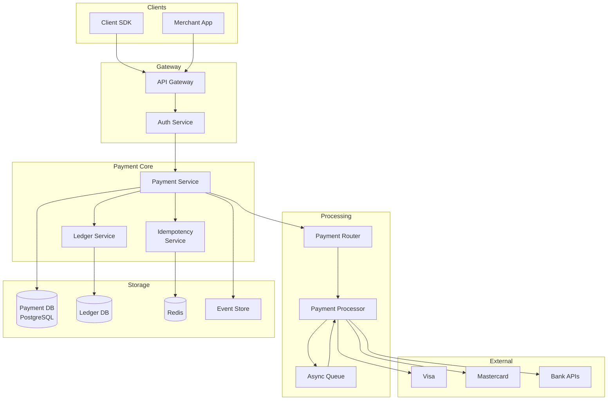
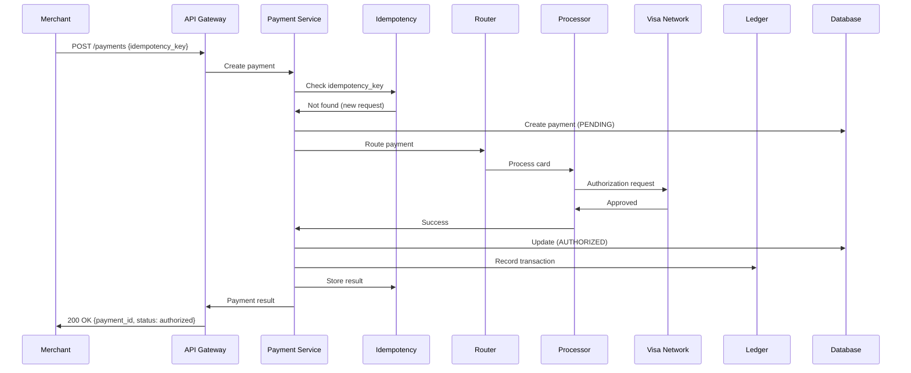
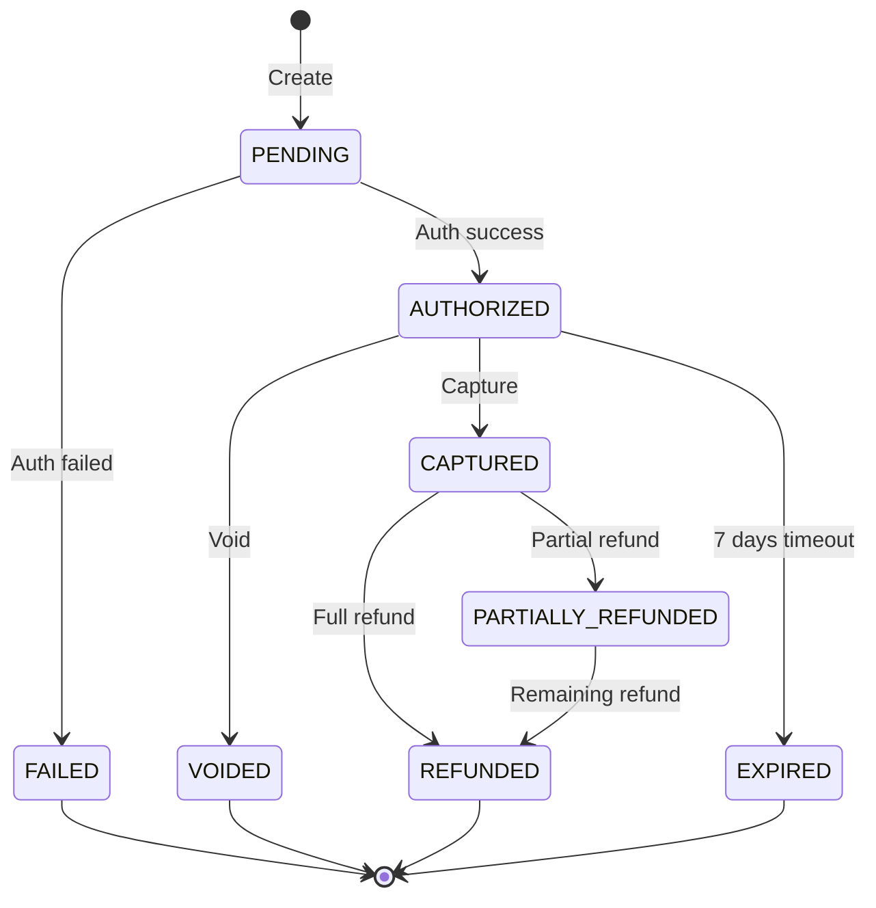
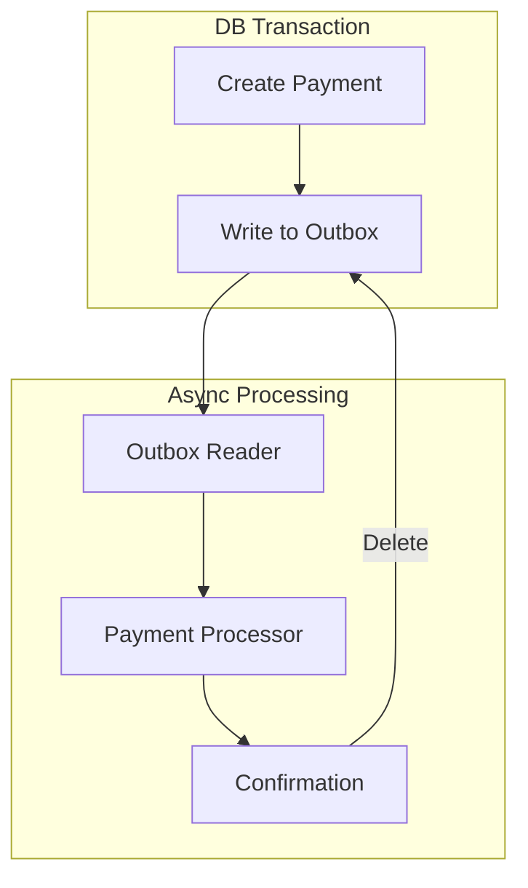

# Payment System (Stripe / PayPal)

## Уточняющие вопросы

- Какие типы платежей? (card, bank transfer, wallets)
- Какой объём? (TPS, daily volume)
- Какие страны/валюты?
- Нужен ли recurring billing?
- Какие требования к latency?
- PCI DSS compliance scope?
- Refunds, disputes handling?
- Multi-merchant или single merchant?

---

## Requirements

### Functional
- Обработка card payments (auth, capture, void)
- Refunds и partial refunds
- Multiple payment methods (cards, bank, wallets)
- Recurring payments / subscriptions
- Multi-currency support
- Merchant dashboard & reporting
- Webhook notifications
- Idempotent API

### Non-Functional
- **Availability**: 99.99% (payment path critical)
- **Latency**: < 500ms для auth, < 2s total
- **Consistency**: Exactly-once processing (no double charges)
- **Security**: PCI DSS Level 1 compliance
- **Durability**: Zero data loss

---

## Capacity Estimation

### Assumptions
- 10M transactions/day
- Peak: 5x average (Black Friday)
- Avg transaction: $50
- Daily volume: $500M

### Calculations

**TPS:**
```
10M / 86400 ≈ 115 TPS average
Peak: 115 × 5 = 575 TPS
Black Friday spike: 2000+ TPS
```

**Storage:**
```
Transaction record: ~2KB
10M × 2KB = 20 GB/day
Per year: ~7 TB
+ audit logs: ~50 TB/year
```

**External API calls:**
```
Each payment: 2-5 calls to card networks
575 TPS × 3 avg = 1,725 external calls/sec
```

---

## High-Level Design



### Компоненты

**API Gateway**
- Rate limiting
- Authentication (API keys, OAuth)
- Request validation
- TLS termination

**Payment Service**
- Payment lifecycle management
- Idempotency enforcement
- State machine transitions
- Webhook dispatch

**Idempotency Service**
- Prevents duplicate processing
- Request deduplication
- Stores results for replay

**Payment Router**
- Route to optimal processor
- Failover logic
- Cost optimization

**Ledger Service**
- Double-entry bookkeeping
- Balance tracking
- Reconciliation

**Payment Processor**
- Card network integration
- Protocol adaptation
- Retry logic

---

## Payment Flow

### Synchronous Payment (Card)



### Payment State Machine



---

## API Design

### Create Payment
```http
POST /v1/payments
Idempotency-Key: pay_abc123xyz
Authorization: Bearer sk_live_...

{
    "amount": 5000,           // cents
    "currency": "usd",
    "payment_method": "pm_card_visa",
    "customer": "cus_123",
    "description": "Order #1234",
    "metadata": {
        "order_id": "1234"
    },
    "capture": true           // auth + capture
}

Response 200:
{
    "id": "pay_xyz789",
    "amount": 5000,
    "currency": "usd",
    "status": "succeeded",
    "payment_method": "pm_card_visa",
    "created": 1705312800,
    "metadata": {...}
}
```

### Capture Payment
```http
POST /v1/payments/{payment_id}/capture
Idempotency-Key: cap_abc123

{
    "amount": 5000    // can be less than auth
}

Response 200:
{
    "id": "pay_xyz789",
    "status": "succeeded",
    "amount_captured": 5000
}
```

### Refund Payment
```http
POST /v1/refunds
Idempotency-Key: ref_abc123

{
    "payment": "pay_xyz789",
    "amount": 2500,           // partial refund
    "reason": "customer_request"
}

Response 200:
{
    "id": "ref_123",
    "payment": "pay_xyz789",
    "amount": 2500,
    "status": "succeeded"
}
```

### Webhook Event
```http
POST https://merchant.com/webhooks/stripe

{
    "id": "evt_123",
    "type": "payment_intent.succeeded",
    "data": {
        "object": {
            "id": "pay_xyz789",
            "amount": 5000,
            "status": "succeeded"
        }
    },
    "created": 1705312800
}

// Merchant должен вернуть 2xx в течение 30 sec
// Иначе — retry с exponential backoff
```

---

## Data Model

### Payments Table
```sql
CREATE TABLE payments (
    id                  VARCHAR(50) PRIMARY KEY,
    merchant_id         VARCHAR(50) NOT NULL,
    customer_id         VARCHAR(50),
    amount              BIGINT NOT NULL,        -- in smallest currency unit
    currency            CHAR(3) NOT NULL,
    status              VARCHAR(20) NOT NULL,
    payment_method_id   VARCHAR(50),
    description         TEXT,
    metadata            JSONB,
    failure_code        VARCHAR(50),
    failure_message     TEXT,

    -- Timestamps
    created_at          TIMESTAMP NOT NULL DEFAULT NOW(),
    authorized_at       TIMESTAMP,
    captured_at         TIMESTAMP,
    canceled_at         TIMESTAMP,

    -- Idempotency
    idempotency_key     VARCHAR(100),
    request_hash        VARCHAR(64),

    -- Audit
    version             INT NOT NULL DEFAULT 1,

    CONSTRAINT unique_idempotency
        UNIQUE (merchant_id, idempotency_key)
);

CREATE INDEX idx_merchant_created ON payments(merchant_id, created_at DESC);
CREATE INDEX idx_status ON payments(status) WHERE status IN ('pending', 'authorized');
```

### Payment Events Table (Event Sourcing)
```sql
CREATE TABLE payment_events (
    id                  BIGSERIAL PRIMARY KEY,
    payment_id          VARCHAR(50) NOT NULL,
    event_type          VARCHAR(50) NOT NULL,
    event_data          JSONB NOT NULL,
    created_at          TIMESTAMP NOT NULL DEFAULT NOW(),
    actor               VARCHAR(50),            -- user/system/processor

    -- Для ordering
    sequence_number     BIGINT NOT NULL
);

CREATE INDEX idx_payment_events ON payment_events(payment_id, sequence_number);
```

### Idempotency Keys Table
```sql
CREATE TABLE idempotency_keys (
    key                 VARCHAR(100) PRIMARY KEY,
    merchant_id         VARCHAR(50) NOT NULL,
    request_path        VARCHAR(200) NOT NULL,
    request_hash        VARCHAR(64) NOT NULL,
    response_code       INT,
    response_body       JSONB,
    created_at          TIMESTAMP NOT NULL DEFAULT NOW(),
    expires_at          TIMESTAMP NOT NULL,

    -- Locking
    locked_at           TIMESTAMP,
    lock_owner          VARCHAR(50)
);

-- Auto-cleanup expired keys
CREATE INDEX idx_expires ON idempotency_keys(expires_at);
```

### Ledger Entries (Double-Entry)
```sql
CREATE TABLE ledger_entries (
    id                  BIGSERIAL PRIMARY KEY,
    transaction_id      VARCHAR(50) NOT NULL,
    account_id          VARCHAR(50) NOT NULL,
    entry_type          VARCHAR(10) NOT NULL,   -- DEBIT/CREDIT
    amount              BIGINT NOT NULL,
    currency            CHAR(3) NOT NULL,
    balance_after       BIGINT NOT NULL,
    created_at          TIMESTAMP NOT NULL DEFAULT NOW(),

    CONSTRAINT positive_amount CHECK (amount > 0)
);

-- Sum of debits must equal sum of credits per transaction
CREATE INDEX idx_transaction ON ledger_entries(transaction_id);
CREATE INDEX idx_account ON ledger_entries(account_id, created_at DESC);
```

---

## Deep Dives

### 1. Idempotency Implementation

**Problem:** Network issues → client retries → double charge

**Solution: Idempotency keys + request fingerprinting**

```python
class IdempotencyService:
    LOCK_TTL = 30  # seconds
    KEY_TTL = 86400 * 7  # 7 days

    async def process_request(self, key: str, merchant_id: str,
                             request: dict, handler: Callable):
        # Create request fingerprint
        request_hash = sha256(json.dumps(request, sort_keys=True))

        # Try to acquire lock
        lock_acquired = await self.try_acquire_lock(key, merchant_id)

        if not lock_acquired:
            # Another request in progress, wait and return cached
            cached = await self.wait_for_result(key, merchant_id)
            if cached:
                return cached
            raise ConcurrentRequestError()

        try:
            # Check for existing result
            existing = await self.get_cached_result(key, merchant_id)

            if existing:
                # Verify same request
                if existing.request_hash != request_hash:
                    raise IdempotencyKeyMismatch()
                return existing.response

            # Process new request
            response = await handler(request)

            # Cache result
            await self.cache_result(key, merchant_id, request_hash, response)

            return response
        finally:
            await self.release_lock(key, merchant_id)

    async def try_acquire_lock(self, key, merchant_id):
        lock_key = f"lock:{merchant_id}:{key}"
        return await redis.set(lock_key, self.instance_id,
                              nx=True, ex=self.LOCK_TTL)
```

**Database implementation:**
```sql
-- Atomic idempotency check + insert
WITH existing AS (
    SELECT response_code, response_body
    FROM idempotency_keys
    WHERE key = $1 AND merchant_id = $2
), inserted AS (
    INSERT INTO idempotency_keys (key, merchant_id, request_path, request_hash, expires_at)
    SELECT $1, $2, $3, $4, NOW() + INTERVAL '7 days'
    WHERE NOT EXISTS (SELECT 1 FROM existing)
    ON CONFLICT DO NOTHING
    RETURNING *
)
SELECT
    CASE WHEN existing.response_code IS NOT NULL THEN 'existing'
         WHEN inserted.key IS NOT NULL THEN 'new'
         ELSE 'conflict'
    END as status,
    existing.response_code,
    existing.response_body
FROM existing
FULL OUTER JOIN inserted ON false;
```

### 2. Exactly-Once Processing

**Problem:** Ensure payment processed exactly once despite failures

**Solution: Saga pattern + outbox**



```python
class PaymentService:
    async def create_payment(self, request):
        async with db.transaction():
            # 1. Create payment record
            payment = await self.create_payment_record(request)

            # 2. Write to outbox (same transaction)
            await self.write_outbox_event(
                event_type="PAYMENT_CREATED",
                payload={"payment_id": payment.id}
            )

            # Transaction commits atomically

        return payment

class OutboxProcessor:
    async def process_events(self):
        while True:
            events = await self.get_unprocessed_events(limit=100)

            for event in events:
                try:
                    await self.process_event(event)
                    await self.mark_processed(event.id)
                except Exception as e:
                    await self.handle_failure(event, e)

            await asyncio.sleep(0.1)
```

### 3. Payment Routing & Failover

**Multi-processor routing:**

```python
class PaymentRouter:
    def __init__(self):
        self.processors = {
            "visa": [AdyenProcessor(), StripeProcessor(), WorldpayProcessor()],
            "mastercard": [StripeProcessor(), AdyenProcessor()],
            "amex": [AmexDirectProcessor(), StripeProcessor()]
        }

    async def route_payment(self, payment):
        card_network = self.detect_network(payment.card_number)
        processors = self.processors[card_network]

        # Sort by: success rate, latency, cost
        ranked = self.rank_processors(processors, payment)

        for processor in ranked:
            try:
                result = await processor.process(payment)
                if result.success:
                    return result

                if result.is_hard_decline:
                    # Card declined, don't retry
                    return result

            except ProcessorTimeout:
                await self.record_timeout(processor)
                continue

            except ProcessorError as e:
                await self.record_error(processor, e)
                continue

        raise AllProcessorsFailedError()

    def rank_processors(self, processors, payment):
        scores = []
        for p in processors:
            score = (
                p.success_rate * 0.5 +
                (1 / p.avg_latency_ms) * 0.3 +
                (1 - p.fee_percent) * 0.2
            )
            # Adjust for specific merchant/card
            if p.has_merchant_account(payment.merchant_id):
                score *= 1.1
            scores.append((p, score))

        return [p for p, _ in sorted(scores, key=lambda x: -x[1])]
```

**Circuit breaker:**
```python
class ProcessorCircuitBreaker:
    def __init__(self, processor):
        self.processor = processor
        self.failure_count = 0
        self.last_failure_time = None
        self.state = "CLOSED"

    async def call(self, payment):
        if self.state == "OPEN":
            if self.should_try_half_open():
                self.state = "HALF_OPEN"
            else:
                raise CircuitOpenError()

        try:
            result = await self.processor.process(payment)
            self.on_success()
            return result
        except Exception as e:
            self.on_failure()
            raise

    def on_failure(self):
        self.failure_count += 1
        self.last_failure_time = now()

        if self.failure_count >= 5:
            self.state = "OPEN"

    def on_success(self):
        self.failure_count = 0
        self.state = "CLOSED"

    def should_try_half_open(self):
        return now() - self.last_failure_time > timedelta(seconds=30)
```

---

## Bottlenecks & Solutions

### Problem 1: Database write bottleneck
- **Issue**: High TPS payments + audit logs
- **Solution**:
  - Async audit logging
  - Sharding by merchant_id
  - Write-ahead buffer

### Problem 2: External processor latency
- **Issue**: Card networks slow → timeout → retry loops
- **Solution**:
  - Aggressive timeouts (5-10 sec)
  - Async capture (auth → queue → capture)
  - Multiple processor fallback

### Problem 3: Idempotency key storage
- **Issue**: Millions of keys, fast lookups needed
- **Solution**:
  - Redis для hot keys (1 hour)
  - PostgreSQL для persistence
  - TTL cleanup (7-30 days)

### Problem 4: Webhook delivery failures
- **Issue**: Merchant endpoint down
- **Solution**:
  - Retry queue с exponential backoff
  - DLQ после N retries
  - Webhook logs для debugging

### Problem 5: Reconciliation discrepancies
- **Issue**: Internal state ≠ processor state
- **Solution**:
  - Daily batch reconciliation
  - Real-time settlement webhooks
  - Alerts on discrepancies

---

## Trade-offs для обсуждения

| Решение | Trade-off |
|---------|-----------|
| Sync vs Async auth | Latency vs Throughput |
| Single vs Multi-processor | Simplicity vs Reliability |
| Event sourcing vs CRUD | Auditability vs Complexity |
| Strong vs Eventual consistency | Correctness vs Performance |
| PCI in-house vs tokenization | Control vs Compliance burden |

---

## Security Considerations

### PCI DSS Compliance
```
Scope reduction strategies:
1. Tokenization — never store raw card numbers
2. Client-side encryption — cards encrypted in browser
3. Hosted payment fields (iframe)
4. Network segmentation — payment systems isolated
```

### Fraud Prevention Layers
```
1. 3D Secure (3DS) — cardholder authentication
2. AVS — address verification
3. CVV check — card-present verification
4. Velocity checks — rate limiting per card/user
5. ML fraud scoring — real-time risk assessment
```
