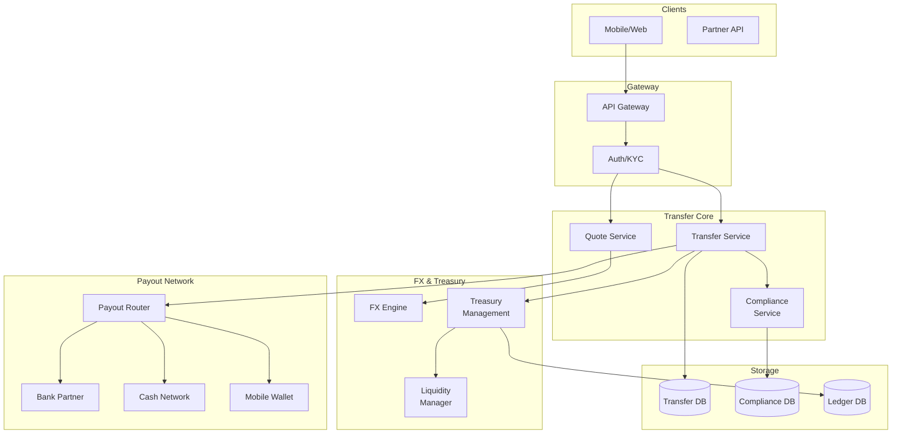
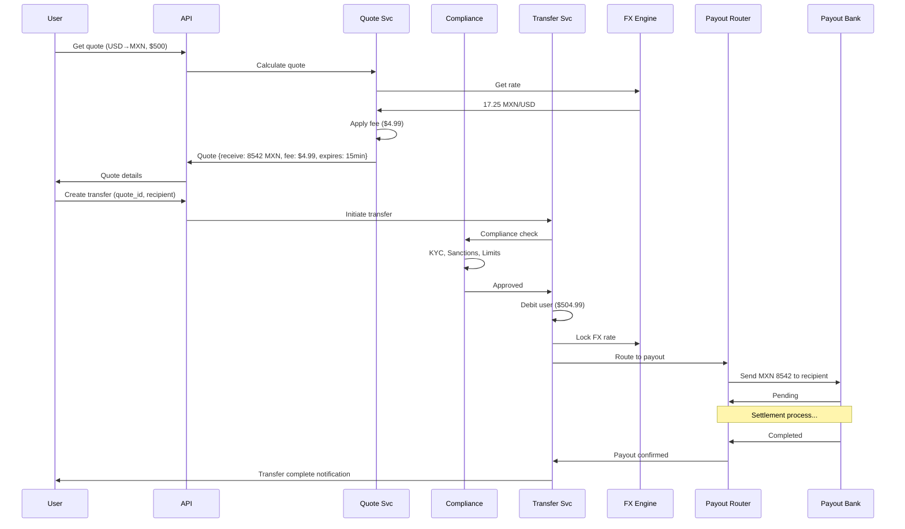
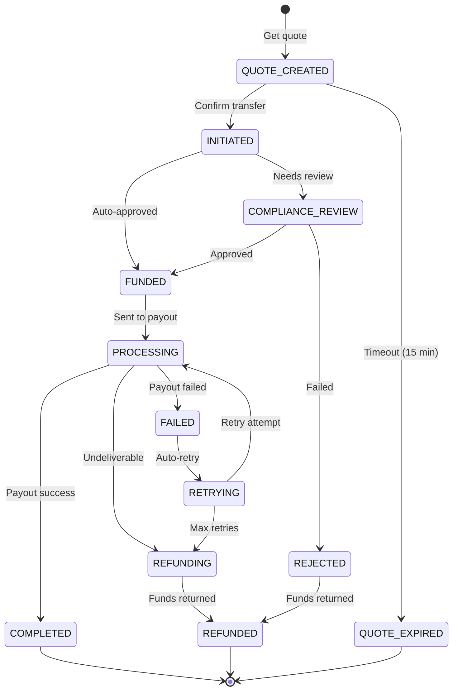
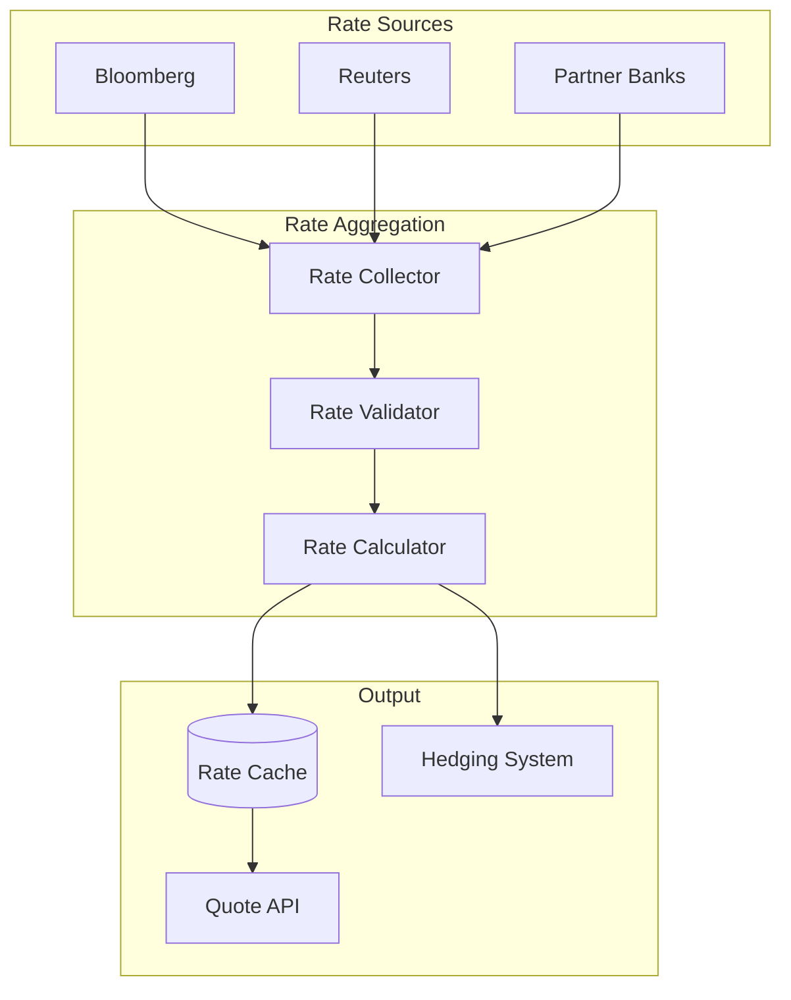
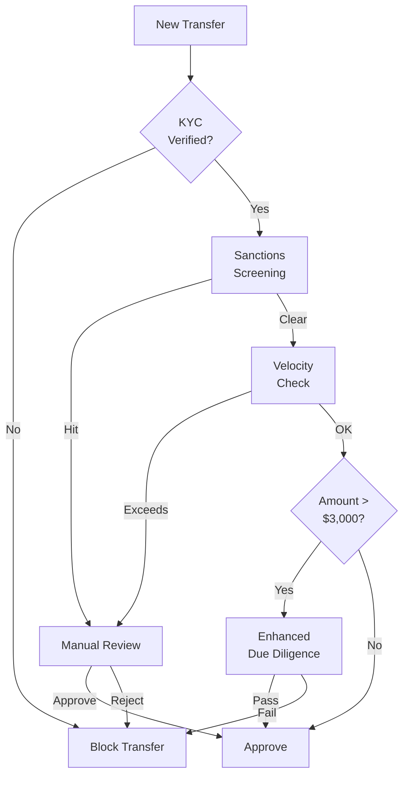

# Cross-Border Remittance System (Wise / Felix)

## Уточняющие вопросы

- Какие коридоры? (US→MX, US→PH, etc.)
- Какой объём? (transfers/day, daily volume)
- Какие методы выплаты? (bank, cash pickup, mobile wallet)
- Real-time или T+1/T+2?
- Какие лимиты на транзакцию?
- Compliance требования? (licenses, reporting)
- Нужен ли recurring/scheduled?
- FX: real-time rates или locked?

---

## Requirements

### Functional
- Create transfer (amount, recipient, corridor)
- FX quote с locked rate
- Multiple payout methods (bank, cash, mobile)
- Recipient management
- Transfer tracking
- Transaction history
- KYC/compliance checks
- Notifications (status updates)

### Non-Functional
- **Latency**: Quote < 500ms, Transfer initiation < 2s
- **Availability**: 99.9% (financial SLA)
- **Consistency**: Strong (no double sends, no lost funds)
- **Compliance**: Licensed, auditable
- **Settlement**: Real-time to 2 business days

---

## Capacity Estimation

### Assumptions
- 1M transfers/day
- Avg transfer: $500
- Daily volume: $500M
- 10 active corridors
- Peak: 3x average

### Calculations

**TPS:**
```
1M / 86400 ≈ 12 TPS average
Peak: 12 × 3 = 36 TPS
```

**FX Quotes:**
```
Quote:Transfer ratio ≈ 10:1 (many quotes, one transfer)
120 quotes/sec peak
```

**Settlement:**
```
$500M daily
Funding requirements: $50M buffer per corridor
Total liquidity: ~$500M
```

**Storage:**
```
Transfer record: ~5KB (with compliance data)
1M × 5KB = 5 GB/day
Per year: ~2 TB
```

---

## High-Level Design



### Компоненты

**Quote Service**
- Real-time FX rates
- Fee calculation
- Rate locking (15-60 min)
- Corridor availability

**Transfer Service**
- Transfer lifecycle management
- State machine
- Retry logic
- Webhook notifications

**Compliance Service**
- KYC verification
- Sanctions screening (OFAC, EU)
- Transaction monitoring
- Reporting (CTR, SAR)

**FX Engine**
- Rate aggregation (multiple sources)
- Spread calculation
- Hedging support
- Rate history

**Treasury Management**
- Pre-funding management
- Settlement processing
- Reconciliation
- Liquidity optimization

**Payout Router**
- Partner selection
- Failover logic
- Cost optimization
- SLA monitoring

---

## Transfer Flow



### Transfer State Machine



---

## API Design

### Get Quote
```http
POST /v1/quotes
{
    "source_currency": "USD",
    "target_currency": "MXN",
    "source_amount": 50000,     // cents ($500)
    "corridor": "US_MX",
    "payout_method": "bank_deposit"
}

Response 200:
{
    "quote_id": "quote_abc123",
    "source_amount": 50000,
    "source_currency": "USD",
    "target_amount": 854200,    // centavos (8,542 MXN)
    "target_currency": "MXN",
    "exchange_rate": 17.25,
    "fee": 499,                 // $4.99
    "total_to_pay": 50499,      // $504.99
    "delivery_estimate": "minutes",
    "expires_at": "2024-01-15T10:15:00Z"
}
```

### Create Transfer
```http
POST /v1/transfers
Idempotency-Key: txn_abc123

{
    "quote_id": "quote_abc123",
    "recipient_id": "rcpt_xyz",
    "purpose": "family_support",
    "source_of_funds": "salary"
}

Response 202:
{
    "transfer_id": "xfer_789",
    "status": "initiated",
    "source_amount": 50499,
    "target_amount": 854200,
    "recipient": {...},
    "estimated_delivery": "2024-01-15T10:30:00Z",
    "tracking_url": "https://app.felix.com/track/xfer_789"
}
```

### Get Transfer Status
```http
GET /v1/transfers/{transfer_id}

{
    "transfer_id": "xfer_789",
    "status": "completed",
    "timeline": [
        {"status": "initiated", "at": "2024-01-15T10:00:00Z"},
        {"status": "funded", "at": "2024-01-15T10:00:05Z"},
        {"status": "processing", "at": "2024-01-15T10:00:10Z"},
        {"status": "completed", "at": "2024-01-15T10:15:00Z"}
    ],
    "source_amount": 50499,
    "target_amount": 854200,
    "exchange_rate": 17.25,
    "fee": 499,
    "recipient": {...},
    "payout_reference": "SPEI-123456"
}
```

### Create Recipient
```http
POST /v1/recipients
{
    "first_name": "Maria",
    "last_name": "Garcia",
    "country": "MX",
    "payout_method": {
        "type": "bank_deposit",
        "bank_code": "BBVA",
        "account_number": "012345678901234567",
        "clabe": "012180001234567890"
    }
}
```

---

## Data Model

### Transfers Table
```sql
CREATE TABLE transfers (
    id                  VARCHAR(50) PRIMARY KEY,
    user_id             VARCHAR(50) NOT NULL,
    quote_id            VARCHAR(50) NOT NULL,
    recipient_id        VARCHAR(50) NOT NULL,
    corridor            VARCHAR(10) NOT NULL,

    -- Amounts
    source_amount       BIGINT NOT NULL,
    source_currency     CHAR(3) NOT NULL,
    target_amount       BIGINT NOT NULL,
    target_currency     CHAR(3) NOT NULL,
    exchange_rate       DECIMAL(18, 8) NOT NULL,
    fee                 BIGINT NOT NULL,

    -- Status
    status              VARCHAR(30) NOT NULL,
    status_reason       TEXT,

    -- Payout
    payout_method       VARCHAR(30) NOT NULL,
    payout_partner      VARCHAR(50),
    payout_reference    VARCHAR(100),

    -- Compliance
    compliance_status   VARCHAR(20),
    compliance_notes    TEXT,

    -- Timestamps
    created_at          TIMESTAMP NOT NULL DEFAULT NOW(),
    funded_at           TIMESTAMP,
    completed_at        TIMESTAMP,

    -- Idempotency
    idempotency_key     VARCHAR(100) UNIQUE,

    INDEX idx_user (user_id, created_at DESC),
    INDEX idx_status (status, created_at)
);
```

### Quotes Table
```sql
CREATE TABLE quotes (
    id                  VARCHAR(50) PRIMARY KEY,
    user_id             VARCHAR(50),
    corridor            VARCHAR(10) NOT NULL,
    source_currency     CHAR(3) NOT NULL,
    target_currency     CHAR(3) NOT NULL,
    source_amount       BIGINT NOT NULL,
    target_amount       BIGINT NOT NULL,
    exchange_rate       DECIMAL(18, 8) NOT NULL,
    fee                 BIGINT NOT NULL,
    rate_source         VARCHAR(50),
    payout_method       VARCHAR(30),
    created_at          TIMESTAMP NOT NULL DEFAULT NOW(),
    expires_at          TIMESTAMP NOT NULL,
    used_at             TIMESTAMP,
    transfer_id         VARCHAR(50),

    INDEX idx_expires (expires_at) WHERE used_at IS NULL
);
```

### Recipients Table
```sql
CREATE TABLE recipients (
    id                  VARCHAR(50) PRIMARY KEY,
    user_id             VARCHAR(50) NOT NULL,
    first_name          VARCHAR(100) NOT NULL,
    last_name           VARCHAR(100) NOT NULL,
    country             CHAR(2) NOT NULL,
    payout_method_type  VARCHAR(30) NOT NULL,
    payout_details      JSONB NOT NULL,       -- encrypted
    verification_status VARCHAR(20) DEFAULT 'pending',
    created_at          TIMESTAMP NOT NULL DEFAULT NOW(),

    INDEX idx_user_recipients (user_id)
);
```

### Compliance Checks Table
```sql
CREATE TABLE compliance_checks (
    id                  BIGSERIAL PRIMARY KEY,
    transfer_id         VARCHAR(50) NOT NULL,
    check_type          VARCHAR(30) NOT NULL,  -- kyc, sanctions, velocity
    result              VARCHAR(20) NOT NULL,  -- pass, fail, review
    details             JSONB,
    checked_at          TIMESTAMP NOT NULL DEFAULT NOW(),

    INDEX idx_transfer (transfer_id)
);
```

### FX Rates Table
```sql
CREATE TABLE fx_rates (
    id                  BIGSERIAL PRIMARY KEY,
    corridor            VARCHAR(10) NOT NULL,
    source_currency     CHAR(3) NOT NULL,
    target_currency     CHAR(3) NOT NULL,
    mid_rate            DECIMAL(18, 8) NOT NULL,
    bid_rate            DECIMAL(18, 8),
    ask_rate            DECIMAL(18, 8),
    spread              DECIMAL(8, 4),
    source              VARCHAR(50) NOT NULL,
    timestamp           TIMESTAMP NOT NULL,

    INDEX idx_corridor_time (corridor, timestamp DESC)
);
```

---

## Deep Dives

### 1. FX Rate Management



**Rate aggregation:**
```python
class FXRateService:
    def __init__(self):
        self.sources = [BloombergSource(), ReutersSource(), BankPartnerSource()]
        self.cache = Redis()

    async def get_rate(self, corridor: str) -> FXRate:
        # Check cache (rates valid for 30 sec)
        cached = await self.cache.get(f"fx_rate:{corridor}")
        if cached:
            return FXRate.from_json(cached)

        # Fetch from multiple sources
        rates = await asyncio.gather(*[
            source.get_rate(corridor) for source in self.sources
        ], return_exceptions=True)

        # Filter valid rates
        valid_rates = [r for r in rates if not isinstance(r, Exception)]

        if len(valid_rates) < 2:
            raise InsufficientRateSourcesError()

        # Aggregate (median to avoid outliers)
        mid_rate = median([r.mid_rate for r in valid_rates])

        # Apply spread (our margin)
        spread = self.get_spread(corridor)
        customer_rate = mid_rate * (1 - spread)

        rate = FXRate(
            corridor=corridor,
            mid_rate=mid_rate,
            customer_rate=customer_rate,
            spread=spread,
            timestamp=now()
        )

        # Cache
        await self.cache.setex(f"fx_rate:{corridor}", 30, rate.to_json())

        return rate

    def get_spread(self, corridor: str) -> float:
        # Dynamic spread based on:
        # - Corridor liquidity
        # - Current inventory position
        # - Market volatility
        base_spread = CORRIDOR_SPREADS[corridor]
        volatility_adj = self.get_volatility_adjustment(corridor)
        inventory_adj = self.get_inventory_adjustment(corridor)

        return base_spread + volatility_adj + inventory_adj
```

**Rate locking:**
```python
class QuoteService:
    async def create_quote(self, request) -> Quote:
        # Get current rate
        rate = await fx_service.get_rate(request.corridor)

        # Calculate amounts
        target_amount = int(request.source_amount * rate.customer_rate)
        fee = self.calculate_fee(request)

        # Create quote with expiry
        quote = Quote(
            id=generate_quote_id(),
            source_amount=request.source_amount,
            target_amount=target_amount,
            exchange_rate=rate.customer_rate,
            fee=fee,
            expires_at=now() + timedelta(minutes=15)
        )

        # Store rate lock
        await self.store_quote(quote)

        # Optionally: hedge the position
        if request.source_amount > HEDGE_THRESHOLD:
            await treasury.hedge_position(quote)

        return quote
```

### 2. Payout Partner Integration

```python
class PayoutRouter:
    def __init__(self):
        self.partners = {
            "MX": {
                "bank": [SPEIPartner(), CIBanco()],
                "cash": [Elektra(), OXXO()]
            },
            "PH": {
                "bank": [Instapay(), PESONet()],
                "mobile": [GCash(), PayMaya()]
            }
        }

    async def route_payout(self, transfer: Transfer) -> PayoutResult:
        corridor = transfer.corridor.split("_")[1]  # US_MX → MX
        method = transfer.payout_method
        partners = self.partners[corridor][method]

        # Sort by: success_rate, cost, speed
        ranked = self.rank_partners(partners, transfer)

        for partner in ranked:
            try:
                result = await partner.send_payout(
                    amount=transfer.target_amount,
                    currency=transfer.target_currency,
                    recipient=transfer.recipient
                )

                if result.success:
                    return result

                if result.is_permanent_failure:
                    # e.g., invalid account
                    break

            except PartnerTimeout:
                await self.record_timeout(partner)
                continue

        raise PayoutFailedError()

    def rank_partners(self, partners, transfer):
        scores = []
        for p in partners:
            # Weight factors
            score = (
                p.success_rate * 0.4 +
                (1 / p.avg_latency_hours) * 0.3 +
                (1 - p.fee_percent) * 0.2 +
                p.has_instant * 0.1
            )

            # Capacity check
            if p.daily_remaining_capacity < transfer.target_amount:
                score *= 0.1

            scores.append((p, score))

        return [p for p, _ in sorted(scores, key=lambda x: -x[1])]
```

**Partner API example (SPEI - Mexico):**
```python
class SPEIPartner:
    async def send_payout(self, amount, currency, recipient):
        # Validate CLABE
        if not self.validate_clabe(recipient.clabe):
            return PayoutResult(success=False, permanent=True,
                               error="invalid_clabe")

        # Send SPEI transfer
        response = await self.client.post("/transfers", json={
            "clabe": recipient.clabe,
            "amount": amount / 100,  # convert centavos
            "concept": "Remittance from USA",
            "reference": generate_reference()
        })

        if response.status == 200:
            return PayoutResult(
                success=True,
                reference=response.json()["cep"],
                estimated_arrival="instant"
            )
        else:
            return PayoutResult(
                success=False,
                error=response.json()["error_code"]
            )
```

### 3. Compliance & AML



```python
class ComplianceService:
    async def check_transfer(self, transfer: Transfer) -> ComplianceResult:
        checks = []

        # 1. KYC verification
        kyc_result = await self.verify_kyc(transfer.user_id)
        checks.append(("kyc", kyc_result))
        if not kyc_result.passed:
            return ComplianceResult(approved=False, reason="kyc_required")

        # 2. Sanctions screening (OFAC, EU, UN)
        sanctions_result = await self.screen_sanctions(
            sender=transfer.user,
            recipient=transfer.recipient
        )
        checks.append(("sanctions", sanctions_result))
        if sanctions_result.hit:
            return ComplianceResult(
                approved=False,
                reason="sanctions_hit",
                requires_review=True
            )

        # 3. Velocity checks
        velocity_result = await self.check_velocity(
            user_id=transfer.user_id,
            amount=transfer.source_amount,
            period="30d"
        )
        checks.append(("velocity", velocity_result))
        if velocity_result.exceeds_limit:
            return ComplianceResult(
                approved=False,
                reason="velocity_limit",
                requires_review=True
            )

        # 4. Amount-based checks
        if transfer.source_amount > 300000:  # $3,000
            edd_result = await self.enhanced_due_diligence(transfer)
            checks.append(("edd", edd_result))
            if not edd_result.passed:
                return ComplianceResult(approved=False, reason="edd_failed")

        # 5. Record for reporting
        if transfer.source_amount > 1000000:  # $10,000
            await self.create_ctr(transfer)  # Currency Transaction Report

        return ComplianceResult(approved=True, checks=checks)

    async def screen_sanctions(self, sender, recipient):
        # Check against multiple lists
        lists = ["OFAC_SDN", "OFAC_CONS", "EU_SANCTIONS", "UN_SANCTIONS"]

        for person in [sender, recipient]:
            for list_name in lists:
                result = await self.sanctions_db.search(
                    name=f"{person.first_name} {person.last_name}",
                    country=person.country,
                    list=list_name
                )
                if result.score > 0.85:  # fuzzy match threshold
                    return SanctionsResult(
                        hit=True,
                        list=list_name,
                        score=result.score,
                        matched_entry=result.entry
                    )

        return SanctionsResult(hit=False)
```

---

## Bottlenecks & Solutions

### Problem 1: FX rate volatility
- **Issue**: Rate changes between quote and transfer
- **Solution**:
  - Short quote expiry (15 min)
  - Rate locking with hedging
  - Buffer in spread

### Problem 2: Payout partner downtime
- **Issue**: Partner API unavailable
- **Solution**:
  - Multiple partners per corridor
  - Automatic failover
  - Queue with retry

### Problem 3: Compliance bottleneck
- **Issue**: Manual review queue grows
- **Solution**:
  - ML-based auto-decisioning
  - Risk-based tiering
  - SLA monitoring

### Problem 4: Settlement delays
- **Issue**: Funds stuck in transit
- **Solution**:
  - Pre-funding at partners
  - Real-time settlement rails (RTP, SPEI)
  - Liquidity monitoring

### Problem 5: Cross-timezone operations
- **Issue**: Bank cut-offs, holidays
- **Solution**:
  - Corridor-specific scheduling
  - Holiday calendar integration
  - Clear delivery estimates

---

## Trade-offs для обсуждения

| Решение | Trade-off |
|---------|-----------|
| Real-time vs Batch settlement | Speed vs Cost |
| Fixed vs Dynamic spread | Simplicity vs Margin optimization |
| Single vs Multi-partner | Reliability vs Complexity |
| Auto vs Manual compliance | Speed vs Risk |
| Pre-funding vs On-demand | Capital efficiency vs Speed |

---

## Regulatory Considerations

### Licenses Required
```
USA: Money Transmitter Licenses (per state), FinCEN registration
EU: E-Money License, PSD2
Mexico: CNBV authorization
Philippines: BSP remittance license
```

### Reporting Requirements
```
- CTR: Currency Transaction Reports (> $10K)
- SAR: Suspicious Activity Reports
- FATF Travel Rule: originator/beneficiary info
- Local reporting per jurisdiction
```
