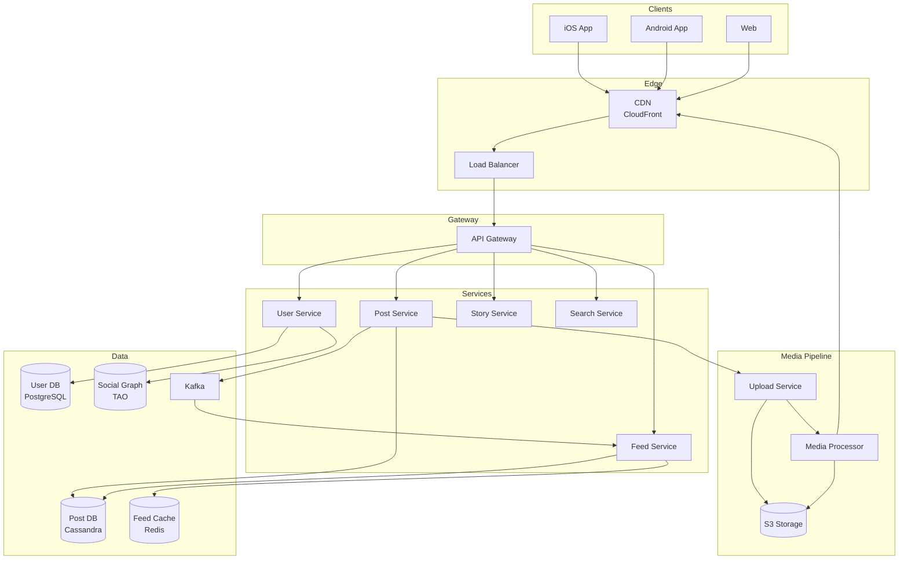
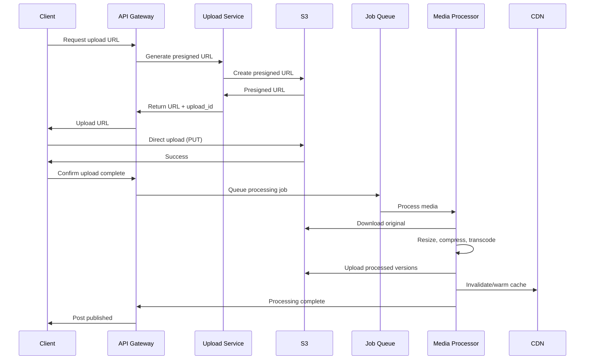
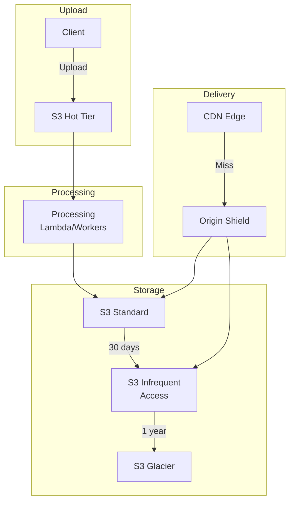

# Instagram

## Уточняющие вопросы

- Какие features в scope? (Feed, Stories, Reels, DM?)
- Какой масштаб? (DAU, posts per day)
- Какие типы media? (photo, video, carousel)
- Какие размеры/качество фото/видео?
- Real-time feed или pull-to-refresh?
- Нужны ли фильтры/редактирование?
- Explore/Discovery page?
- Notifications?

---

## Requirements

### Functional
- Upload photos/videos (с фильтрами)
- News feed из постов followings
- Like, comment, share
- Follow/unfollow пользователей
- Stories (24h ephemeral content)
- Explore page (discovery)
- User profiles
- Direct messages (optional)

### Non-Functional
- **Availability**: 99.99%
- **Latency**: Feed < 200ms, Upload < 5s
- **Scalability**: 2B MAU, 100M posts/day
- **Durability**: Media никогда не теряется
- **Global**: низкая latency по всему миру

---

## Capacity Estimation

### Assumptions
- 2B MAU, 500M DAU
- 100M photos/day, 50M videos/day
- Photo: 2MB original → 200KB optimized
- Video: 50MB original → 5MB optimized
- Avg user: 300 followings
- Feed: 500 posts cached

### Calculations

**Upload QPS:**
```
150M uploads / 86400 ≈ 1,700/sec
Peak: 1,700 × 5 = 8,500/sec
```

**Feed reads:**
```
500M DAU × 10 opens/day = 5B reads/day
5B / 86400 ≈ 58,000 reads/sec
Peak: 290,000 reads/sec
```

**Storage (daily):**
```
Photos: 100M × 200KB = 20 TB/day
Videos: 50M × 5MB = 250 TB/day
Total: ~270 TB/day
Per year: ~100 PB
```

**CDN bandwidth:**
```
Assume 10 views per post
150M × 10 × avg(200KB, 5MB) ≈ 3 PB/day egress
```

---

## High-Level Design



### Компоненты

**CDN (CloudFront/Akamai)**
- Кэширует все media
- Edge locations по миру
- ~90% cache hit rate

**Media Processing Pipeline**
- Resize до multiple resolutions
- Compression и optimization
- Video transcoding (HLS)
- Face detection, content moderation

**Post Service**
- CRUD для постов
- Captions, location, tags
- Triggers fan-out

**Feed Service**
- Pre-computed feeds
- Merge с celebrity posts
- Ranking algorithm

**Story Service**
- 24h TTL content
- Viewers tracking
- Ring UI ordering

**Social Graph (TAO-like)**
- Follow relationships
- Efficient fan-out queries
- Cached in memory

---

## Media Upload Flow



### Media Processing Details

**Photo processing:**
```
Original (HEIC/RAW) → JPEG conversion
Sizes generated:
- 1080px (feed)
- 640px (profile grid)
- 320px (thumbnails)
- 150px (comments/likes preview)

Optimizations:
- WebP for supported clients
- JPEG quality 85%
- Strip metadata (EXIF)
- Face detection → auto-crop
```

**Video processing:**
```
Original → Multiple bitrates (HLS):
- 1080p @ 5 Mbps
- 720p @ 2.5 Mbps
- 480p @ 1 Mbps
- 360p @ 500 Kbps

Format: H.264 + AAC
Segment duration: 2-4 seconds
Thumbnail extraction: every 5 sec
First frame as poster
```

---

## API Design

### Create Post
```http
POST /api/v1/posts
Content-Type: application/json

{
    "media_ids": ["media_123", "media_456"],  // pre-uploaded
    "caption": "Beautiful sunset! #travel",
    "location": {
        "id": "loc_789",
        "name": "Bali, Indonesia"
    },
    "tagged_users": ["user_111", "user_222"],
    "disable_comments": false
}

Response 201:
{
    "id": "post_abc",
    "media": [
        {
            "id": "media_123",
            "type": "image",
            "url": "https://cdn.instagram.com/...",
            "dimensions": {"width": 1080, "height": 1350}
        }
    ],
    "caption": "Beautiful sunset! #travel",
    "author": {...},
    "created_at": "2024-01-15T10:00:00Z"
}
```

### Get Feed
```http
GET /api/v1/feed?max_id={post_id}&count=20

{
    "posts": [
        {
            "id": "post_123",
            "media": [...],
            "caption": "...",
            "author": {...},
            "liked_by_viewer": false,
            "like_count": 1234,
            "comment_count": 56,
            "preview_comments": [...]
        }
    ],
    "next_max_id": "post_100",
    "has_more": true
}
```

### Get Stories Tray
```http
GET /api/v1/stories/tray

{
    "stories": [
        {
            "user": {...},
            "items_count": 3,
            "seen_all": false,
            "latest_reel_media": 1705312800
        }
    ]
}
```

### Get User Stories
```http
GET /api/v1/users/{user_id}/stories

{
    "items": [
        {
            "id": "story_123",
            "media_type": "image",
            "url": "...",
            "taken_at": 1705312800,
            "expiring_at": 1705399200,
            "viewers_count": 234,
            "sticker_data": {...}
        }
    ]
}
```

---

## Data Model

### Posts Table (Cassandra)
```sql
CREATE TABLE posts (
    post_id         UUID,
    author_id       BIGINT,
    caption         TEXT,
    location_id     BIGINT,
    created_at      TIMESTAMP,
    media_type      VARCHAR,  -- image, video, carousel
    is_deleted      BOOLEAN,

    PRIMARY KEY (author_id, post_id)
) WITH CLUSTERING ORDER BY (post_id DESC);

-- Partition by author for user timeline
-- Secondary index or separate table for feed
```

### Media Table
```sql
CREATE TABLE media (
    media_id        UUID PRIMARY KEY,
    post_id         UUID,
    type            VARCHAR,     -- image, video
    original_url    TEXT,
    urls            MAP<TEXT, TEXT>,  -- {1080: url, 640: url, ...}
    dimensions      MAP<TEXT, INT>,   -- {width: 1080, height: 1350}
    duration_ms     INT,         -- for video
    created_at      TIMESTAMP
);
```

### Stories (Redis + Cassandra)
```
# Redis (active stories, 24h TTL)
Key: stories:{user_id}
Type: Sorted Set
Score: created_at
Value: story_id

# Cassandra (permanent storage for analytics)
CREATE TABLE stories (
    story_id        UUID PRIMARY KEY,
    author_id       BIGINT,
    media_url       TEXT,
    media_type      VARCHAR,
    created_at      TIMESTAMP,
    expires_at      TIMESTAMP,
    viewers         SET<BIGINT>
);
```

### Social Graph (TAO-like structure)
```sql
-- Following edges (who I follow)
CREATE TABLE following (
    user_id         BIGINT,
    following_id    BIGINT,
    created_at      TIMESTAMP,
    PRIMARY KEY (user_id, following_id)
);

-- Follower edges (who follows me)
CREATE TABLE followers (
    user_id         BIGINT,
    follower_id     BIGINT,
    created_at      TIMESTAMP,
    PRIMARY KEY (user_id, follower_id)
);

-- Counts (denormalized)
CREATE TABLE user_counts (
    user_id         BIGINT PRIMARY KEY,
    following_count INT,
    followers_count INT,
    posts_count     INT
);
```

### Feed Cache (Redis)
```
Key: feed:{user_id}
Type: Sorted Set
Score: post timestamp
Value: post_id

# Keep last 500 posts
# TTL: 7 days for inactive users
```

---

## Deep Dives

### 1. Feed Generation (Hybrid Fan-out)

**Similar to Twitter, but media-heavy:**

```python
CELEBRITY_THRESHOLD = 50_000  # followers

def publish_post(post):
    # Store post
    save_post(post)

    # Upload media (async)
    process_media.delay(post.media_ids)

    # Fan-out decision
    author = get_user(post.author_id)
    followers_count = get_followers_count(author.id)

    if followers_count > CELEBRITY_THRESHOLD:
        # Don't fan-out, pull on read
        mark_as_celebrity_post(post.id)
    else:
        # Fan-out to active followers
        fanout_to_followers.delay(post.id, author.id)

def get_feed(user_id, cursor, limit):
    # Get pre-computed feed
    feed_posts = redis.zrevrangebyscore(
        f"feed:{user_id}",
        max=cursor,
        min="-inf",
        start=0,
        num=limit
    )

    # Get celebrity posts
    celebrity_followings = get_celebrity_followings(user_id)
    celebrity_posts = get_recent_posts_for_users(
        celebrity_followings,
        limit=50
    )

    # Merge and rank
    all_posts = merge_posts(feed_posts, celebrity_posts)
    ranked = rank_feed(user_id, all_posts)

    return ranked[:limit]
```

### 2. Media Storage & CDN Strategy



**Tiered storage:**
- Hot (0-30 days): S3 Standard, full CDN caching
- Warm (30-365 days): S3-IA, on-demand CDN
- Cold (>1 year): Glacier, async retrieval

**CDN strategy:**
```python
def get_media_url(media_id, user_region):
    # Check if media is popular (hot)
    if is_popular(media_id):
        return f"https://cdn.instagram.com/{media_id}"

    # Regional CDN for less popular
    region_cdn = get_regional_cdn(user_region)
    return f"https://{region_cdn}/{media_id}"

def is_popular(media_id):
    # Based on views in last hour
    views = redis.get(f"views:{media_id}:hourly")
    return views > POPULARITY_THRESHOLD
```

### 3. Stories Architecture

**Stories Ring (who has active stories):**

```python
def get_stories_tray(user_id):
    # Get users I follow who have active stories
    followings = get_followings(user_id)

    stories_users = []
    for uid in followings:
        if redis.exists(f"stories:{uid}"):
            latest = redis.zrevrange(f"stories:{uid}", 0, 0)
            seen = has_seen_story(user_id, uid, latest)
            stories_users.append({
                "user_id": uid,
                "latest_story_id": latest,
                "seen": seen
            })

    # Sort: unseen first, then by recency
    stories_users.sort(key=lambda x: (x["seen"], -x["latest_timestamp"]))

    return stories_users
```

**Story viewers tracking:**
```python
def view_story(viewer_id, story_id, author_id):
    # Add to viewers set (for story owner)
    redis.sadd(f"story_viewers:{story_id}", viewer_id)

    # Mark as seen for viewer
    redis.setbit(f"seen_stories:{viewer_id}:{author_id}", story_offset, 1)

    # Analytics
    kafka.produce("story_views", {
        "story_id": story_id,
        "viewer_id": viewer_id,
        "timestamp": now()
    })
```

**Auto-expiry:**
```python
# When creating story
redis.zadd(f"stories:{user_id}", {story_id: created_at})
redis.expire(f"stories:{user_id}", 86400)  # 24h

# Background cleanup job
def cleanup_expired_stories():
    cutoff = now() - timedelta(hours=24)
    # Cassandra TTL handles storage
    # Redis expires automatically
```

---

## Bottlenecks & Solutions

### Problem 1: Media processing backlog
- **Issue**: Viral момент = миллионы uploads
- **Solution**:
  - Auto-scaling workers (Lambda/ECS)
  - Priority queue для celebrities
  - Progressive upload (show blur, then HD)

### Problem 2: CDN origin overload
- **Issue**: Cold content = origin hits
- **Solution**:
  - Origin shield (single cache layer)
  - Regional origins
  - Pre-warm popular content

### Problem 3: Feed latency spikes
- **Issue**: Cache miss = expensive query
- **Solution**:
  - Background feed refresh
  - Fallback to simpler feed
  - Pre-compute при login

### Problem 4: Story viewers list scale
- **Issue**: Celebrity story = millions of viewers
- **Solution**:
  - Sample viewers (show "and 1M others")
  - Batch viewer writes
  - Async counter updates

### Problem 5: Explore page personalization
- **Issue**: Real-time recommendations at scale
- **Solution**:
  - Pre-computed candidate pools
  - Two-stage ranking (retrieve → rank)
  - Periodic batch updates

---

## Trade-offs для обсуждения

| Решение | Trade-off |
|---------|-----------|
| Multiple resolutions vs On-demand | Storage vs Latency |
| Push vs Pull feed | Write cost vs Read cost |
| 24h stories vs Permanent | Engagement vs Storage |
| Single CDN vs Multi-CDN | Simplicity vs Resilience |
| Real-time vs Batch processing | Freshness vs Cost |

---

## Instagram vs Twitter Comparison

| Aspect | Instagram | Twitter |
|--------|-----------|---------|
| Content type | Media-first | Text-first |
| Upload complexity | High (processing) | Low |
| Storage cost | Very high (~270TB/day) | Low (~200GB/day) |
| CDN importance | Critical | Important |
| Feed algorithm | Strong ranking | Chronological option |
| Engagement model | Visual discovery | Conversation |
| Stories | Core feature | Added later |
