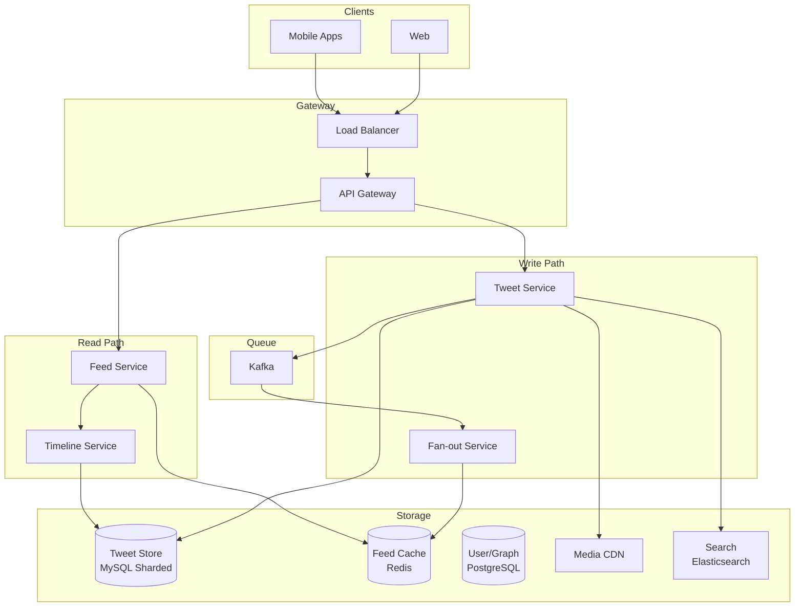
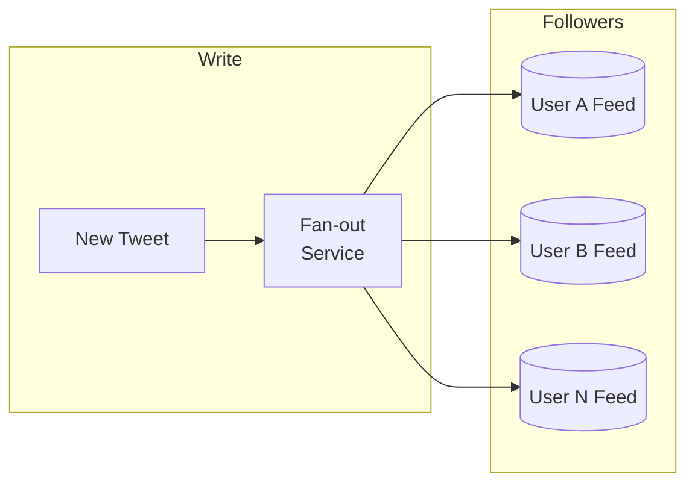
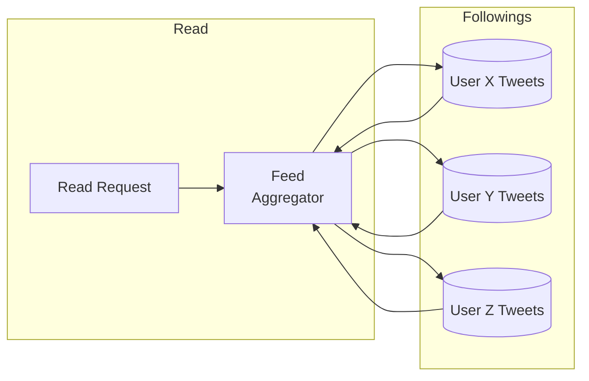
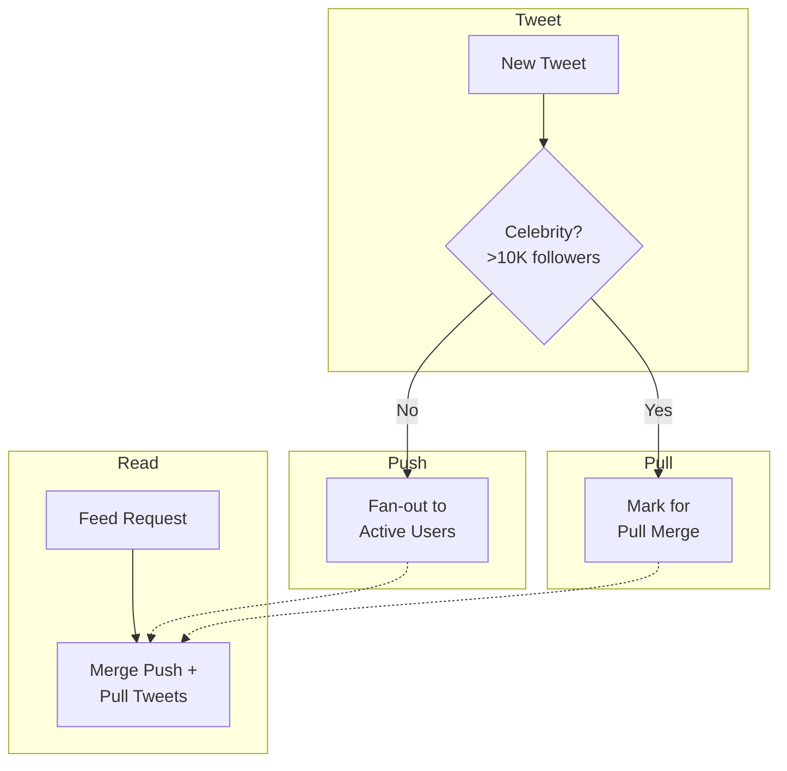
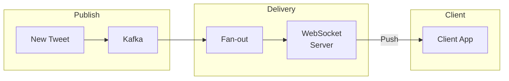

# Twitter / News Feed System

## Уточняющие вопросы

- Какой масштаб? (DAU, количество твитов/день)
- Что показываем в feed? (только followings или algorithmic)
- Real-time или периодическое обновление?
- Максимальный размер твита? Media?
- Какой размер feed (последние 100, 1000 постов)?
- Нужны ли retweets, replies, likes в feed?
- Какая модель follow? (односторонняя vs mutual)

---

## Requirements

### Functional
- Публикация твитов (текст + media)
- News feed из постов тех, на кого подписан
- Follow/unfollow пользователей
- Like, retweet, reply
- Real-time обновления feed
- Поиск по твитам и пользователям

### Non-Functional
- **Availability**: 99.99% (читатели важнее писателей)
- **Latency**: Feed load < 200ms, post < 500ms
- **Scalability**: 500M DAU, 200M tweets/day
- **Consistency**: eventual (OK если feed немного отстаёт)

---

## Capacity Estimation

### Assumptions
- 500M DAU
- 200M tweets/day (60% с media)
- Avg user: 200 followings
- Feed size: 1000 tweets cached
- Celebrity users: 10K+ с 1M+ followers
- Read:Write ratio = 100:1

### Calculations

**Write QPS (tweets):**
```
200M / 86400 ≈ 2,300 tweets/sec
Peak: 2,300 × 5 = 11,500 tweets/sec
```

**Read QPS (feed):**
```
500M users × 5 feed refreshes/day = 2.5B reads/day
2.5B / 86400 ≈ 30,000 reads/sec
Peak: 150,000 reads/sec
```

**Storage:**
```
Tweet: ~1KB (text + metadata)
Media: ~100KB average (thumbnails)
200M × 1KB = 200 GB/day (text)
200M × 60% × 100KB = 12 TB/day (media)
```

**Fan-out calculation:**
```
Avg user: 200 followers
2,300 tweets/sec × 200 = 460,000 fan-out ops/sec

Celebrity (1M followers):
1 tweet × 1M followers = 1M fan-out ops
```

---

## High-Level Design



### Компоненты

**Tweet Service**
- Создание, удаление твитов
- Validation, rate limiting
- Upload media to CDN
- Publish event to Kafka

**Fan-out Service**
- Слушает Kafka events
- Получает список followers
- Записывает tweet_id в feed cache каждого follower
- Разные стратегии для celebrities

**Feed Service**
- Читает pre-computed feed из Redis
- Для celebrities — читает на лету
- Hydration: добавляет полные данные твита

**Timeline Service**
- Fallback когда нет в cache
- Агрегация из множества источников
- Ranking и filtering

---

## Feed Generation: Fan-out Strategies

### Push Model (Fan-out on Write)



**Как работает:**
1. User публикует tweet
2. Получаем список followers (1000 users)
3. Записываем tweet_id в feed cache каждого follower
4. O(followers) write operations

**Pros:**
- Быстрое чтение feed (уже готов)
- Простая логика чтения

**Cons:**
- Медленная публикация для celebrities
- Wasted work для inactive users
- Hot spot при fan-out

### Pull Model (Fan-out on Read)



**Как работает:**
1. User запрашивает feed
2. Получаем список followings (200 users)
3. Читаем последние твиты каждого
4. Merge и sort
5. O(followings) read operations

**Pros:**
- Мгновенная публикация
- Нет wasted work
- Свежие данные

**Cons:**
- Медленное чтение feed
- Много параллельных запросов

### Hybrid Model (Twitter's Approach) ⭐



**Правила:**
- **Regular users** (< 10K followers): Push model
- **Celebrities** (> 10K followers): Pull model на чтение
- **Feed = cached tweets + celebrity tweets merged on read**

```python
def get_feed(user_id):
    # Get pre-computed feed (push)
    cached_feed = redis.zrevrange(f"feed:{user_id}", 0, 1000)

    # Get celebrity followings
    celebrities = get_celebrity_followings(user_id)

    # Fetch their recent tweets (pull)
    celebrity_tweets = []
    for celeb in celebrities:
        tweets = get_recent_tweets(celeb, limit=10)
        celebrity_tweets.extend(tweets)

    # Merge and sort by timestamp
    all_tweets = merge_sorted(cached_feed, celebrity_tweets)

    # Hydrate with full tweet data
    return hydrate_tweets(all_tweets[:100])
```

---

## API Design

### Post Tweet
```http
POST /api/v1/tweets
Content-Type: multipart/form-data

{
    "content": "Hello, world!",
    "media_ids": ["media_123"],  // pre-uploaded
    "reply_to": "tweet_456",     // optional
    "quote_tweet_id": "tweet_789" // optional
}

Response 201:
{
    "id": "tweet_abc",
    "content": "Hello, world!",
    "author": {...},
    "created_at": "2024-01-15T10:00:00Z",
    "media": [...],
    "metrics": {
        "likes": 0,
        "retweets": 0,
        "replies": 0
    }
}
```

### Get Home Feed
```http
GET /api/v1/feed?cursor={cursor}&limit=20

{
    "tweets": [
        {
            "id": "tweet_123",
            "content": "...",
            "author": {...},
            "created_at": "...",
            "metrics": {...}
        }
    ],
    "next_cursor": "...",
    "has_more": true
}
```

### Follow User
```http
POST /api/v1/users/{user_id}/follow

Response 200:
{
    "following": true,
    "followers_count": 1234
}
```

### Get User Timeline
```http
GET /api/v1/users/{user_id}/tweets?cursor={cursor}&limit=20
```

---

## Data Model

### Tweets Table (MySQL, Sharded by user_id)
```sql
CREATE TABLE tweets (
    id              BIGINT PRIMARY KEY,
    author_id       BIGINT NOT NULL,
    content         VARCHAR(280),
    reply_to_id     BIGINT,
    quote_tweet_id  BIGINT,
    media_ids       JSON,
    created_at      TIMESTAMP DEFAULT NOW(),
    is_deleted      BOOLEAN DEFAULT FALSE,

    INDEX idx_author_time (author_id, created_at DESC)
);

-- Sharding: hash(author_id) % num_shards
-- All tweets by user on same shard
```

### Tweet Metrics (Separate table, high write)
```sql
CREATE TABLE tweet_metrics (
    tweet_id        BIGINT PRIMARY KEY,
    likes_count     INT DEFAULT 0,
    retweets_count  INT DEFAULT 0,
    replies_count   INT DEFAULT 0,
    views_count     BIGINT DEFAULT 0
);
```

### User Follow Graph (PostgreSQL or Graph DB)
```sql
CREATE TABLE follows (
    follower_id     BIGINT NOT NULL,
    following_id    BIGINT NOT NULL,
    created_at      TIMESTAMP DEFAULT NOW(),

    PRIMARY KEY (follower_id, following_id),
    INDEX idx_following (following_id)  -- для fan-out
);
```

### Feed Cache (Redis Sorted Set)
```
Key: feed:{user_id}
Type: Sorted Set
Score: tweet timestamp (for ordering)
Value: tweet_id

ZADD feed:123 1705312800 "tweet_abc"
ZREVRANGE feed:123 0 99  -- get latest 100
```

**TTL & Eviction:**
- Keep last 1000 tweets per user
- TTL: 7 days (inactive users)
- ZREMRANGEBYRANK для trimming

---

## Deep Dives

### 1. Handling Celebrity Users

**Problem:** Taylor Swift (100M followers) posts → 100M writes

**Solutions:**

1. **Lazy fan-out:**
```python
def fanout_tweet(tweet, author):
    followers = get_followers(author.id)

    if len(followers) > CELEBRITY_THRESHOLD:
        # Mark as celebrity tweet, pull on read
        mark_celebrity_tweet(tweet.id, author.id)
        return

    # Normal fan-out for regular users
    for batch in chunks(followers, 1000):
        async_fanout.delay(tweet.id, batch)
```

2. **Prioritized fan-out:**
```python
def smart_fanout(tweet, author, followers):
    # Fan-out only to active users
    active_followers = filter_active(followers, days=7)

    # Priority to engaged users
    engaged = sort_by_engagement(active_followers)

    # Fan-out in priority order
    for user_id in engaged:
        add_to_feed(user_id, tweet.id)
```

3. **Read-time merge:**
```python
def get_feed(user_id):
    regular_feed = get_cached_feed(user_id)
    celebrity_tweets = get_celebrity_tweets(user_id)
    return merge_by_time(regular_feed, celebrity_tweets)
```

### 2. Feed Ranking

**Chronological feed:**
```python
def rank_chronological(tweets):
    return sorted(tweets, key=lambda t: t.created_at, reverse=True)
```

**Algorithmic feed (Twitter "For You"):**
```python
def rank_algorithmic(user_id, tweets):
    features = []
    for tweet in tweets:
        score = calculate_score(
            # Engagement signals
            likes=tweet.likes_count,
            retweets=tweet.retweets_count,
            replies=tweet.replies_count,

            # Freshness
            age_hours=(now() - tweet.created_at).hours,

            # User affinity
            author_interactions=get_interaction_count(user_id, tweet.author_id),
            author_follow_duration=get_follow_duration(user_id, tweet.author_id),

            # Content signals
            has_media=tweet.has_media,
            has_link=tweet.has_link,

            # Negative signals
            reported_count=tweet.reported_count,
        )
        features.append((tweet, score))

    return sorted(features, key=lambda x: x[1], reverse=True)

def calculate_score(likes, retweets, replies, age_hours, author_interactions, ...):
    engagement_score = likes * 1 + retweets * 2 + replies * 3
    freshness_decay = 1 / (1 + age_hours * 0.1)
    affinity_boost = log(1 + author_interactions) * 0.5

    return engagement_score * freshness_decay * (1 + affinity_boost)
```

### 3. Real-time Updates



**WebSocket notification:**
```json
{
    "type": "new_tweet",
    "count": 5,
    "top_tweet": {
        "id": "tweet_123",
        "preview": "Breaking news..."
    }
}
```

**Client behavior:**
- Show "5 new tweets" banner
- User clicks → fetch new tweets
- Don't auto-refresh (disruptive)

---

## Bottlenecks & Solutions

### Problem 1: Fan-out thundering herd
- **Issue**: Popular user posts → millions of writes
- **Solution**:
  - Async fan-out через Kafka
  - Rate limiting fan-out workers
  - Hybrid model для celebrities

### Problem 2: Hot partition (celebrity)
- **Issue**: Все читают один timeline
- **Solution**:
  - Cache celebrity timelines в CDN
  - Replicated cache shards
  - TTL based refresh

### Problem 3: Feed cache memory
- **Issue**: 500M users × 1000 tweets × 8 bytes = 4 TB
- **Solution**:
  - Keep only active users in cache
  - LRU eviction
  - Rebuild on cache miss

### Problem 4: Metrics update storm
- **Issue**: Viral tweet = millions of likes
- **Solution**:
  - Buffer likes in Redis
  - Batch write to DB (every 10 sec)
  - Eventually consistent counts

### Problem 5: Stale feed
- **Issue**: User unfollows but still sees tweets
- **Solution**:
  - Lazy cleanup при чтении
  - Periodic background reconciliation
  - Accept eventual consistency

---

## Trade-offs для обсуждения

| Решение | Trade-off |
|---------|-----------|
| Push vs Pull fan-out | Read latency vs Write latency |
| Chronological vs Algorithmic | User control vs Engagement |
| Cache per user vs shared | Memory vs Latency |
| Strong vs Eventual consistency | Correctness vs Performance |
| Real-time vs Pull refresh | Resource usage vs Freshness |

---

## Scale Numbers (Twitter-like)

| Metric | Value |
|--------|-------|
| DAU | 500M |
| Tweets/day | 200M |
| QPS (read) | 30K-150K |
| QPS (write) | 2K-10K |
| Avg followers | 200 |
| Max followers | 100M+ |
| Feed cache | ~4 TB |
| Tweet storage | ~200 GB/day |
