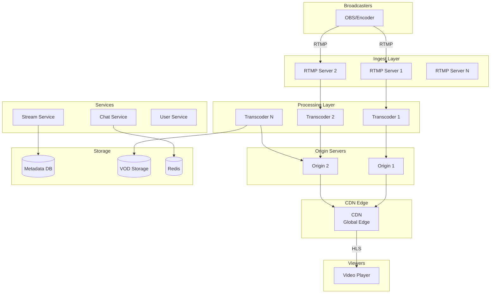
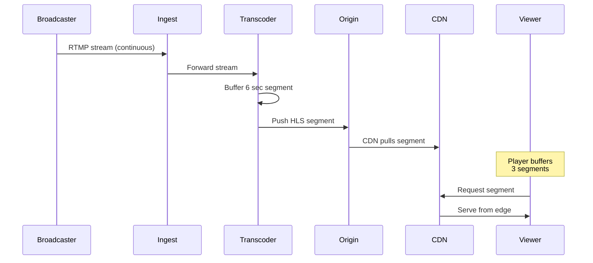
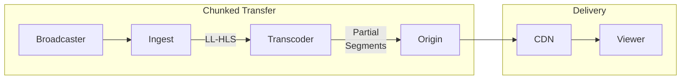
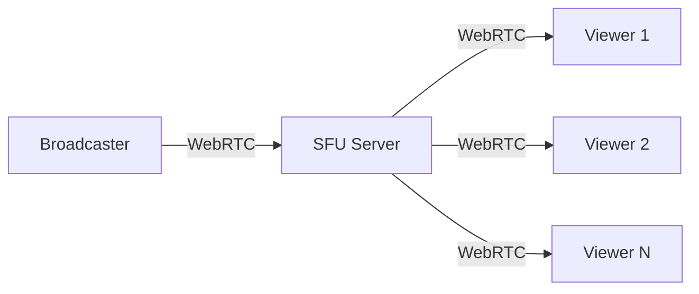
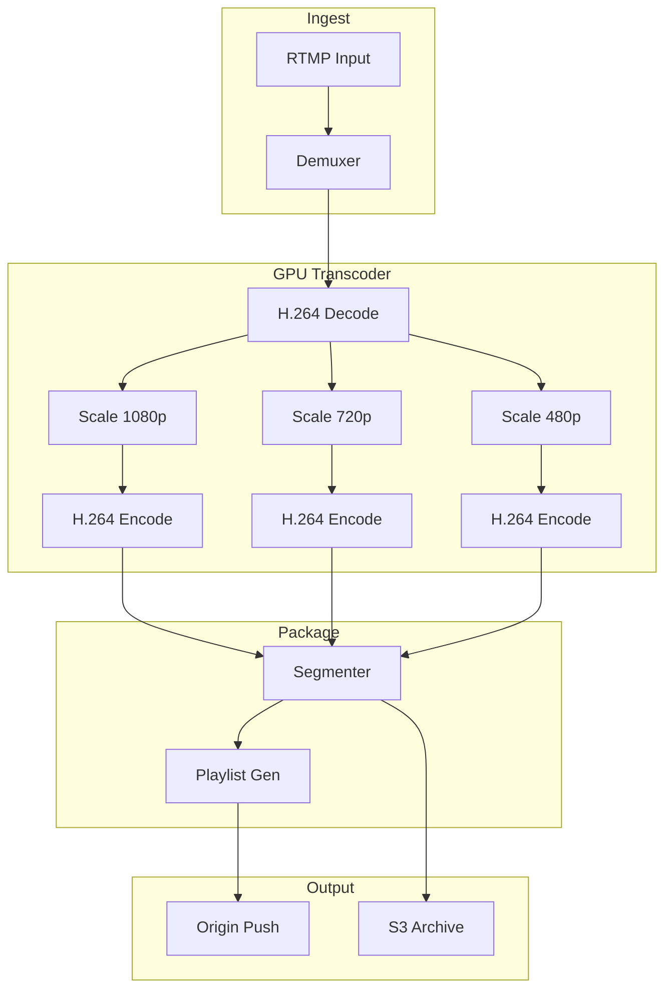
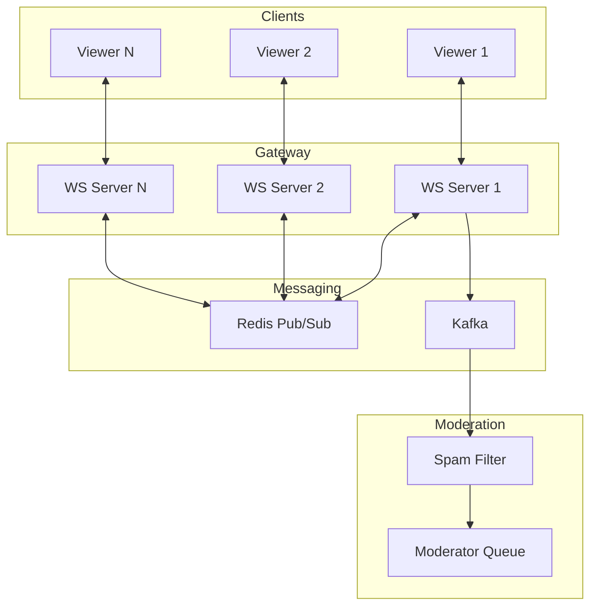

# Live Streaming Platform (Twitch / YouTube Live)

## Уточняющие вопросы

- Какой масштаб? (concurrent viewers, concurrent streamers)
- Какая допустимая latency? (< 5 sec, < 30 sec, real-time < 1 sec)
- Нужен ли chat вместе со стримом?
- Какое качество? (4K, 1080p, adaptive)
- Recording/VOD после стрима?
- Монетизация? (donations, subscriptions)
- Mobile streaming или только desktop?

---

## Requirements

### Functional
- Start/stop live stream (broadcaster)
- Watch live stream (viewer)
- Adaptive bitrate playback
- Live chat
- Recording to VOD
- Stream discovery (browse, search)
- Follow/subscribe channels
- Donations/bits (optional)

### Non-Functional
- **Latency**: < 5 seconds (standard), < 1 sec (low-latency mode)
- **Availability**: 99.99% для viewers
- **Scalability**: 100K concurrent streamers, 10M concurrent viewers
- **Global**: одинаковый опыт по миру

---

## Capacity Estimation

### Assumptions
- 100K concurrent streamers
- Peak: 10M concurrent viewers
- Avg viewers per stream: 100
- Stream quality: 1080p @ 6 Mbps (ingest), multiple output qualities
- Chat: 100 messages/sec для крупных стримов

### Calculations

**Ingest bandwidth:**
```
100K streamers × 6 Mbps = 600 Gbps ingest
```

**Egress bandwidth:**
```
10M viewers × avg 3 Mbps = 30 Tbps egress
Peak popular stream (1M viewers): 3 Tbps для одного стрима
```

**Transcoding:**
```
100K concurrent streams
Each stream → 4 quality levels
= 400K transcoding pipelines
```

**Chat messages:**
```
10M viewers, 10% chat active
= 1M chatters
Avg 1 msg/min = 16K messages/sec
```

**Storage (VOD):**
```
100K streams × avg 2 hours × 6 Mbps
= 100K × 7200 × 0.75 MB
= 540 TB/day (original)
```

---

## High-Level Design



### Компоненты

**RTMP Ingest Servers**
- Принимают RTMP stream от broadcaster
- Authentication, stream key validation
- Route к ближайшему transcoder

**Transcoder Farm**
- Real-time transcoding в multiple qualities
- Segment generation (2-6 sec chunks)
- GPU-accelerated encoding

**Origin Servers**
- Хранят текущие сегменты
- Serve to CDN
- Fallback для cache miss

**CDN Edge**
- Global distribution
- HLS/DASH delivery
- Minimize latency

**Chat Service**
- Real-time messaging (WebSocket)
- Rate limiting
- Moderation

---

## Streaming Protocol Flow

### Standard Latency (10-30 sec)



**Latency breakdown:**
```
RTMP ingest:     ~1 sec
Transcoding:     ~2 sec (segment size)
CDN propagation: ~2 sec
Player buffer:   ~6 sec (3 segments)
Total:           ~11 sec
```

### Low Latency (3-5 sec)



**Techniques:**
- Smaller segments (2 sec)
- Chunked transfer encoding
- LL-HLS (Low Latency HLS)
- Reduced player buffer (2 segments)

**Latency breakdown:**
```
RTMP ingest:     ~0.5 sec
Transcoding:     ~1 sec (smaller segments)
CDN propagation: ~1 sec
Player buffer:   ~2 sec
Total:           ~4.5 sec
```

### Ultra Low Latency (< 1 sec) - WebRTC



**Use case:** Interactive streams, auctions
**Limitation:** < 10K viewers per stream

---

## API Design

### Start Stream
```http
POST /api/v1/streams/start
{
    "title": "Gaming Stream",
    "category": "gaming",
    "tags": ["fps", "competitive"]
}

Response:
{
    "stream_id": "stream_123",
    "stream_key": "live_abc123xyz",
    "ingest_url": "rtmp://ingest.twitch.tv/live",
    "status": "pending"
}
```

### Get Stream
```http
GET /api/v1/streams/{stream_id}

{
    "id": "stream_123",
    "channel": {...},
    "title": "Gaming Stream",
    "viewer_count": 15234,
    "started_at": "2024-01-15T10:00:00Z",
    "playback": {
        "hls_url": "https://cdn.twitch.tv/.../master.m3u8"
    },
    "thumbnail": "https://..."
}
```

### Get Live Streams (Browse)
```http
GET /api/v1/streams?category=gaming&sort=viewers&limit=20

{
    "streams": [...],
    "pagination": {...}
}
```

### Chat - WebSocket
```javascript
// Connect
ws://chat.twitch.tv/streams/{stream_id}

// Send message
{
    "type": "message",
    "content": "Hello streamer!",
    "timestamp": 1705312800000
}

// Receive
{
    "type": "message",
    "user": {"id": "user_123", "name": "Viewer1"},
    "content": "Hello streamer!",
    "timestamp": 1705312800050,
    "badges": ["subscriber"]
}
```

---

## Data Model

### Streams Table
```sql
CREATE TABLE streams (
    id              UUID PRIMARY KEY,
    channel_id      BIGINT NOT NULL,
    stream_key      VARCHAR(50) UNIQUE,
    title           VARCHAR(140),
    category_id     INT,
    status          ENUM('pending', 'live', 'ended'),
    started_at      TIMESTAMP,
    ended_at        TIMESTAMP,
    peak_viewers    INT DEFAULT 0,
    total_views     INT DEFAULT 0,

    INDEX idx_channel (channel_id),
    INDEX idx_status_viewers (status, peak_viewers DESC)
);
```

### Live Streams (Redis)
```
# Currently live streams
Key: live_streams
Type: Sorted Set
Score: viewer_count
Value: stream_id

# Stream metadata cache
Key: stream:{stream_id}
Type: Hash
Fields: title, channel_name, viewer_count, category, thumbnail

# Viewer count (real-time)
Key: viewers:{stream_id}
Type: HyperLogLog (approximate unique viewers)
```

### Chat Messages (Cassandra for history)
```sql
CREATE TABLE chat_messages (
    stream_id       UUID,
    message_id      TIMEUUID,
    user_id         BIGINT,
    content         TEXT,
    timestamp       TIMESTAMP,

    PRIMARY KEY (stream_id, message_id)
) WITH CLUSTERING ORDER BY (message_id DESC)
  AND default_time_to_live = 604800;  -- 7 days
```

### VOD Table
```sql
CREATE TABLE vods (
    id              UUID PRIMARY KEY,
    stream_id       UUID NOT NULL,
    channel_id      BIGINT NOT NULL,
    title           VARCHAR(140),
    duration        INT,
    storage_path    VARCHAR(500),
    status          ENUM('processing', 'ready', 'deleted'),
    created_at      TIMESTAMP,

    INDEX idx_channel (channel_id, created_at DESC)
);
```

---

## Deep Dives

### 1. Real-time Transcoding Pipeline



**Transcoder implementation:**
```python
class LiveTranscoder:
    def __init__(self, stream_id):
        self.stream_id = stream_id
        self.segment_duration = 2  # seconds
        self.qualities = [
            {"name": "source", "scale": "1920:1080", "bitrate": "6000k"},
            {"name": "720p", "scale": "1280:720", "bitrate": "3000k"},
            {"name": "480p", "scale": "854:480", "bitrate": "1500k"},
            {"name": "360p", "scale": "640:360", "bitrate": "800k"},
        ]

    async def process_stream(self, rtmp_url):
        # FFmpeg command with multiple outputs
        cmd = f"""
        ffmpeg -i {rtmp_url} \
            -filter_complex "[0:v]split=4[v1][v2][v3][v4]; \
                [v1]scale=1920:1080[1080p]; \
                [v2]scale=1280:720[720p]; \
                [v3]scale=854:480[480p]; \
                [v4]scale=640:360[360p]" \
            -map "[1080p]" -c:v h264_nvenc -b:v 6000k -f hls ... \
            -map "[720p]" -c:v h264_nvenc -b:v 3000k -f hls ... \
            -map "[480p]" -c:v h264_nvenc -b:v 1500k -f hls ... \
            -map "[360p]" -c:v h264_nvenc -b:v 800k -f hls ...
        """
        await run_ffmpeg_pipeline(cmd)
```

**Fault tolerance:**
```python
class TranscoderCluster:
    async def assign_stream(self, stream_id, ingest_server):
        # Find available transcoder
        transcoder = await self.find_available_transcoder()

        if not transcoder:
            # Auto-scale: spin up new instance
            transcoder = await self.scale_up()

        # Start transcoding with health check
        try:
            await transcoder.start(stream_id, ingest_server)
            await self.monitor_health(stream_id, transcoder)
        except TranscoderFailure:
            # Failover to backup transcoder
            backup = await self.find_backup_transcoder()
            await backup.start(stream_id, ingest_server)
```

### 2. Viewer Count at Scale

**Problem:** 10M concurrent viewers, many switching streams

**Solution: Distributed counting with sampling**

```python
class ViewerCountService:
    def __init__(self):
        self.redis = Redis()

    async def viewer_joined(self, stream_id, viewer_id):
        # Use HyperLogLog for unique count
        await self.redis.pfadd(f"viewers:{stream_id}", viewer_id)

        # Increment active counter
        await self.redis.incr(f"active:{stream_id}")

        # Set viewer session
        await self.redis.setex(
            f"session:{stream_id}:{viewer_id}",
            60,  # 60 sec heartbeat
            "1"
        )

    async def viewer_heartbeat(self, stream_id, viewer_id):
        await self.redis.setex(
            f"session:{stream_id}:{viewer_id}",
            60,
            "1"
        )

    async def get_viewer_count(self, stream_id):
        # Approximate unique viewers (HyperLogLog)
        unique = await self.redis.pfcount(f"viewers:{stream_id}")

        # Active viewers (sessions not expired)
        pattern = f"session:{stream_id}:*"
        active = len(await self.redis.keys(pattern))

        return {
            "total_unique": unique,
            "current_active": active
        }
```

**Displaying counts:**
```python
def format_viewer_count(count):
    # Round to avoid UI flickering
    if count < 1000:
        return str(count)
    elif count < 10000:
        return f"{count // 100 / 10:.1f}K"
    elif count < 1000000:
        return f"{count // 1000}K"
    else:
        return f"{count // 100000 / 10:.1f}M"
```

### 3. Chat at Scale

**Architecture for large streams (100K+ chatters):**



**Rate limiting and spam prevention:**
```python
class ChatService:
    async def send_message(self, stream_id, user_id, content):
        # Rate limit: 1 message per second per user
        rate_key = f"chat_rate:{stream_id}:{user_id}"
        if await self.redis.exists(rate_key):
            return {"error": "rate_limited"}
        await self.redis.setex(rate_key, 1, "1")

        # Spam detection
        if await self.is_spam(content):
            return {"error": "spam_detected"}

        # Slow mode (stream-level)
        slow_mode = await self.get_slow_mode(stream_id)
        if slow_mode:
            slow_key = f"slow:{stream_id}:{user_id}"
            if await self.redis.exists(slow_key):
                return {"error": "slow_mode"}
            await self.redis.setex(slow_key, slow_mode, "1")

        # Broadcast message
        message = {
            "type": "message",
            "stream_id": stream_id,
            "user_id": user_id,
            "content": content,
            "timestamp": now()
        }
        await self.redis.publish(f"chat:{stream_id}", json.dumps(message))

        return {"success": True}
```

**Subscriber-only mode:**
```python
async def check_can_chat(stream_id, user_id):
    stream_settings = await get_stream_settings(stream_id)

    if stream_settings.subscriber_only:
        is_sub = await check_subscription(user_id, stream_settings.channel_id)
        if not is_sub:
            return False

    if stream_settings.follower_only:
        follow_duration = await get_follow_duration(user_id, stream_settings.channel_id)
        if follow_duration < stream_settings.follower_min_duration:
            return False

    return True
```

---

## Bottlenecks & Solutions

### Problem 1: Viral stream (millions of viewers)
- **Issue**: One stream = massive CDN/origin load
- **Solution**:
  - Pre-scale CDN capacity
  - Multiple origin servers per stream
  - Request coalescing

### Problem 2: Transcoder failure mid-stream
- **Issue**: Stream goes offline
- **Solution**:
  - Hot standby transcoders
  - State checkpointing
  - Seamless failover (< 5 sec gap)

### Problem 3: Chat thundering herd
- **Issue**: 100K messages on goal/event
- **Solution**:
  - Message sampling для очень активных чатов
  - Local buffering + batch broadcast
  - Отдельные серверы для hot streams

### Problem 4: Ingest point failure
- **Issue**: Broadcaster disconnected
- **Solution**:
  - Multiple ingest endpoints
  - Broadcaster auto-reconnect
  - Stream key works on any ingest

### Problem 5: Global latency variance
- **Issue**: Viewers см. разное время
- **Solution**:
  - Consistent segment timing
  - Time synchronization
  - Viewer-side delay compensation

---

## Trade-offs для обсуждения

| Решение | Trade-off |
|---------|-----------|
| HLS vs WebRTC | Scale vs Latency |
| 2 sec vs 6 sec segments | Latency vs Buffering stability |
| Transcoding all vs Passthrough | Compatibility vs Latency |
| Single vs Multi-CDN | Simplicity vs Resilience |
| Chat sampling vs Full | Performance vs User experience |

---

## Latency Comparison

| Mode | Latency | Use Case |
|------|---------|----------|
| Standard HLS | 15-30 sec | Most streams |
| Low-latency HLS | 3-5 sec | Gaming, interaction |
| WebRTC | < 1 sec | Auctions, interviews |
| RTMP (direct) | 1-2 sec | Professional broadcast |

---

## Twitch vs YouTube Live Comparison

| Aspect | Twitch | YouTube Live |
|--------|--------|--------------|
| Focus | Gaming, live | General, VOD → live |
| Latency | ~10 sec default | ~15-30 sec default |
| Chat | Central feature | Secondary |
| Monetization | Bits, subs | Super Chat, memberships |
| Discovery | Categories, raids | Search, recommendations |
| VOD | 60 days (affiliate) | Permanent |
