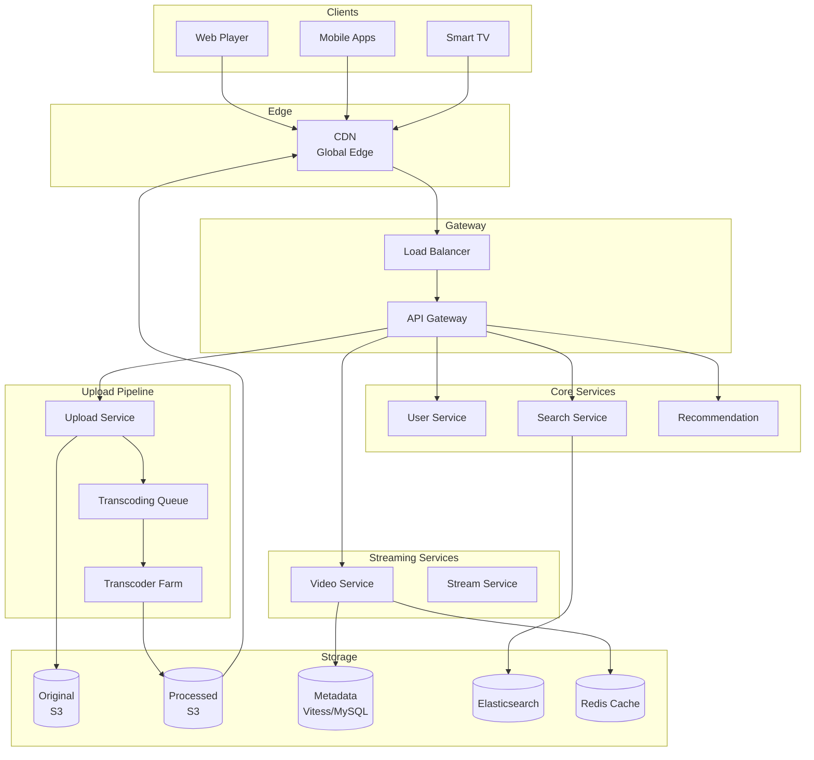
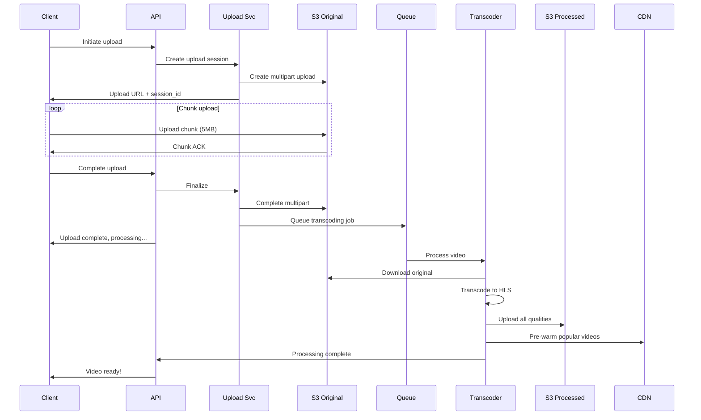
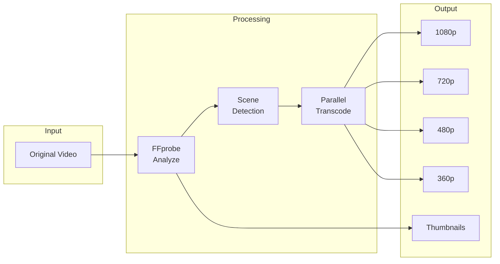
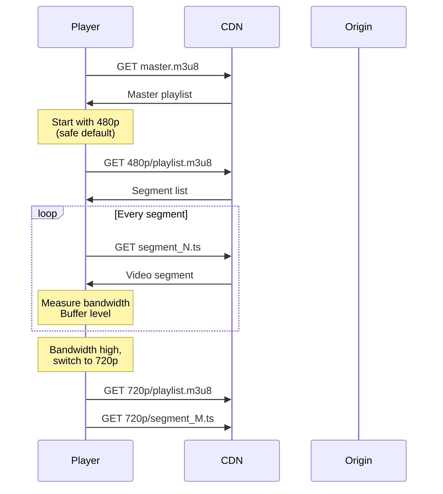
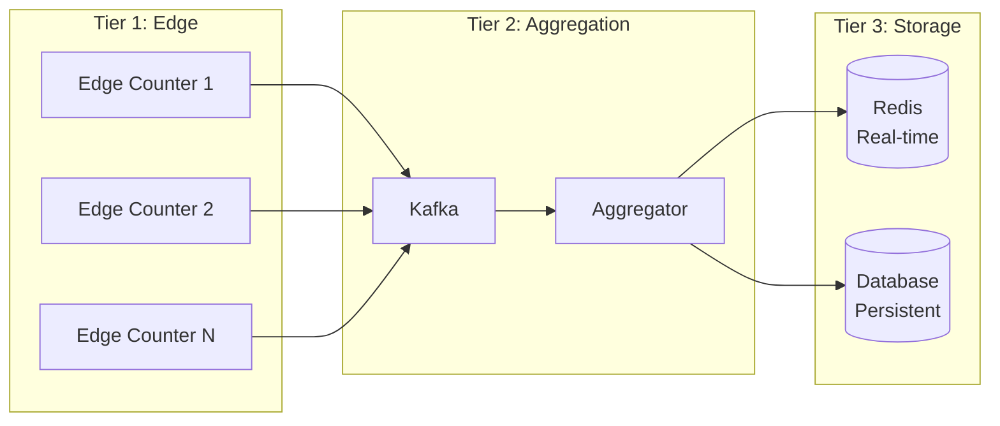

# YouTube / Video Streaming Platform

## Уточняющие вопросы

- Какой масштаб? (видео/день, DAU)
- Какое качество видео? (4K, 1080p, adaptive)
- Нужен ли live streaming или только VOD?
- Какой максимальный размер/длительность видео?
- Нужны ли комментарии, likes, subscriptions?
- Глобальное распространение или один регион?
- Нужна ли монетизация (ads)?
- Рекомендации / search?

---

## Requirements

### Functional
- Upload videos (до 12 часов, до 256GB)
- Watch videos (adaptive bitrate streaming)
- Search videos
- Subscribe to channels
- Like, comment, share
- Video recommendations
- Watch history
- (Опционально) Live streaming

### Non-Functional
- **Availability**: 99.99%
- **Latency**: Video start < 2 sec
- **Scalability**: 2B MAU, 500 часов видео/минуту upload
- **Global**: низкая latency по миру
- **Durability**: видео никогда не теряется

---

## Capacity Estimation

### Assumptions
- 2B MAU, 800M DAU
- 500 часов видео uploadится каждую минуту
- Avg video: 5 min, 50MB (после сжатия)
- 5B видео просмотров в день
- Storage: 720K minutes/day = 720K × 50MB/5min = 7.2 TB/day

### Calculations

**Upload volume:**
```
500 hours/min = 30,000 hours/hour
30,000 hours/day = 720,000 hours
720,000 hours × 12 min avg = 8.64M videos/day
8.64M / 86400 ≈ 100 uploads/sec
```

**Video storage (raw):**
```
Raw upload: ~1GB per hour of video
720K hours × 1GB = 720 TB/day (raw)
```

**Video storage (processed):**
```
Multiple qualities: 5x storage
720 TB × 5 = 3.6 PB/day total
Per year: ~1.3 EB (exabyte)
```

**Watch bandwidth:**
```
5B views/day × 5 min avg × 2.5 Mbps avg
= 5B × 300sec × 0.3MB/s
= 450 PB/day egress
≈ 5.2 TB/sec
```

**CDN hit rate:**
```
~95% cache hit rate
Origin traffic: 5% × 450 PB = 22.5 PB/day
```

---

## High-Level Design



### Компоненты

**CDN (Global Edge)**
- Thousands of edge locations
- 95%+ cache hit rate
- Adaptive bitrate delivery

**Upload Service**
- Resumable uploads (для больших файлов)
- Chunked upload protocol
- Validation и virus scanning

**Transcoding Farm**
- FFmpeg workers (thousands)
- Multiple quality levels
- Parallel processing

**Video Service**
- Metadata CRUD
- View counting
- Engagement (likes, comments)

**Recommendation Service**
- Watch history analysis
- Collaborative filtering
- Real-time personalization

---

## Video Upload Flow



### Resumable Upload Protocol

```python
class ResumableUpload:
    CHUNK_SIZE = 5 * 1024 * 1024  # 5MB

    def initiate(self, filename, size):
        session_id = generate_session_id()
        s3.create_multipart_upload(
            Bucket="originals",
            Key=f"uploads/{session_id}/{filename}"
        )
        return {
            "session_id": session_id,
            "chunk_size": self.CHUNK_SIZE,
            "total_chunks": ceil(size / self.CHUNK_SIZE)
        }

    def upload_chunk(self, session_id, chunk_number, data):
        s3.upload_part(
            UploadId=session_id,
            PartNumber=chunk_number,
            Body=data
        )
        return {"uploaded": chunk_number}

    def get_status(self, session_id):
        parts = s3.list_parts(UploadId=session_id)
        return {
            "uploaded_chunks": [p["PartNumber"] for p in parts],
            "bytes_uploaded": sum(p["Size"] for p in parts)
        }

    def complete(self, session_id):
        s3.complete_multipart_upload(UploadId=session_id)
        queue.send({"session_id": session_id, "action": "transcode"})
```

---

## Video Transcoding

### HLS (HTTP Live Streaming) Format

```
video_123/
├── master.m3u8          # Master playlist
├── 1080p/
│   ├── playlist.m3u8    # Quality playlist
│   ├── segment_001.ts   # 2-6 sec segments
│   ├── segment_002.ts
│   └── ...
├── 720p/
│   ├── playlist.m3u8
│   └── ...
├── 480p/
├── 360p/
└── audio/
    ├── en.m3u8
    └── ...
```

**Master Playlist (master.m3u8):**
```m3u8
#EXTM3U
#EXT-X-STREAM-INF:BANDWIDTH=5000000,RESOLUTION=1920x1080
1080p/playlist.m3u8
#EXT-X-STREAM-INF:BANDWIDTH=2500000,RESOLUTION=1280x720
720p/playlist.m3u8
#EXT-X-STREAM-INF:BANDWIDTH=1000000,RESOLUTION=854x480
480p/playlist.m3u8
#EXT-X-STREAM-INF:BANDWIDTH=500000,RESOLUTION=640x360
360p/playlist.m3u8
```

### Transcoding Pipeline



**Transcoding parameters:**
```python
ENCODING_PROFILES = {
    "1080p": {
        "resolution": "1920x1080",
        "bitrate": "5000k",
        "codec": "h264",
        "preset": "medium"
    },
    "720p": {
        "resolution": "1280x720",
        "bitrate": "2500k",
        "codec": "h264",
        "preset": "medium"
    },
    "480p": {
        "resolution": "854x480",
        "bitrate": "1000k",
        "codec": "h264",
        "preset": "fast"
    },
    "360p": {
        "resolution": "640x360",
        "bitrate": "500k",
        "codec": "h264",
        "preset": "fast"
    }
}

def transcode_video(video_id, original_path):
    for quality, params in ENCODING_PROFILES.items():
        cmd = f"""
        ffmpeg -i {original_path} \
            -vf scale={params['resolution']} \
            -c:v libx264 -preset {params['preset']} \
            -b:v {params['bitrate']} \
            -c:a aac -b:a 128k \
            -hls_time 6 -hls_list_size 0 \
            -f hls output/{quality}/playlist.m3u8
        """
        run_ffmpeg(cmd)
```

---

## API Design

### Upload Video
```http
POST /api/v1/videos/upload/init
{
    "filename": "my_video.mp4",
    "size": 1073741824,  // 1GB
    "title": "My Awesome Video",
    "description": "...",
    "visibility": "public"
}

Response:
{
    "upload_id": "upload_123",
    "chunk_size": 5242880,
    "upload_urls": [
        {"chunk": 1, "url": "https://upload.youtube.com/..."},
        {"chunk": 2, "url": "https://upload.youtube.com/..."}
    ]
}
```

### Get Video
```http
GET /api/v1/videos/{video_id}

{
    "id": "video_abc",
    "title": "My Awesome Video",
    "description": "...",
    "channel": {...},
    "duration": 300,
    "view_count": 1234567,
    "like_count": 50000,
    "published_at": "2024-01-15T10:00:00Z",
    "stream_url": "https://cdn.youtube.com/.../master.m3u8",
    "thumbnails": {
        "default": "https://...",
        "high": "https://..."
    }
}
```

### Get Stream URL
```http
GET /api/v1/videos/{video_id}/stream

{
    "stream_url": "https://cdn.youtube.com/video_123/master.m3u8",
    "expires_at": "2024-01-15T11:00:00Z",
    "drm": {
        "type": "widevine",
        "license_url": "https://..."
    }
}
```

### Search Videos
```http
GET /api/v1/search?q=cats&type=video&order=relevance

{
    "results": [...],
    "total": 1000000,
    "next_page_token": "..."
}
```

---

## Data Model

### Videos Table (Vitess/MySQL Sharded)
```sql
CREATE TABLE videos (
    id              VARCHAR(11) PRIMARY KEY,  -- YouTube-style ID
    channel_id      BIGINT NOT NULL,
    title           VARCHAR(100) NOT NULL,
    description     TEXT,
    duration        INT,          -- seconds
    status          ENUM('processing', 'ready', 'failed', 'deleted'),
    visibility      ENUM('public', 'unlisted', 'private'),
    upload_date     TIMESTAMP,
    publish_date    TIMESTAMP,

    -- Denormalized counts (updated async)
    view_count      BIGINT DEFAULT 0,
    like_count      INT DEFAULT 0,
    dislike_count   INT DEFAULT 0,
    comment_count   INT DEFAULT 0,

    INDEX idx_channel (channel_id, publish_date DESC),
    INDEX idx_status (status)
);
```

### Video Files Table
```sql
CREATE TABLE video_files (
    id              BIGINT PRIMARY KEY AUTO_INCREMENT,
    video_id        VARCHAR(11) NOT NULL,
    quality         VARCHAR(10),      -- 1080p, 720p, etc.
    codec           VARCHAR(20),      -- h264, vp9, av1
    container       VARCHAR(10),      -- mp4, webm
    storage_path    VARCHAR(500),
    size_bytes      BIGINT,
    bitrate         INT,

    INDEX idx_video (video_id)
);
```

### View Counts (Real-time aggregation)
```sql
-- Redis for real-time
Key: views:{video_id}
Type: String (counter)
Increment on each view

-- Batch write to database every minute
-- Approximate counts are acceptable
```

### Watch History (Cassandra)
```sql
CREATE TABLE watch_history (
    user_id         BIGINT,
    watched_at      TIMESTAMP,
    video_id        VARCHAR,
    watch_duration  INT,
    completion_pct  FLOAT,

    PRIMARY KEY (user_id, watched_at)
) WITH CLUSTERING ORDER BY (watched_at DESC);
```

---

## Deep Dives

### 1. Adaptive Bitrate Streaming (ABR)



**ABR Algorithm (simplified):**
```python
class AdaptiveBitrateController:
    def __init__(self):
        self.bandwidth_samples = []
        self.buffer_level = 0
        self.current_quality = "480p"

    def select_quality(self):
        avg_bandwidth = self.estimate_bandwidth()
        buffer_ok = self.buffer_level > 10  # seconds

        # Quality selection logic
        if avg_bandwidth > 6000 and buffer_ok:
            return "1080p"
        elif avg_bandwidth > 3000 and buffer_ok:
            return "720p"
        elif avg_bandwidth > 1500:
            return "480p"
        else:
            return "360p"

    def estimate_bandwidth(self):
        # Weighted average, recent samples more important
        if not self.bandwidth_samples:
            return 1000  # default 1 Mbps
        weights = [0.5 ** i for i in range(len(self.bandwidth_samples))]
        return sum(b * w for b, w in zip(self.bandwidth_samples, weights)) / sum(weights)
```

### 2. Video View Counting at Scale

**Problem:** 5B views/day = 58K views/sec

**Solution: Multi-tier counting**



```python
# Edge (local buffer, flush every 10 sec)
class EdgeViewCounter:
    def __init__(self):
        self.local_counts = defaultdict(int)

    def increment(self, video_id):
        self.local_counts[video_id] += 1

    async def flush(self):
        batch = dict(self.local_counts)
        self.local_counts.clear()
        await kafka.send("view_counts", batch)

# Aggregator (runs every minute)
class ViewAggregator:
    async def process(self, window_events):
        counts = defaultdict(int)
        for event in window_events:
            for video_id, count in event.items():
                counts[video_id] += count

        # Update Redis (real-time display)
        for video_id, count in counts.items():
            await redis.incrby(f"views:{video_id}", count)

        # Batch write to DB (every hour)
        if time_for_db_flush():
            await db.batch_increment_views(counts)
```

**View deduplication:**
```python
def should_count_view(user_id, video_id, session_id):
    # Dedupe key: user + video + time window
    dedupe_key = f"view:{user_id}:{video_id}:{hour()}"

    if redis.exists(dedupe_key):
        return False

    redis.setex(dedupe_key, 3600, 1)  # 1 hour
    return True
```

### 3. Content Delivery Optimization

**Multi-CDN strategy:**
```python
def get_cdn_url(video_id, user_location, device):
    # Select CDN based on:
    # 1. Geographic proximity
    # 2. Current load
    # 3. Cost
    # 4. Performance history

    cdns = [
        {"name": "cloudfront", "regions": ["us", "eu"], "cost": 0.08},
        {"name": "akamai", "regions": ["apac"], "cost": 0.10},
        {"name": "google_cdn", "regions": ["*"], "cost": 0.085}
    ]

    best_cdn = select_best_cdn(cdns, user_location)

    # Signed URL с expiration
    url = sign_url(
        cdn=best_cdn,
        path=f"/videos/{video_id}/master.m3u8",
        expires=now() + timedelta(hours=4)
    )

    return url
```

**Pre-warming popular videos:**
```python
async def prewarm_video(video_id, expected_views):
    if expected_views > VIRAL_THRESHOLD:
        # Push to all edge locations
        for edge in get_all_edge_locations():
            await edge.prefetch(f"/videos/{video_id}/")

    elif expected_views > POPULAR_THRESHOLD:
        # Push to regional edges
        regions = predict_view_regions(video_id)
        for region in regions:
            await get_regional_edges(region).prefetch(...)
```

---

## Bottlenecks & Solutions

### Problem 1: Transcoding backlog
- **Issue**: Popular creator uploads = priority queue explosion
- **Solution**:
  - Priority tiers (partners > regular)
  - Auto-scaling transcoder fleet
  - Progressive availability (360p first)

### Problem 2: Cold video retrieval
- **Issue**: Old video = not in CDN cache
- **Solution**:
  - Origin shield (intermediate cache)
  - Tiered storage with smart retrieval
  - Predictive pre-fetching

### Problem 3: Viral video thundering herd
- **Issue**: Sudden traffic spike to one video
- **Solution**:
  - Request coalescing at origin
  - CDN holds stale + background refresh
  - Circuit breaker to origin

### Problem 4: View count accuracy vs performance
- **Issue**: Exact counts = bottleneck
- **Solution**:
  - Approximate counts (eventual consistency)
  - Tiered aggregation
  - Batch updates to DB

### Problem 5: Global latency
- **Issue**: User далеко от origin
- **Solution**:
  - 200+ CDN edge locations
  - Regional API servers
  - Edge compute for personalization

---

## Trade-offs для обсуждения

| Решение | Trade-off |
|---------|-----------|
| HLS vs DASH | Compatibility vs Features |
| H.264 vs VP9 vs AV1 | Compatibility vs Compression |
| Segment size (2s vs 10s) | Latency vs Efficiency |
| Pre-transcode all vs On-demand | Storage vs Latency |
| Exact vs Approximate counts | Accuracy vs Performance |

---

## Comparison: YouTube vs Netflix

| Aspect | YouTube | Netflix |
|--------|---------|---------|
| Content | UGC + Premium | Premium only |
| Catalog size | 800M+ videos | ~15K titles |
| Upload flow | Yes | Internal pipeline |
| Live streaming | Yes | Limited |
| Recommendation | Watch more | Watch specific |
| Monetization | Ads + Premium | Subscription |
| Quality priority | Reach | Quality |
