# System Design Cheatsheet

> Одна страница на систему: диаграмма + ключевые решения

---

## 1. URL Shortener

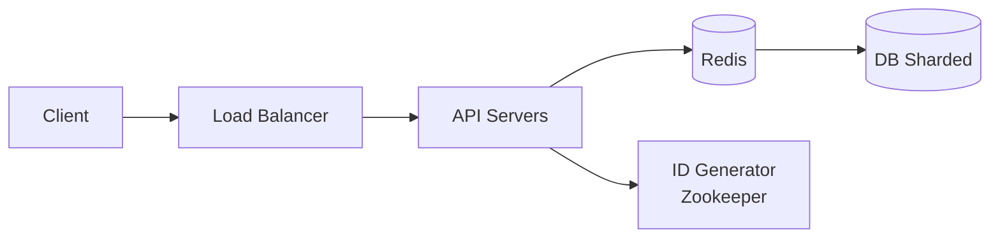

**Flow:**
1. **Write:** API получает long URL → Counter выдаёт unique ID → Base62 encode → сохраняем в DB
2. **Read:** Lookup в Redis (80% hit) → miss идёт в DB → 301/302 redirect

| Параметр | Значение |
|----------|----------|
| Read:Write | 100:1 |
| Short code | 7 chars Base62 = 3.5T URLs |
| Storage | ~500 bytes/URL |

**Ключевые решения:**
- **ID generation:** Counter + Zookeeper ranges (не MD5 — коллизии)
- **301 vs 302:** 301 = браузер кэширует (меньше нагрузки), 302 = каждый запрос к нам (аналитика)
- **Cache:** LRU eviction, 20% URLs генерируют 80% трафика

---

## 2. Rate Limiter

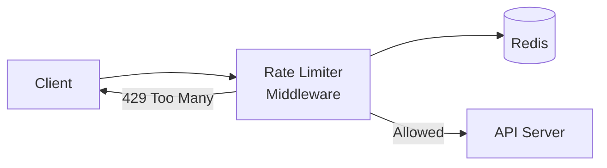

**Flow:**
1. Request приходит → middleware проверяет counter/tokens в Redis
2. Если лимит не превышен → инкремент counter → пропускаем
3. Если превышен → возвращаем 429 + Retry-After header

| Алгоритм | Особенность |
|----------|-------------|
| **Token Bucket** | Bursts OK, рекомендуется |
| Sliding Window | Точный, больше памяти |
| Fixed Window | Простой, 2x burst на границе |

**Ключевые решения:**
- **Distributed:** Redis + Lua scripts для атомарности (check + increment)
- **Fail-open:** при падении Redis — пропускаем запросы (лучше чем блокировать всех)
- **Key:** user_id (fair) / IP (DDoS) / API key (billing)

---

## 3. Notification System

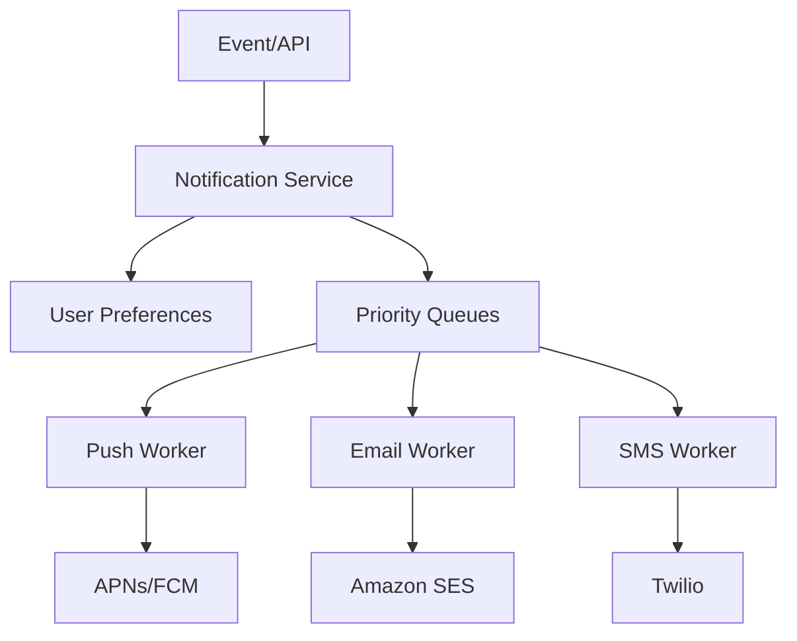

**Flow:**
1. **Trigger** (event/API) → Notification Service проверяет user preferences
2. **Routing:** по приоритету в разные очереди (high/normal/low)
3. **Workers:** читают из очереди → отправляют через провайдеров → retry при ошибке

| Приоритет | SLA | Пример |
|-----------|-----|--------|
| High | < 30 sec | OTP, security alerts |
| Normal | < 5 min | Order updates |
| Low | Best effort | Marketing |

**Ключевые решения:**
- **At-least-once:** persist → queue → send → confirm (retry если нет confirm)
- **Idempotency:** dedupe по idempotency_key (предотвращает дубли при retry)
- **Rate limit:** per user (не спамить) + per provider (API limits)

---

## 4. Chat System

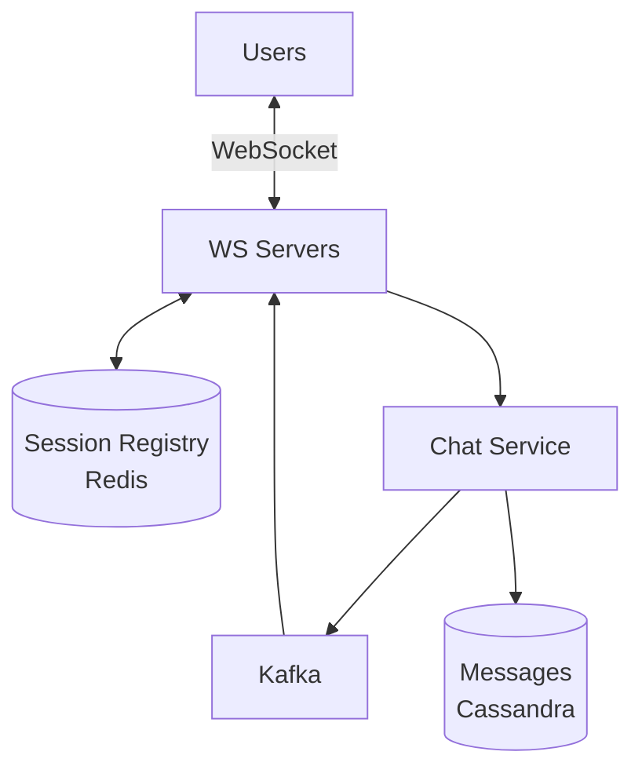

**Flow:**
1. **Connect:** User → WebSocket → регистрируем в Redis (user_id → ws_server_id)
2. **Send:** Message → Chat Service → persist в Cassandra → publish в Kafka
3. **Receive:** Kafka → lookup recipient's WS server → deliver через WebSocket

| Компонент | Роль |
|-----------|------|
| **WebSocket** | Persistent bidirectional connection |
| **Session Registry** | Маппинг user → server для routing |
| **Kafka** | Routing между WS серверами |
| **Cassandra** | Хранение истории (TIMEUUID для ordering) |

**Ключевые решения:**
- **Message ordering:** sequence_num per chat (Cassandra TIMEUUID)
- **Offline:** сохраняем в очередь + push notification → sync при reconnect
- **Groups:** eager fan-out для маленьких (<50), lazy для больших

---

## 5. Twitter / News Feed

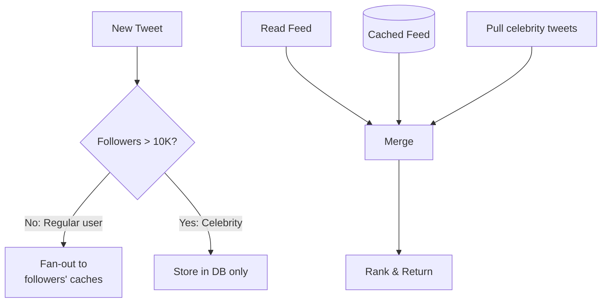

**Flow:**
1. **Write (regular):** Tweet → fan-out: записываем tweet_id в Redis feed каждого follower
2. **Write (celebrity):** Tweet → только сохраняем в DB (fan-out слишком дорогой)
3. **Read:** Берём cached feed + pull свежие tweets от celebrities → merge → rank

| Модель | Когда | Trade-off |
|--------|-------|-----------|
| **Push** | < 10K followers | Fast read, slow write |
| **Pull** | Celebrities | Fast write, slow read |
| **Hybrid** | Комбинация | Best of both |

**Ключевые решения:**
- **Feed cache:** Redis Sorted Set (score = timestamp, value = tweet_id)
- **Ranking:** `score = engagement × freshness_decay × user_affinity`
- **Hot partition:** replicate celebrity timelines across shards

---

## 6. Instagram

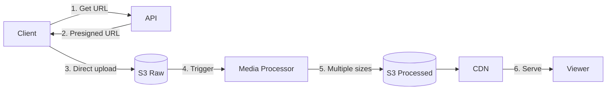

**Flow:**
1. Client запрашивает upload URL → получает presigned S3 URL
2. Client загружает напрямую в S3 (не через наши серверы)
3. S3 trigger → Media Processor создаёт multiple sizes
4. Processed images → CDN → serve viewers

| Размер | Использование |
|--------|---------------|
| 1080px | Feed view |
| 640px | Profile grid |
| 150px | Thumbnails |

**Ключевые решения:**
- **Upload:** Presigned URL = client uploads direct to S3 (не грузим серверы)
- **Processing:** async job, генерируем все размеры сразу
- **Storage tiers:** Hot (S3, 30d) → Warm (S3-IA) → Cold (Glacier)
- **Feed:** hybrid fan-out как Twitter

---

## 7. YouTube / Video Streaming

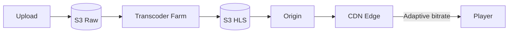

**Flow:**
1. **Upload:** Chunked upload → S3 Raw storage
2. **Transcode:** FFmpeg workers создают HLS (multiple qualities + segments)
3. **Serve:** CDN кэширует segments → Player выбирает quality по bandwidth

| Quality | Bitrate | Когда |
|---------|---------|-------|
| 1080p | 5 Mbps | Fast connection |
| 720p | 2.5 Mbps | Normal |
| 480p | 1 Mbps | Slow |
| 360p | 0.5 Mbps | Very slow |

**Ключевые решения:**
- **Format:** HLS (2-6 sec segments), master.m3u8 + quality playlists
- **ABR:** Player измеряет bandwidth → switches quality seamlessly
- **View counting:** buffer locally → batch aggregate (eventual consistency OK)

---

## 8. Live Streaming

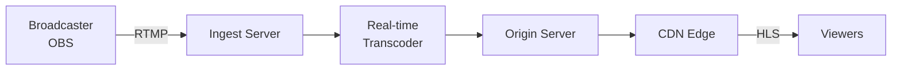

**Flow:**
1. **Ingest:** Broadcaster sends RTMP stream → Ingest server validates stream key
2. **Transcode:** Real-time encoding to multiple qualities (GPU accelerated)
3. **Distribute:** Segments pushed to Origin → CDN pulls → Viewers receive HLS

| Mode | Latency | Use case |
|------|---------|----------|
| Standard HLS | 15-30 sec | Most streams |
| Low-latency HLS | 3-5 sec | Gaming, interaction |
| WebRTC | < 1 sec | Auctions, interviews |

**Ключевые решения:**
- **Segment size:** 2 sec = lower latency, 6 sec = better buffering
- **Failover:** hot standby transcoders, seamless switch
- **Chat:** отдельный WebSocket service + aggressive rate limiting

---

## 9. Payment System

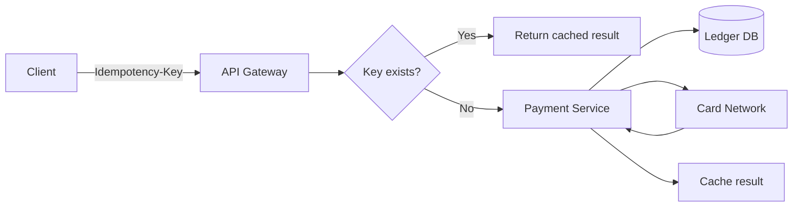

**Flow:**
1. **Check idempotency:** key exists → return cached response (prevents double charge)
2. **Process:** validate → authorize with card network → record in ledger
3. **Cache:** store result with idempotency key for future retries

| State | Transitions |
|-------|-------------|
| PENDING | → AUTHORIZED / FAILED |
| AUTHORIZED | → CAPTURED / VOIDED / EXPIRED |
| CAPTURED | → PARTIALLY_REFUNDED / REFUNDED |

**Ключевые решения:**
- **Idempotency:** key + request_hash + cached response (7 day TTL)
- **Exactly-once:** Outbox pattern (DB transaction: save payment + queue message)
- **Routing:** multiple processors + circuit breaker + failover

---

## 10. Digital Wallet / Ledger

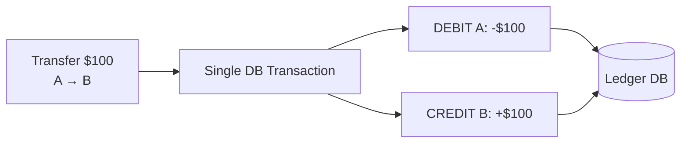

**Flow:**
1. **Atomic transaction:** lock both wallets (ordered by ID to prevent deadlock)
2. **Validate:** check balance >= amount, check account status
3. **Execute:** DEBIT sender + CREDIT receiver + update balances (single transaction)

**Double-entry principle:**
```
Sum(DEBIT) = Sum(CREDIT) — всегда!
```

| Операция | DEBIT (откуда) | CREDIT (куда) |
|----------|----------------|---------------|
| Deposit | Bank Account | User Wallet |
| Withdraw | User Wallet | Bank Account |
| Transfer | Sender Wallet | Receiver Wallet |
| Fee | User Wallet | Revenue Account |

**Ключевые решения:**
- **Atomic:** `SELECT FOR UPDATE` + single transaction (SERIALIZABLE)
- **Balance:** materialized field (update on write, не считаем каждый раз)
- **Reconciliation:** daily check: sum(user wallets) = liability account

---

## 11. Remittance (Cross-border)

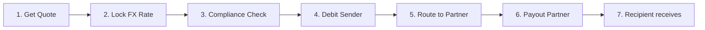

**Flow:**
1. **Quote:** Get FX rate + calculate fees → lock rate for 15 min
2. **Compliance:** KYC check + sanctions screening + velocity limits
3. **Fund:** Debit sender's account (hold funds)
4. **Payout:** Route to best partner → execute payout in destination currency

| Risk | Mitigation |
|------|------------|
| FX volatility | Lock rate, hedge large amounts |
| Compliance block | Pre-screen, clear rejection flow |
| Partner downtime | Multiple partners per corridor |

**Ключевые решения:**
- **FX:** lock rate на 15 мин, spread = margin, hedge positions > threshold
- **Compliance:** OFAC/sanctions screening, velocity checks, CTR for >$10K
- **Payout:** ranked partners (success_rate, cost, speed) + automatic failover

---

## 12. Fraud Detection

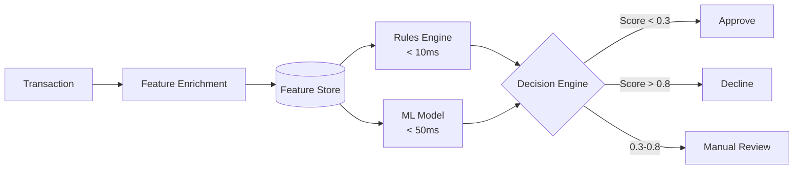

**Flow:**
1. **Enrich:** Add device fingerprint, geo, user history from Feature Store
2. **Score (parallel):** Rules engine (blacklists, velocity) + ML model (anomaly)
3. **Decide:** Combine scores → approve / decline / send to review queue

| Layer | Latency | What it catches |
|-------|---------|-----------------|
| **Rules** | < 10ms | Blacklists, velocity limits, known patterns |
| **ML** | < 50ms | Anomalies, new patterns |
| **Review** | Async | Edge cases, high-value |

**Ключевые решения:**
- **Feature Store:** Redis (online, real-time) + BigQuery (offline, training)
- **Model:** Ensemble (XGBoost + Neural Net) — разные паттерны
- **Feedback loop:** confirmed fraud → label data → retrain model

---

## Quick Reference

### Масштабирование БД
```
1. Read replicas    ← read-heavy workload
2. Caching (Redis)  ← hot data
3. Sharding         ← data doesn't fit one machine
```

### Async паттерн
```
Client → API → Queue → Worker → Done
              ↓
         Return 202 Accepted
         (check status later)
```

### Consistency выбор
```
CP (Consistency): Banking, Payments, Inventory
AP (Availability): Social feeds, Analytics, Caching
```

### Quick Math
```
QPS = DAU × requests_per_user / 86400
Peak = Average × 3

Storage/day = records × size_per_record
Storage/year = daily × 365
```
